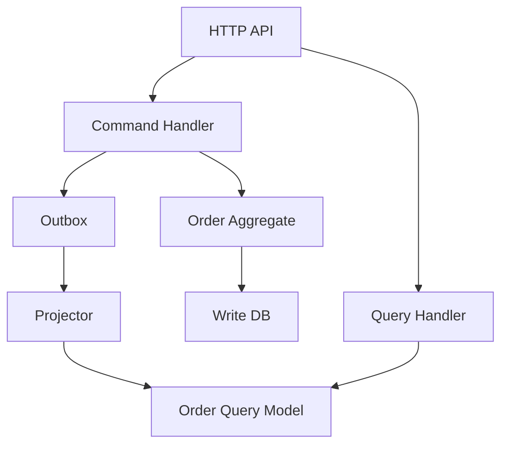

>[!success] 이 문서를 통해 아래 질문들에 답할 수 있게 됩니다.
>- CQRS에서 command model과 query model은 각각 어떤 책임을 갖는가?
>- 단순 read/write split을 넘어 CQRS를 적용해야 하는 조건은 무엇인가?
>- CQRS가 성능, 정합성, 장애 격리, 운영 복잡도에 만드는 trade-off는 무엇인가?

## CQRS의 초점

CQRS는 DB를 두 개로 나누는 이름이 아니다.

쓰기 요청을 처리하는 command model과 읽기 요청을 처리하는 query model의 책임을 분리하는 설계다.

command model은 상태 전이, 불변식, 중복 요청 방어, 트랜잭션 경계를 책임진다.

query model은 화면, 검색, 목록, 통계, API 응답 형태를 책임진다.

이 분리는 읽기 성능을 돕지만, 핵심은 도메인 변경 책임과 조회 표현 책임을 분리하는 데 있다.

따라서 CQRS는 read replica보다 더 큰 결정이다.

코드 경계, 모델 언어, 이벤트 계약, 배포 순서, 장애 대응이 함께 바뀐다.

## Command model

Command는 시스템 상태를 바꾸는 의도다.

예를 들어 `PlaceOrder`, `PayOrder`, `CancelOrder`, `ShipOrder`가 command다.

command model은 다음 질문에 답한다.

| 질문 | 이유 |
| --- | --- |
| 이 상태 전이는 허용되는가? | 도메인 불변식을 지키기 위해 |
| 같은 command가 두 번 오면 어떻게 되는가? | retry와 중복 클릭을 견디기 위해 |
| 어떤 row를 한 트랜잭션에서 보호해야 하는가? | 금액, 재고, 상태 전이 정합성을 위해 |
| 외부 이벤트는 언제 기록하는가? | read model과 후속 작업을 안전하게 연결하기 위해 |

command model은 얇은 CRUD service가 아니다.

주문을 `PAID`로 바꾸는 행위에는 결제 승인, 금액 검증, 재고 상태, 이전 주문 상태가 함께 들어간다.

이 책임이 controller, batch, consumer에 흩어지면 CQRS 이전에 command boundary가 깨진 것이다.

## Query model

Query는 상태를 읽는 요청이다.

예를 들어 `GetOrderDetail`, `SearchOrders`, `GetSellerDashboard`, `GetUserTimeline`이 query다.

query model은 다음 질문에 답한다.

| 질문 | 이유 |
| --- | --- |
| 화면이 어떤 형태의 데이터를 요구하는가? | 조인과 변환 비용을 줄이기 위해 |
| 조회 latency 목표는 얼마인가? | 저장소와 인덱스 선택을 위해 |
| stale을 허용할 수 있는가? | read model과 primary read를 나누기 위해 |
| 정렬, 필터, 검색은 어디서 처리하는가? | DB, search, document store 경계를 정하기 위해 |

query model은 상태를 바꾸지 않는다.

조회 편의를 위해 command model의 불변식을 우회해서도 안 된다.

빠른 조회 모델이 생겼다고 그것을 원본처럼 수정하면 책임이 뒤집힌다.

## 적용해야 하는 조건

CQRS가 맞는 상황은 보통 여러 조건이 겹칠 때다.

| 조건 | 의미 |
| --- | --- |
| 쓰기 불변식이 복잡하다 | 단순 CRUD보다 상태 전이 규칙이 중요하다. |
| 읽기 모델이 화면마다 다르다 | 원본 도메인 모델로 응답 조립 비용이 크다. |
| read/write 트래픽 peak가 다르다 | 독립 확장 가치가 있다. |
| stale 허용 화면이 있다 | 모든 query에 strong read가 필요하지 않다. |
| 팀이 lag, replay, schema version을 운영할 수 있다 | 장애 복구 책임을 감당할 수 있다. |

반대로 단순 CRUD, 작은 트래픽, 동일한 read/write 모델, 강한 최신성 요구가 대부분이면 CQRS는 과하다.

이때는 repository method나 DTO 분리만으로 충분할 수 있다.

## 구조 예시



여기서 중요한 것은 저장소 개수가 아니라 handler의 책임이다.

Command handler는 read model을 직접 조립하지 않는다.

Query handler는 주문 상태를 바꾸지 않는다.

Projector는 command 결과를 조회 모델로 옮기는 별도 책임이다.

## Spring 경계

쓰기 쪽은 command 객체와 handler를 명시한다.

```java
public record PlaceOrderCommand(
    Long memberId,
    List<OrderLineCommand> lines,
    String idempotencyKey
) {}
```

```java
@Transactional
public PlaceOrderResult handle(PlaceOrderCommand command) {
    idempotencyService.ensureFirstRequest(command.idempotencyKey());
    Order order = Order.place(command.memberId(), command.lines());
    orderRepository.save(order);
    outboxRepository.save(OutboxMessage.orderPlaced(order.id(), order.version()));
    return PlaceOrderResult.accepted(order.id(), Visibility.EVENTUAL);
}
```

읽기 쪽은 entity가 아니라 query 응답 모델을 반환한다.

```java
@Transactional(readOnly = true)
public List<OrderListItem> search(OrderSearchCondition condition) {
    return orderListReadRepository.search(condition);
}
```

코드 분리는 패키지를 늘리기 위한 것이 아니다.

쓰기와 읽기의 실패, 지표, 배포 책임을 분리하기 위한 것이다.

## 같은 DB에서도 시작할 수 있다

CQRS는 물리 DB 분리부터 시작하지 않아도 된다.

초기에는 같은 DB 안에서 command repository와 query repository를 나눌 수 있다.

같은 table을 읽더라도 command path와 query path의 DTO, service, metric을 분리하면 책임이 드러난다.

그 다음 조회 요구가 커지면 materialized view, projection table, search index로 확장한다.

이 순서가 중요한 이유는 운영 복잡도를 늦게 가져오기 위해서다.

처음부터 별도 read DB를 만들면 lag, rebuild, schema version, DLQ를 바로 운영해야 한다.

## 정합성 계약

CQRS에서 쓰기 성공은 query model 최신 반영을 뜻하지 않는다.

쓰기 API는 다음 상태 중 하나를 명시해야 한다.

| 상태 | 의미 |
| --- | --- |
| `COMMITTED` | write model에 반영되었다. |
| `ACCEPTED` | command는 처리됐지만 query model 반영은 지연될 수 있다. |
| `PENDING` | command 자체가 비동기 처리 중이다. |
| `REJECTED` | 불변식 위반이나 중복 요청으로 거절되었다. |

사용자 자기 데이터처럼 read-after-write가 중요한 화면은 command result를 유지하거나 write model을 우회 조회할 수 있다.

관리자 통계처럼 지연 허용 화면은 read model을 읽고 기준 시각을 표시한다.

## 운영 경계

CQRS를 운영하려면 command와 query를 다른 지표로 본다.

- command success/failure rate
- command idempotency conflict count
- write transaction latency
- query latency와 stale response ratio
- projection lag와 failed event count
- read model rebuild duration

command가 정상인데 query가 stale이면 사용자에게는 장애처럼 보일 수 있다.

따라서 운영자는 "쓰기 실패"와 "조회 반영 지연"을 다른 사건으로 다뤄야 한다.

## 위험 신호

- CQRS를 적용한다고 말하지만 command와 query가 같은 entity를 공유한다.
- query handler에서 상태를 변경한다.
- command handler가 read model DB까지 동기 갱신한다.
- 모든 화면에 read-after-write를 요구하면서 projection lag를 허용하지 않는다.
- event schema version 없이 projector를 배포한다.
- read model 장애 때 command API까지 실패하도록 묶어 둔다.
- 단순 CRUD에 아키텍처 일관성을 이유로 CQRS를 강제한다.

## 확인 질문

- 확인 질문: CQRS에서 command model의 핵심 책임은 무엇인가?
	- 답변: 도메인 불변식, 상태 전이, 트랜잭션 경계, 중복 요청 방어를 책임지는 것이다.
- 확인 질문: Read replica와 CQRS가 다른 이유는 무엇인가?
	- 답변: Read replica는 같은 모델의 읽기 부하를 옮기는 선택이고, CQRS는 command와 query의 모델 책임을 분리하는 선택이다.
- 확인 질문: CQRS가 바꾸는 설계 축은 무엇인가?
	- 답변: 읽기 성능과 장애 격리는 좋아질 수 있지만, 쓰기 직후 읽기 정합성과 운영 복잡도는 나빠질 수 있다.

## 참고 문서

- [Martin Fowler, CQRS](https://martinfowler.com/bliki/CQRS.html)
- [Microsoft, CQRS pattern](https://learn.microsoft.com/en-us/azure/architecture/patterns/cqrs)
- [Microsoft, Event Sourcing pattern](https://learn.microsoft.com/en-us/azure/architecture/patterns/event-sourcing)
- [Designing Data-Intensive Applications](https://dataintensive.net/)
