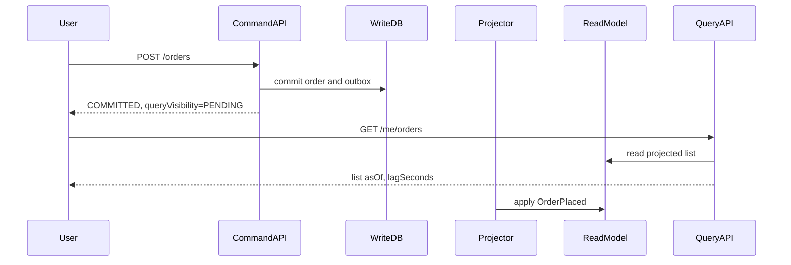

>[!success] 이 문서를 통해 아래 질문들에 답할 수 있게 됩니다.
>- Read Write 분리에서 projection lag는 사용자 경험에 어떻게 드러나는가?
>- read-after-write, monotonic read, stale data를 API 계약으로 어떻게 다루는가?
>- 동기화 지연은 성능, 정합성, 장애 격리, 운영 복잡도를 어떻게 바꾸는가?

## 개요

Read Write 분리의 가장 큰 함정은 "쓰기 성공 후 읽기 실패처럼 보이는 경험"이다.

주문 생성은 성공했지만 주문 목록에는 아직 보이지 않을 수 있다.

결제는 완료됐지만 관리자 매출 통계에는 1분 뒤 반영될 수 있다.

이 현상은 시스템 내부에서는 projection lag지만 사용자에게는 데이터가 사라진 것처럼 보일 수 있다.

따라서 동기화 지연은 기술 문제가 아니라 API 계약과 UX 문제다.

## 일관성 종류

Read Write 분리에서 자주 보는 일관성 요구는 다음이다.

| 요구 | 의미 | 예시 | 설계 선택 |
| --- | --- | --- | --- |
| Strong read | 쓰기 성공 직후 최신 값을 읽음 | 결제 완료 후 영수증 | write model 직접 조회 |
| Read-after-write | 내가 쓴 값은 내가 바로 봄 | 주문 직후 내 주문 상세 | command 결과 보관 또는 owner read 우회 |
| Monotonic read | 이전에 본 상태보다 과거로 돌아가지 않음 | 배송 상태가 배송중에서 결제완료로 후퇴하지 않음 | version 비교와 client cache |
| Eventual consistency | 시간이 지나면 수렴 | 관리자 통계, 랭킹 | stale 표시와 lag SLO |
| Bounded staleness | 최대 지연을 약속 | 최대 60초 늦은 매출 지표 | lag alert와 fallback |

모든 화면에 strong read를 요구하면 분리 이점이 줄고, 모든 화면을 eventual로 두면 사용자는 성공 여부를 믿기 어렵다.

## 기준 시나리오

사용자가 주문을 완료한 직후 다음 세 화면을 본다고 하자.

- 주문 완료 화면
- 내 주문 목록
- 관리자 매출 대시보드

세 화면의 정합성 요구는 같지 않다.

```text
주문 완료 화면 = command 결과로 즉시 표시
내 주문 목록 = read-after-write 필요, 최대 3초 지연 허용
관리자 대시보드 = eventual consistency, 최대 60초 지연 허용
```

이 구분 없이 모든 query를 read model로 보내면 주문 직후 내 주문이 목록에서 사라지고, 모든 조회를 write DB로 보내면 대시보드 분리 효과가 줄어든다.

## API 계약 예시

쓰기 API는 projection 반영 상태를 별도로 표현한다.

```json
{
  "orderId": "ord-1001",
  "commandStatus": "COMMITTED",
  "queryVisibility": "PENDING",
  "committedAt": "2026-07-01T10:15:00+09:00",
  "estimatedVisibleWithinSeconds": 3
}
```

목록 API는 read model의 기준 시각을 드러낸다.

```json
{
  "items": [
    {
      "orderId": "ord-1000",
      "status": "DELIVERING"
    }
  ],
  "asOf": "2026-07-01T10:14:58+09:00",
  "lagSeconds": 4,
  "freshness": "DELAYED"
}
```

사용자가 방금 만든 주문이 목록에 없으면 클라이언트는 command 결과를 임시 row로 보여 read-after-write 경험을 보존할 수 있다.

## 흐름 예시



이 흐름에서 성공 응답과 조회 반영은 다른 사건이며, API가 이를 숨기면 "DB에는 있는데 화면에는 없다"라는 신고만 남는다.

## Lag 계산

Projection lag는 보통 이벤트의 발생 시각과 read model 반영 시각으로 계산한다.

```text
event occurredAt = 10:15:00
read model projectedAt = 10:15:07
current time = 10:15:10
source lag = current time - max(occurredAt applied) = 10s
apply delay = projectedAt - occurredAt = 7s
```

`source lag`는 read model이 얼마나 뒤처졌는지, `apply delay`는 worker 처리 속도와 queue 적체를 보여준다.

둘을 구분해야 원인이 이벤트 유입 폭증인지, worker 처리 지연인지, 특정 이벤트 실패인지 판단할 수 있다.

## Spring 처리 예시

내가 방금 만든 주문은 짧은 시간 동안 write model을 우회 조회할 수 있다.

```java
@Transactional(readOnly = true)
public OrderDetail getMyOrder(Long memberId, Long orderId) {
    if (recentCommandTracker.isRecentlyCommitted(memberId, orderId)) {
        return orderWriteRepository.findOwnerView(memberId, orderId)
            .map(OrderDetail::fresh)
            .orElseThrow();
    }

    return orderReadRepository.findOwnerView(memberId, orderId)
        .map(row -> OrderDetail.projected(row, freshness(row.projectedAt())))
        .orElseThrow();
}
```

이런 우회는 모든 조회가 아니라 read-after-write가 사용자 신뢰에 중요한 화면에만 쓴다.

## 지연 허용 정책

화면별 정책을 표로 남기면 설계 리뷰가 쉬워진다.

| 화면/API | 정합성 요구 | 허용 지연 | 지연 시 동작 |
| --- | --- | ---: | --- |
| 주문 완료 | command result | 0초 | command 결과 표시 |
| 내 주문 상세 | read-after-write | 3초 | write model 우회 조회 |
| 내 주문 목록 | monotonic read | 5초 | 임시 row 병합 |
| 관리자 통계 | bounded staleness | 60초 | stale badge 표시 |
| 랭킹 | eventual consistency | 5분 | 기준 시각 표시 |

이 표가 없으면 write DB 우회, 캐시 무효화, 강제 새로고침이 각자 추가되어 성능 최적화와 정합성 보완이 충돌한다.

## 장애와 알림

Lag가 커질 때 바로 전체 장애로 볼 필요는 없지만, 허용 시간을 넘으면 사용자 계약을 위반한다.

예를 들어 관리자 통계 lag SLO가 60초라면 다음 단계가 필요하다.

- 30초 초과: dashboard에 delayed 상태 표시
- 60초 초과: warning alert
- 180초 초과: incident 생성, projector scale out 또는 실패 이벤트 격리
- 600초 초과: 통계 화면 일부 비활성화 또는 마지막 안전 시점 고정

중요한 것은 "조회가 된다"와 "믿을 수 있는 조회다"를 구분하는 것이다.

## 위험 신호

- 쓰기 성공 응답이 query model 최신 반영을 암묵적으로 약속한다.
- 모든 조회를 read model로 보내고 read-after-write 예외를 정의하지 않는다.
- lag를 queue length로만 보고 실제 source lag를 측정하지 않는다.
- stale data를 UI/API에 표시하지 않는다.
- 오래된 이벤트가 늦게 도착해 상태가 과거로 돌아간다.
- lag가 SLO를 넘었는데도 알림이나 degraded 정책이 없다.

## 개인 프로젝트 기준

개인 프로젝트에서는 최소한 화면별 지연 허용 시간을 적는다.

- 내 데이터는 즉시 보여야 하는가?
- 관리자 통계는 몇 초까지 늦어도 되는가?
- 목록에 방금 만든 항목이 없을 때 어떤 문구를 보여줄 것인가?
- lag를 로그로라도 확인할 수 있는가?

이 정도만 있어도 "eventual consistency"를 막연한 단어가 아니라 사용자 경험으로 설명할 수 있다.

## 기업 운영 기준

기업 환경에서는 지연 일관성을 SLO와 연결한다.

- `projection.source_lag.seconds`
- `read_after_write.miss.count`
- `stale_response.ratio`
- `monotonic_read_violation.count`
- `projector.blocked_event.age`

이 지표가 없다면 Read Write 분리는 장애를 줄인 것이 아니라 장애를 보이지 않게 만든 것이다.

## 확인 질문

- 확인 질문: read-after-write가 필요한 화면과 eventual consistency가 가능한 화면을 왜 나누어야 하는가?
	- 답변: 모든 화면에 최신성을 요구하면 분리 이점이 줄고, 모든 화면을 지연 허용으로 두면 사용자 신뢰가 깨지기 때문이다.
- 확인 질문: stale data를 API에 드러내는 방법은 무엇인가?
	- 답변: `asOf`, `lagSeconds`, `freshness`, `queryVisibility` 같은 필드로 기준 시각과 반영 상태를 명시한다.
- 확인 질문: 동기화 지연이 바꾸는 설계 축은 무엇인가?
	- 답변: 읽기 성능과 장애 격리는 좋아질 수 있지만, 정합성 계약과 lag 운영 복잡도가 증가한다.

## 참고 문서

- [Microsoft, Data Consistency Primer](https://learn.microsoft.com/en-us/previous-versions/msp-n-p/dn589800(v=pandp.10))
- [Microsoft, CQRS pattern](https://learn.microsoft.com/en-us/azure/architecture/patterns/cqrs)
- [Designing Data-Intensive Applications](https://dataintensive.net/)
- [Google SRE Book, Service Level Objectives](https://sre.google/sre-book/service-level-objectives/)
