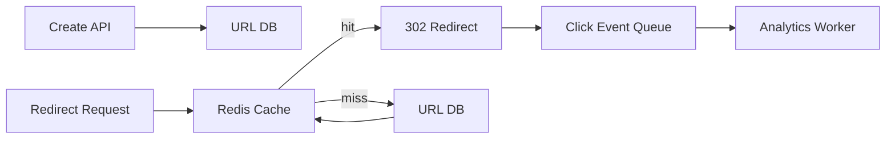

>[!success] 이 문서를 통해 아래 질문들에 답할 수 있게 됩니다.
>- URL Shortener에서 생성 API보다 redirect 경로를 먼저 보는 이유는 무엇인가?
>- Short key 생성, cache, click log, abuse 방어는 어떤 trade-off를 만드는가?
>- URL Shortener 설계는 성능, 정합성, 장애 격리, 운영 복잡도를 어떻게 바꾸는가?

## 개요
URL Shortener는 긴 URL을 짧은 key로 바꾸고, 사용자가 그 key로 접근하면 원래 URL로 redirect하는 서비스다.
겉보기에는 CRUD처럼 보이지만 실제 핵심 경로는 redirect read path다.
Marketing link나 social link는 생성보다 조회가 훨씬 많고, redirect p95가 사용자 경험을 결정한다.
반대로 생성 API에서는 alias 중복, 악성 URL, 만료 시간, owner 권한이 중요하다.
Click log와 analytics는 redirect 성공과 분리해야 한다.
Redirect는 빠르게 끝나야 하고, click log는 지연되어도 된다.

## 이 문서가 바꾸는 설계 축
| 축 | 바뀌는 내용 |
| --- | --- |
| 성능 | redirect read path를 cache와 DB fallback으로 최적화한다. |
| 정합성 | short key uniqueness, custom alias 충돌, 삭제/만료 반영 기준을 정한다. |
| 장애 격리 | click log, analytics, abuse scan을 redirect 핵심 경로에서 분리한다. |
| 운영 복잡도 | hot link, cache invalidation, abuse report, analytics replay를 운영한다. |

## 요구사항 분리
| 요구사항 | 설계 의미 |
| --- | --- |
| 짧은 URL 생성 | key 생성, custom alias, owner, expiration |
| 빠른 redirect | cache hit, DB fallback, 301/302 선택 |
| click 통계 | 비동기 log, 중복 허용, 집계 지연 |
| 악성 URL 차단 | 생성 시 scan, 신고 후 disable |
| 링크 삭제/만료 | cache invalidation, stale redirect 허용 여부 |
| 대량 campaign | hot key, CDN/cache, rate limit |
이 표를 먼저 쓰면 모든 기능을 한 transaction에 넣는 실수를 줄일 수 있다.

## 대표 시나리오
다음 traffic을 가정한다.
```text
daily_created_links = 200,000
daily_redirects = 300,000,000
peak_redirect_qps = 25,000
cache_hit_target = 98%
click_log_loss_tolerance = 0.1%
```
생성 API는 초당 몇 건 수준일 수 있지만 redirect는 수만 QPS까지 튈 수 있다.
따라서 생성 path와 redirect path를 같은 기준으로 설계하면 안 된다.
Redirect path는 `key -> originalUrl` 조회와 redirect 응답에 집중한다.
Click log 저장, country/device enrichment, abuse scoring은 queue로 넘긴다.

## 기본 흐름

이 흐름에서 redirect 응답은 analytics worker를 기다리지 않는다.
Queue가 밀려도 redirect는 계속 성공할 수 있어야 한다.
대신 click log 지연과 유실 허용 범위는 product 요구사항으로 정한다.

## Short Key 생성
Short key 생성 방식은 충돌과 추측 가능성을 함께 본다.
| 방식 | 장점 | 비용 |
| --- | --- | --- |
| auto increment base62 | 짧고 빠르다. | 추측 가능하고 shard 확장 시 조정 필요 |
| random base62 | 추측이 어렵다. | 충돌 검사와 재시도 필요 |
| hash original URL | 같은 URL dedupe 가능 | 충돌과 privacy 문제 |
| custom alias | 사용자 친화적 | 예약어, 소유권, 충돌 처리 필요 |
Random key를 쓰면 DB unique constraint가 최종 안전장치다.
```sql
create table short_urls (
    short_key varchar(20) primary key,
    original_url text not null,
    owner_id bigint not null,
    status varchar(20) not null,
    expires_at timestamp null,
    created_at timestamp not null
);
```
Application의 충돌 검사는 최적화일 뿐이고, 최종 판단은 unique key가 해야 한다.

## Redirect 계약
Redirect API는 성공, 만료, 비활성, 악성 차단을 구분해야 한다.
```http
GET /r/abc123
```
| 상태 | 응답 |
| --- | --- |
| active | `302 Location: originalUrl` |
| expired | `410 Gone` |
| disabled by owner | `404 Not Found` 또는 `410 Gone` |
| abuse blocked | warning page 또는 `403 Forbidden` |
301은 client와 검색엔진 cache가 강하게 동작하므로 변경 가능성이 있는 링크에는 위험할 수 있다.
대부분의 동적 단축 URL은 302 또는 307처럼 변경 여지를 남긴다.

## Cache 전략
Redirect는 cache hit가 중요하다.
```text
peak_redirect_qps = 25,000
cache_hit = 98%
db_qps = 25,000 * 0.02 = 500
```
Cache hit가 95%로 내려가면 DB QPS는 1,250이 된다.
Hot link는 cache가 있어도 Redis shard 하나를 때릴 수 있다.
TTL은 링크 만료와 신고 차단 요구에 맞춘다.
삭제나 abuse block은 cache invalidation이 필요하다.
Stale redirect가 절대 허용되지 않는 경우와 몇 초 허용되는 경우를 구분한다.

## Click Log 분리
Click log를 redirect transaction 안에서 DB에 쓰면 redirect latency가 흔들린다.
```json
{
  "eventId": "clk-20260701-abc123-0001",
  "shortKey": "abc123",
  "occurredAt": "2026-07-01T12:00:00Z",
  "ipHash": "sha256:...",
  "userAgent": "..."
}
```
Event는 중복될 수 있다.
Analytics 집계는 eventId 기준 idempotency를 가져야 한다.
Click log queue가 장애면 redirect를 막을지, log를 일부 유실할지 요구사항으로 정한다.
대부분의 서비스에서는 redirect 성공이 click 통계보다 우선이다.

## Abuse와 Rate Limit
URL Shortener는 phishing과 spam에 악용되기 쉽다.
생성 API에는 rate limit과 URL validation이 필요하다.
| 위치 | 정책 |
| --- | --- |
| create API | user/IP/API key별 생성 제한 |
| custom alias | 예약어와 브랜드 보호 |
| redirect | hot key 보호와 block list |
| abuse report | 신고 후 review 상태 전환 |
악성 URL scan을 redirect마다 동기로 호출하면 latency와 외부 API 장애가 redirect 장애로 전파된다.
생성 시 scan하고, 신고나 재검사 결과는 상태 변경으로 반영하는 편이 낫다.

## Preview와 Safety Page
모든 redirect가 바로 원본 URL로 가야 하는 것은 아니다.
신규 도메인, 신고가 누적된 링크, corporate policy에 걸린 링크는 safety page를 거칠 수 있다.
```text
shortKey status = ACTIVE_REVIEW_REQUIRED
response = 200 safety page
user action = continue or report
```
이 선택은 redirect latency를 늘리지만 abuse 피해를 줄인다.
마케팅 campaign 링크처럼 신뢰된 owner는 바로 redirect하고, 익명 사용자가 만든 링크는 preview를 요구할 수 있다.
설계 리뷰에서는 “빠른 redirect”와 “안전한 redirect” 중 어떤 링크 등급에 무엇을 적용할지 나눠야 한다.

## 장애 중 판단
| 장애 | 우선 판단 |
| --- | --- |
| Redis 장애 | DB fallback 허용 범위와 DB 보호 limit |
| DB read 증가 | hot link cache, rate limit, stale cache 검토 |
| click queue 적체 | redirect 유지, analytics 지연 표시 |
| abuse provider 장애 | 생성 제한 또는 pending review |
| cache invalidation 실패 | block link 우선 invalidation retry |
Redirect 핵심 경로와 부가 경로를 분리했는지 장애 때 드러난다.
Queue가 느리다고 redirect를 멈추면 경계가 잘못 잡힌 것이다.

## 개인 프로젝트 기준
- 생성 API와 redirect API의 QPS 차이를 숫자로 적는다.
- short key uniqueness를 DB primary key로 보장한다.
- Redis cache hit와 DB fallback 계산을 넣는다.
- click log는 queue로 분리하고 유실 허용 범위를 적는다.
- abuse 방어를 “나중에”가 아니라 create rate limit과 block status로 설명한다.

## 기업 운영 기준
- redirect p95, cache hit, DB fallback QPS, hot key top N을 dashboard로 본다.
- abuse block과 cache invalidation에는 긴급 runbook을 둔다.
- click log queue lag와 analytics freshness를 redirect SLO와 분리한다.
- custom alias 정책, 브랜드 보호, 신고 처리 owner를 둔다.
- migration 시 old/new redirect code와 cache key version을 함께 검증한다.

## 위험 신호
- 생성 API만 설계하고 redirect peak를 계산하지 않는다.
- click log 저장 실패가 redirect 실패로 이어진다.
- key 충돌을 application retry만으로 막고 DB unique constraint가 없다.
- 삭제/만료/차단 상태가 cache에 어떻게 반영되는지 없다.
- 301과 302 선택 이유를 설명하지 못한다.
- abuse 방어가 없어 단축 URL이 spam 발송 경로가 된다.

## 확인 질문

>[!question] 확인 질문
>- 확인 질문: URL Shortener의 핵심 성능 경로는 무엇인가?
>	- 답변: 사용자가 short key로 접근해 original URL로 redirect되는 read path이며, cache hit와 DB fallback이 핵심이다.
>- 확인 질문: Click log를 redirect와 분리하는 이유는 무엇인가?
>	- 답변: analytics 지연은 허용 가능하지만 redirect latency 증가는 사용자 성공을 직접 깨뜨리기 때문이다.
>- 확인 질문: Short key 충돌의 최종 안전장치는 무엇인가?
>	- 답변: DB primary key나 unique constraint이며, application retry는 충돌을 줄이는 보조 수단이다.
