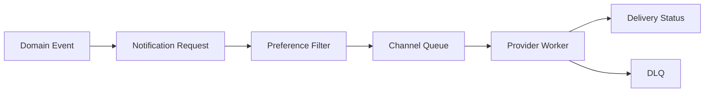

>[!success] 이 문서를 통해 아래 질문들에 답할 수 있게 됩니다.
>- Notification System에서 “발송 요청 성공”과 “사용자 도착”은 왜 다른가?
>- 수신 거부, 채널 선택, retry, DLQ는 어떤 책임으로 나누어야 하는가?
>- Notification 설계는 성능, 정합성, 장애 격리, 운영 복잡도를 어떻게 바꾸는가?

## 개요
Notification System은 사용자에게 push, email, SMS, in-app 알림을 보내는 시스템이다.
핵심은 메시지를 queue에 넣는 것이 아니라 누구에게 어떤 채널로 언제까지 보내야 하는지 결정하는 것이다.
발송 요청이 성공해도 provider가 실패할 수 있고, provider가 성공해도 사용자가 실제로 보지 않을 수 있다.
수신 거부와 채널 선호는 발송 전에 적용해야 하고, retry는 provider별 실패 유형에 맞게 제한해야 한다.
알림은 대부분 사용자 핵심 transaction 뒤에 붙는 부가 작업이므로 원본 기능과 장애 격리가 중요하다.

## 이 문서가 바꾸는 설계 축
| 축 | 바뀌는 내용 |
| --- | --- |
| 성능 | 대량 fanout을 queue와 worker로 분리해 원본 API latency를 보호한다. |
| 정합성 | 수신 거부, 중복 발송 방지, 발송 상태 추적의 기준을 정한다. |
| 장애 격리 | provider 장애가 주문/결제 같은 원본 기능을 막지 않게 한다. |
| 운영 복잡도 | retry, DLQ, provider quota, template version, delivery tracking을 운영한다. |

## 요구사항 분리
| 요구사항 | 설계 질문 |
| --- | --- |
| 거래성 알림 | 반드시 보내야 하는가, 어느 채널이 fallback인가? |
| 마케팅 알림 | 수신 동의와 발송 시간 제한은 무엇인가? |
| in-app 알림 | 읽음 상태와 보관 기간은 어떻게 되는가? |
| push/email/SMS | provider quota와 비용은 어느 정도인가? |
| delivery tracking | sent, delivered, opened 중 어디까지 필요한가? |
| 중복 방지 | 같은 event로 여러 번 발송되면 안 되는가? |
거래성 알림과 마케팅 알림은 같은 시스템을 쓸 수 있지만 정책은 다르다.

## 대표 시나리오
주문 완료 후 사용자에게 push와 email을 보낸다고 하자.
주문 API의 성공 기준은 주문이 생성되는 것이다.
알림 발송은 후속 작업이다.
```text
Order Created
-> Notification Request Created
-> Preference Filter
-> Channel Fanout
-> Provider Send
-> Delivery Status Update
```
Push provider가 느리거나 실패해도 주문 생성 transaction이 rollback되면 안 된다.
대신 알림 요청 상태가 `RETRY_SCHEDULED` 또는 `FAILED`로 남아야 한다.

## 기본 흐름

수신 거부 사용자는 worker에서 제외하는 것보다 producer 또는 filter 단계에서 제외하는 편이 낫다.
그래야 provider 비용과 불필요한 retry를 줄일 수 있다.

## API와 Event 계약
원본 service는 알림 provider를 직접 호출하지 않는다.
알림 요청 event를 남긴다.
```json
{
  "eventId": "order-123-notification-1",
  "eventType": "ORDER_CREATED",
  "recipientId": "member-77",
  "templateCode": "ORDER_CREATED_V2",
  "channels": ["PUSH", "EMAIL"],
  "idempotencyKey": "order-123:ORDER_CREATED"
}
```
`idempotencyKey`는 같은 주문 완료 알림이 중복 발송되는 것을 막는다.
Template code는 version을 포함해야 한다.
템플릿 변경이 과거 재처리 결과를 바꾸지 않게 하기 위해서다.

## 상태 모델
Notification은 단순 성공/실패가 아니다.
```text
REQUESTED
-> FILTERED_OUT
-> QUEUED
-> SENT_TO_PROVIDER
-> DELIVERED
-> OPENED

QUEUED
-> RETRY_SCHEDULED
-> FAILED
-> DLQ
```
상태가 있어야 운영자가 “발송이 안 됐다”를 어디서 멈췄는지 찾을 수 있다.
거래성 알림은 `DLQ` 후 수동 재처리 경로가 필요할 수 있다.
마케팅 알림은 일정 시간이 지나면 포기하는 것이 맞을 수 있다.

## Retry 정책
Retry는 실패 유형별로 달라야 한다.
| 실패 | 정책 |
| --- | --- |
| provider 5xx | backoff 후 제한 재시도 |
| provider 429 | quota window에 맞춰 지연 |
| invalid token | 재시도하지 않고 token 비활성화 |
| unsubscribe | 발송 금지, 재시도 없음 |
| template error | DLQ, 배포 rollback 검토 |
무조건 3회 retry는 위험하다.
Provider quota를 초과했을 때 retry를 몰아치면 장애가 증폭된다.

## 처리량 계산
이벤트 캠페인을 예로 든다.
```text
target_users = 5,000,000
send_window = 2 hours
required_send_rate = 5,000,000 / 7,200 = 695 msg/s
provider_safe_rate = 500 msg/s
```
이 경우 두 시간 안에 모두 보내려면 provider 증설이나 발송 창구 조정이 필요하다.
무리하게 worker를 늘리면 provider 429가 늘고 retry queue가 쌓인다.
알림 시스템의 throughput은 worker 수가 아니라 provider quota와 비용이 결정할 때가 많다.

## Channel 선택
| 채널 | 장점 | 비용 |
| --- | --- | --- |
| Push | 빠르고 저렴하다. | token 만료와 OS 정책 영향 |
| Email | 보존성과 긴 메시지에 좋다. | spam, template, 발송 평판 |
| SMS | 도달률이 높다. | 비용이 높고 규제 영향 |
| In-app | 비용이 낮고 조회 가능 | 사용자가 앱에 들어와야 본다. |
거래성 알림은 push 실패 시 email fallback이 필요할 수 있다.
마케팅 알림은 비용과 수신 동의를 더 강하게 본다.

## 장애 중 판단
| 장애 | 우선 조치 |
| --- | --- |
| Push provider 장애 | email fallback 또는 retry 지연 |
| SMS quota 초과 | 저우선순위 캠페인 중단 |
| DLQ 급증 | template/provider 변경 rollback 검토 |
| preference DB 장애 | 거래성 알림만 제한 발송 또는 대기 |
| queue lag 증가 | campaign throttle, worker 조정 |
장애 중 모든 알림을 살리려 하면 비용과 retry 폭주가 커진다.
우선순위와 포기 기준이 필요하다.

## 개인 프로젝트 기준
- 주문 완료 같은 거래성 알림과 마케팅 알림을 구분한다.
- 수신 거부를 producer/filter 단계에서 적용한다고 설명한다.
- provider 실패 유형별 retry 정책을 표로 만든다.
- `idempotencyKey`로 중복 발송을 막는다.
- delivery status는 최소 `REQUESTED`, `SENT`, `FAILED`로 남긴다.

## 기업 운영 기준
- provider별 success rate, 429, latency, cost를 dashboard로 본다.
- campaign throttle과 emergency stop 기능을 둔다.
- template version과 승인 절차를 운영한다.
- DLQ 재처리 runbook과 idempotency 검증을 둔다.
- 개인정보와 수신 동의 변경은 audit log로 남긴다.

## 위험 신호
- 주문 transaction 안에서 push provider를 직접 호출한다.
- 수신 거부 사용자를 worker 마지막 단계에서만 거른다.
- 모든 실패를 같은 retry 횟수로 처리한다.
- provider quota와 비용을 계산하지 않는다.
- DLQ는 있지만 누가 언제 재처리할지 없다.
- template 변경이 과거 메시지 재처리 결과를 바꾼다.

## 확인 질문

>[!question] 확인 질문
>- 확인 질문: 알림 발송 요청 성공과 사용자 도착이 다른 이유는 무엇인가?
>	- 답변: 내부 요청, provider 수락, 실제 기기 도착, 사용자의 열람은 서로 다른 단계이고 각각 실패할 수 있기 때문이다.
>- 확인 질문: 수신 거부는 어디에서 적용하는 것이 좋은가?
>	- 답변: 가능한 producer/filter 단계에서 적용해 provider 비용과 불필요한 retry를 줄인다.
>- 확인 질문: Notification retry에서 가장 위험한 실수는 무엇인가?
>	- 답변: provider 429나 invalid token처럼 재시도하면 안 되거나 늦춰야 하는 실패를 무조건 반복하는 것이다.
