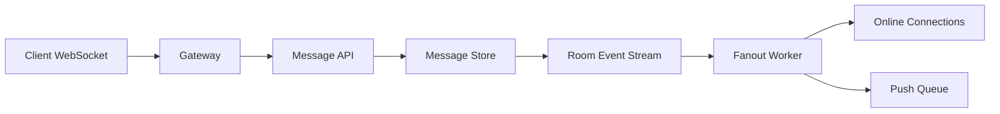

>[!success] 이 문서를 통해 아래 질문들에 답할 수 있게 됩니다.
>- Chat System에서 메시지 저장, 실시간 전달, 읽음 상태는 왜 분리해서 설계해야 하는가?
>- 1:1 채팅과 대형 단체방은 fanout, ordering, storage 선택이 어떻게 달라지는가?
>- Chat 설계는 성능, 정합성, 장애 격리, 운영 복잡도를 어떻게 바꾸는가?

## 개요
Chat System은 메시지를 저장하고 참여자에게 실시간으로 전달하는 시스템이다.
실시간 전달이 눈에 띄지만 최종 진실의 원천은 저장된 메시지다.
WebSocket 전달이 실패해도 메시지가 저장되어 있으면 재접속 후 복구할 수 있다.
반대로 WebSocket으로 보냈지만 저장이 실패하면 사용자 간 상태가 갈라진다.
그래서 메시지 저장, fanout, presence, read receipt, push notification을 별도 책임으로 나눠야 한다.

## 이 문서가 바꾸는 설계 축
| 축 | 바뀌는 내용 |
| --- | --- |
| 성능 | room 크기와 online user 수에 맞춰 fanout 비용을 조절한다. |
| 정합성 | room 단위 ordering, message idempotency, read receipt 기준을 정한다. |
| 장애 격리 | WebSocket gateway, message store, push notification 장애를 분리한다. |
| 운영 복잡도 | connection state, reconnect, backpressure, shard by room을 운영한다. |

## 요구사항 분리
| 요구사항 | 설계 질문 |
| --- | --- |
| 메시지 전송 | 저장 성공을 언제 사용자에게 알려줄 것인가? |
| 실시간 전달 | online user에게만 보내는가, offline도 보장하는가? |
| 순서 | room 전체 순서가 필요한가, sender별 순서면 충분한가? |
| 읽음 표시 | 메시지별인지 마지막 읽은 offset인지 정한다. |
| presence | 정확해야 하는가, 몇 초 stale을 허용하는가? |
| 대형방 | 모든 참여자에게 즉시 fanout할 수 있는가? |

## 대표 시나리오
1:1 채팅과 10,000명 공개방은 같은 구조로 처리하면 안 된다.
```text
1:1 room:
  message write = 20 msg/s
  recipients = 1
  ordering = room sequence

large room:
  message write = 200 msg/s
  online users = 6,000
  fanout = 1,200,000 deliveries/s
```
대형방에서 모든 메시지를 모든 연결에 즉시 push하면 gateway와 network가 먼저 포화된다.
Room size에 따라 fanout 전략과 backpressure가 달라져야 한다.

## 기본 흐름

Client가 메시지를 보내면 먼저 저장한다.
저장된 메시지는 room event stream을 통해 online connection으로 전달한다.
Offline user에게는 push queue나 unread counter를 갱신한다.

## 메시지 저장 계약
메시지 전송 API는 client generated id를 받아 중복 전송을 막는다.
```json
{
  "clientMessageId": "ios-7f31-10001",
  "roomId": "room-42",
  "senderId": "member-9",
  "body": "hello",
  "sentAt": "2026-07-01T12:00:00Z"
}
```
DB에는 `(room_id, client_message_id, sender_id)` unique constraint를 둔다.
모바일 네트워크에서 사용자가 재전송하거나 client가 retry할 수 있기 때문이다.
서버는 저장 후 server message id와 room sequence를 반환한다.

## Ordering
Ordering은 범위를 정해야 한다.
| 범위 | 장점 | 비용 |
| --- | --- | --- |
| room global sequence | 사용자 경험이 단순하다. | room별 sequence 병목 |
| partitioned room sequence | 대형방 처리량 증가 | merge와 표시 순서 복잡 |
| sender sequence | 쓰기 분산 쉬움 | 참여자마다 순서가 다르게 보일 수 있음 |
대부분의 작은 room은 room sequence가 단순하다.
대형 공개방은 exact ordering보다 near-real-time stream과 pagination consistency가 더 중요할 수 있다.

## Presence
Presence는 정확한 DB 상태가 아니라 짧은 TTL 상태로 보는 편이 맞다.
```text
presence:{memberId} = online, ttl 30s
connection:{connectionId} = gateway-3, ttl 30s
```
Client heartbeat가 끊기면 TTL로 offline 처리된다.
Presence가 몇 초 늦게 반영되는 것은 대개 허용된다.
정확한 결제 상태처럼 다루면 write 부하와 장애 민감도가 커진다.

## Read Receipt
읽음 상태를 메시지마다 저장하면 write가 폭증한다.
대부분은 room/member별 마지막 읽은 sequence로 충분하다.
```sql
create table room_read_offsets (
    room_id varchar(80) not null,
    member_id bigint not null,
    last_read_sequence bigint not null,
    updated_at timestamp not null,
    primary key (room_id, member_id)
);
```
이 구조는 “몇 번 메시지까지 읽었는가”를 빠르게 계산할 수 있다.
단, 메시지별 개별 읽음이 필요한 기업 메신저라면 비용을 별도 계산해야 한다.

## Fanout 전략
| 전략 | 장점 | 비용 | 적합 |
| --- | --- | --- | --- |
| direct gateway push | 단순하고 빠름 | gateway affinity 필요 | 작은 room |
| room event stream | gateway 확장 쉬움 | stream 운영 필요 | 중간 규모 |
| pull on reconnect | 저장소 기준 복구 | 실시간성이 낮음 | offline 복구 |
| sampled delivery | 대형방 보호 | 일부 메시지 지연/누락 표시 필요 | 대형 공개방 |
Fanout은 room 크기, online user 수, 메시지 빈도에 따라 바뀐다.
하나의 전략으로 모든 방을 처리하려 하면 큰 방이 작은 방 SLO를 깨뜨린다.

## Backpressure
Client connection이 느리면 gateway queue가 쌓인다.
```text
max_pending_messages_per_connection = 500
if exceeded:
  close connection with reconnect_required
```
느린 client 하나 때문에 gateway memory가 커지면 안 된다.
대형방은 오래된 메시지를 drop하고 최신 상태를 다시 pull하게 할 수 있다.
1:1 채팅은 drop 대신 재접속 후 missed messages 조회를 보장하는 편이 낫다.

## Reconnect와 Missed Messages
Mobile client는 네트워크가 자주 끊긴다.
Client는 마지막으로 확인한 room sequence를 들고 다시 연결해야 한다.
```http
GET /rooms/room-42/messages?afterSequence=9912&limit=100
```
서버는 `9913` 이후 메시지를 반환하고, gap이 너무 크면 snapshot이나 pagination을 요구한다.
WebSocket gateway는 복구의 owner가 아니다.
복구 기준은 message store와 room sequence다.
이 경계를 두면 gateway 재시작, region 이동, client reconnect가 일어나도 대화 내역을 다시 맞출 수 있다.

## 장애 중 판단
| 장애 | 대응 |
| --- | --- |
| WebSocket gateway 장애 | reconnect, missed message pull |
| message store 지연 | send API 제한, read-only 모드 검토 |
| fanout worker lag | 대형방 throttle, small room 우선순위 |
| push provider 장애 | offline push 지연, message store 유지 |
| presence store 장애 | presence degrade, message send 유지 |
Presence나 read receipt 장애가 message send를 막으면 안 된다.
사용자 핵심 성공은 메시지 저장과 복구 가능성이다.

## 개인 프로젝트 기준
- WebSocket 연결보다 message store와 reconnect 복구를 먼저 설명한다.
- clientMessageId로 중복 전송을 막는다.
- 1:1 room과 대형 room의 fanout 차이를 계산한다.
- presence는 TTL 기반 stale 허용 상태로 둔다.
- read receipt는 last read sequence로 단순화한다.

## 기업 운영 기준
- active connections, send p95, fanout lag, reconnect rate를 dashboard로 본다.
- room size별 정책과 quota를 둔다.
- gateway shard와 room routing 기준을 문서화한다.
- message store backup과 retention 정책을 운영한다.
- slow consumer와 abusive sender에 대한 제한 정책을 둔다.

## 위험 신호
- WebSocket 전달 성공을 메시지 저장 성공으로 착각한다.
- client retry 중복을 막을 idempotency key가 없다.
- 모든 room에 같은 fanout 전략을 적용한다.
- presence를 강한 정합성 데이터처럼 저장한다.
- read receipt를 메시지별 row로만 설계하고 write 폭증을 계산하지 않는다.
- fanout lag가 쌓여도 사용자에게 지연 상태를 보여주지 않는다.

## 확인 질문
- 확인 질문: Chat에서 최종 진실의 원천은 무엇인가?
	- 답변: WebSocket 전달 여부가 아니라 저장된 메시지와 room sequence가 최종 복구 기준이다.
- 확인 질문: Presence를 TTL 상태로 보는 이유는 무엇인가?
	- 답변: online 상태는 순간적으로 변하고 몇 초 stale이 허용되므로 강한 DB 정합성으로 다루면 비용이 과하다.
- 확인 질문: 대형방이 어려운 이유는 무엇인가?
	- 답변: 메시지 하나가 수천~수만 connection fanout으로 증폭되어 gateway, network, ordering, backpressure 문제가 생기기 때문이다.
