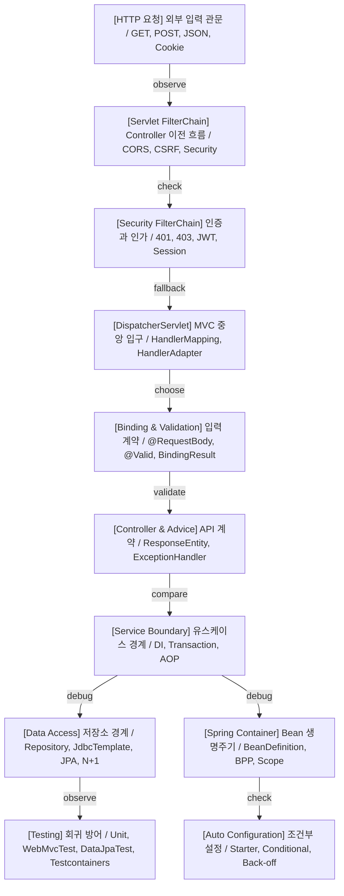

>[!success] 이 가이드북을 통해 아래 질문들에 답할 수 있게 됩니다.
>- Spring 웹 백엔드에서 문제가 생겼을 때 Controller, Filter, AOP, Transaction, Data Access 중 어디부터 확인해야 하는가?
>- 요청이 Controller에 도착하지 않거나 401, 403, 302, CORS, CSRF 문제가 날 때 어떤 순서로 추적해야 하는가?
>- `@Transactional`, AOP, Method Validation, Security가 기대대로 동작하지 않을 때 공통으로 확인할 프록시 조건은 무엇인가?
>- JSON 바인딩, 검증 실패, 예외 응답, 테스트 실패를 하나의 API 계약 흐름으로 어떻게 연결해야 하는가?
>- Spring Boot 자동 설정과 Bean 등록 문제가 생겼을 때 감이 아니라 어떤 증거로 판단해야 하는가?
>- 학습할 때 압축본과 상세본, 레거시 MVC/Security 문서를 어떤 순서로 다시 찾아가야 하는가?

## 이 가이드북을 쓰는 법

이 문서는 요약본이 아니라 `Blog/posts/Web-Back(Spring)` 폴더 전체를 실제 상황에서 다시 찾아가기 위한 안내서다. 개념을 처음부터 다시 설명하기보다, 지금 마주친 증상이나 설계 질문에서 어떤 문서를 먼저 봐야 하는지 알려주는 지도에 가깝다.

처음 공부한다면 `실전 판단 지도`를 먼저 보고, Case 1에서 학습 순서를 잡은 뒤 각 주제의 압축 정리로 들어간다. 이미 문제를 겪고 있다면 `상황별 빠른 길찾기`에서 자기 상황에 가까운 Case를 고르고, 해당 Case의 `찾아볼 문서`만 다시 읽는다.

상세본은 깊게 파는 문서다. 압축본에서 흐름을 회수한 뒤, 실제 코드 작성이나 디버깅에 들어갈 때 상세본의 `원리`, `실전 팁`, `위험 신호`를 확인한다. 오래된 MVC/Security 문서는 버리지 않고, 새 얕은 구조로 흡수된 개념을 보강하는 레거시 참고 문서로 사용한다.

## 실전 판단 지도

큰 원칙은 단순하다. HTTP 요청 자체가 문제면 Filter와 Security에서 출발한다. Controller method 선택과 입력 변환이 문제면 MVC와 Binding을 본다. 유스케이스 일관성이 문제면 Service 경계, Transaction, Data Access를 본다. Bean이 없거나 설정이 의심되면 Container와 Auto Configuration에서 증거를 모은다.

## 상황별 실전 가이드

### Case 1. Spring 웹 백엔드를 처음부터 다시 정리한다

#### 상황
- 문서가 많아졌고, 무엇부터 다시 읽어야 하는지 흐름이 흐려졌다.
- 개념을 따로따로 아는 것 같지만 요청, Bean, 보안, 트랜잭션, 테스트가 한 장면으로 연결되지 않는다.

#### 관찰할 증거 또는 확인할 단서
- `DispatcherServlet`, `SecurityFilterChain`, `ApplicationContext`, `@Transactional`을 각각 설명할 수 있지만 서로의 위치를 이어 말하기 어렵다.
- 압축본은 읽었지만 상세본을 언제 다시 봐야 하는지 기준이 없다.
- 레거시 MVC 문서를 새 구조와 어떻게 연결할지 애매하다.

#### 먼저 생각해보기
- 지금 필요한 것은 암기인가, 실제 문제 해결 흐름인가?
- 요청 흐름, 객체 생성 흐름, 데이터 일관성 흐름 중 어느 축이 가장 약한가?
- 압축본에서 빠르게 회수할 내용과 상세본에서 깊게 확인할 내용을 나누고 있는가?

#### 찾아볼 문서
- [[00. 학습 문서 개선 기준|학습 문서 개선 기준]]: 이 폴더의 압축본/상세본 사용 규칙을 잡는다.
- [[07. Spring MVC 요청 처리 흐름/00. Spring MVC 요청 처리 흐름 압축 정리|Spring MVC 요청 처리 흐름 압축 정리]]: HTTP 요청이 Controller까지 가는 큰 축을 잡는다.
- [[04. IoC DI Bean/00. IoC DI Bean 압축 정리|IoC DI Bean 압축 정리]]: Spring 기능이 Bean을 기준으로 동작한다는 출발점을 잡는다.
- [[11. Transaction/00. Transaction 압축 정리|Transaction 압축 정리]]: Service 유스케이스 경계를 데이터 일관성과 연결한다.
- [[16. Testing/00. Testing 압축 정리|Testing 압축 정리]]: 학습한 개념을 테스트 전략으로 되돌린다.

#### 정리
- 처음에는 AOP부터 깊게 들어가지 말고, 요청이 들어오고 Bean이 협력하며 Service가 트랜잭션을 열고 Repository가 데이터를 다루는 큰 흐름을 먼저 잡는다.
- 그 다음 보안, 검증, 예외 응답, 테스트처럼 실제 API 품질을 결정하는 문서를 연결한다.
- 깊은 원리는 상세본에서 확인하되, 다시 보기 기준은 압축본과 이 가이드북으로 유지한다.

#### 가져갈 한 문장
- Spring 공부는 기능 목록을 외우는 일이 아니라, 요청 하나가 어떤 경계를 지나가는지 복원하는 일이다.

### Case 2. Bean이 없거나 의존성 주입이 실패한다

#### 상황
- 애플리케이션 시작 중 `NoSuchBeanDefinitionException`, `NoUniqueBeanDefinitionException`, 순환 참조 오류가 난다.
- 테스트에서는 되는데 실제 실행에서 Bean이 없거나, 반대로 실제 실행에서는 되는데 slice 테스트에서 Bean이 빠진다.

#### 관찰할 증거 또는 확인할 단서
- 생성자 주입 파라미터가 많아지고, `@Qualifier`가 여기저기 늘어난다.
- 같은 타입 Bean 후보가 여러 개다.
- `@ComponentScan` 범위 밖에 클래스가 있거나, `@Bean` 등록이 특정 profile에서만 켜진다.
- 시작 로그에는 자동 설정이 동작한 것 같지만 원하는 Bean이 없다.

#### 먼저 생각해보기
- 이 객체는 Spring이 관리해야 하는 Bean인가, 직접 생성해도 되는 순수 객체인가?
- Bean 등록 실패인가, 후보 선택 실패인가, 자동 설정 조건 실패인가?
- 생성자 주입이 드러낸 순환 참조를 우회할 문제로 보는가, 설계를 나눌 신호로 보는가?

#### 찾아볼 문서
- [[04. IoC DI Bean/01. IoC Container와 Bean|IoC Container와 Bean]]: Bean과 일반 객체의 경계를 확인한다.
- [[04. IoC DI Bean/02. 의존성 주입과 생성자 주입|의존성 주입과 생성자 주입]]: 필수 의존성과 후보 선택 기준을 확인한다.
- [[04. IoC DI Bean/03. Bean 등록 방식과 Component Scan|Bean 등록 방식과 Component Scan]]: 스캔과 Java 설정 등록 방식을 비교한다.
- [[06. Spring Container와 Bean 생명주기/01. Container 부팅과 BeanDefinition|Container 부팅과 BeanDefinition]]: 정의 등록과 실제 생성 단계를 나눈다.
- [[13. Spring Boot Auto Configuration/04. Actuator Conditions와 자동 설정 디버깅|Actuator Conditions와 자동 설정 디버깅]]: 자동 설정 조건 결과를 증거로 확인한다.

#### 정리
- Bean 문제는 먼저 “등록되지 않았다”, “여러 후보 중 못 골랐다”, “자동 설정이 물러났다”, “테스트 slice 범위 밖이다”로 나눈다.
- 생성자 주입 오류는 불편하지만 빠른 실패다. 누락 의존성, 순환 참조, 책임 과다를 시작 시점에 드러낸다.
- 자동 설정이 개입된 Bean은 component scan만 보지 말고 classpath, property, back-off 조건을 함께 확인한다.

#### 가져갈 한 문장
- Bean 오류는 스프링이 변덕을 부린 것이 아니라, 객체 그래프의 빈칸이나 충돌을 시작 시점에 보여주는 신호다.

### Case 3. Spring Boot 자동 설정이 기대대로 동작하지 않는다

#### 상황
- Starter를 추가했는데 기대한 기능이 켜지지 않는다.
- 내가 만든 Bean 때문에 Boot 기본 Bean이 사라졌거나, 반대로 기본 Bean이 계속 남아 있다.
- 설정 파일을 바꿨는데 실제 값이 다르게 적용된다.

#### 관찰할 증거 또는 확인할 단서
- `--debug` conditions report에서 관련 auto configuration이 negative match다.
- `@ConditionalOnMissingBean` 조건이 예상과 다르게 평가된다.
- 환경 변수나 command line 인자가 `application.yml` 값을 덮어쓴다.
- profile 조합이 많아 실제 운영 값이 보이지 않는다.

#### 먼저 생각해보기
- 이 기능은 직접 등록한 Bean인가, Boot 자동 설정이 만든 Bean인가?
- 조건이 안 맞은 것인가, 사용자 Bean 때문에 back-off된 것인가?
- 설정 값 충돌은 파일 문제가 아니라 property source 우선순위 문제일 수 있는가?

#### 찾아볼 문서
- [[13. Spring Boot Auto Configuration/01. Starter와 Auto Configuration 동작|Starter와 Auto Configuration 동작]]: starter와 자동 설정 후보 로딩을 확인한다.
- [[13. Spring Boot Auto Configuration/02. Conditional과 Back Off|Conditional과 Back Off]]: 조건부 Bean 등록과 사용자 Bean 우선 원칙을 확인한다.
- [[13. Spring Boot Auto Configuration/03. Configuration Properties와 Profile|Configuration Properties와 Profile]]: 설정 바인딩과 profile 위험을 확인한다.
- [[13. Spring Boot Auto Configuration/04. Actuator Conditions와 자동 설정 디버깅|Actuator Conditions와 자동 설정 디버깅]]: conditions report를 읽는 순서를 확인한다.

#### 정리
- 자동 설정 문제는 “왜 생겼는가”와 “왜 생기지 않았는가”를 조건으로 설명하는 문제다.
- exclude는 마지막 선택지에 가깝다. 먼저 property 조절 지점, 사용자 Bean 제공, configurer 확장 지점을 찾는다.
- 운영 설정은 profile 이름보다 실제 Environment에 들어간 값을 기준으로 확인한다.

#### 가져갈 한 문장
- Boot 자동 설정은 감으로 끄는 대상이 아니라 조건 평가 결과로 읽는 설정 시스템이다.

### Case 4. 요청이 Controller에 도착하지 않는다

#### 상황
- Controller breakpoint가 걸리지 않는다.
- API 호출 결과가 401, 403, 302, CORS 오류, CSRF 403으로 나온다.
- URL은 맞는 것 같은데 요청이 어디에서 멈췄는지 모르겠다.

#### 관찰할 증거 또는 확인할 단서
- 브라우저 network tab에는 preflight 요청이 보인다.
- API인데 로그인 페이지로 redirect된다.
- Security debug 로그에 필터 체인 매칭 정보가 있다.
- Controller log는 없지만 Filter log는 남는다.

#### 먼저 생각해보기
- 요청이 DispatcherServlet까지 도달했는가?
- 인증 실패인가, 권한 부족인가, CORS/CSRF 같은 브라우저 보안 흐름인가?
- request matcher와 실제 Controller mapping이 같은 URL과 HTTP method를 바라보는가?

#### 찾아볼 문서
- [[14. Spring Security/01. Security FilterChain과 Controller 이전 흐름|Security FilterChain과 Controller 이전 흐름]]: Controller 이전 흐름과 보안 필터를 확인한다.
- [[15. Filter Interceptor AOP/02. Servlet Filter와 Security FilterChain|Servlet Filter와 Security FilterChain]]: Filter 중단과 `chain.doFilter()` 의미를 확인한다.
- [[07. Spring MVC 요청 처리 흐름/01. DispatcherServlet과 Front Controller|DispatcherServlet과 Front Controller]]: MVC 입구까지 도달했는지 확인한다.
- [[03.Security,JWT,Session/1.  클라이언트 요청은 Controller로 바로 가지 않고, Servlet Container와 FilterChain을 먼저 지나간다.|FilterChain 1강 레거시 문서]]: 401/403/302/CORS 증상을 요청 흐름으로 해석한다.

#### 정리
- Controller가 실행되지 않았다면 Controller 코드보다 앞단을 먼저 본다.
- FilterChain, SecurityFilterChain, DispatcherServlet, HandlerMapping 순서로 요청 위치를 좁힌다.
- 401과 403만 보지 말고 302, CORS, CSRF, 404, 405까지 함께 해석해야 요청이 멈춘 위치가 선명해진다.

#### 가져갈 한 문장
- Controller breakpoint가 조용하면, 문제도 Controller 안에 없을 가능성이 높다.

### Case 5. Controller 매핑과 요청 데이터 바인딩이 이상하다

#### 상황
- URL은 맞는 것 같은데 404 또는 405가 난다.
- query parameter, path variable, form 데이터, JSON body가 DTO에 예상대로 들어오지 않는다.
- `Content-Type`이나 `Accept`를 바꿨더니 400, 406, 415가 난다.

#### 관찰할 증거 또는 확인할 단서
- `@RequestBody` 없이 JSON DTO 바인딩을 기대하고 있다.
- `@ModelAttribute`와 JSON body 변환을 혼동한다.
- 숫자나 날짜 변환 실패가 검증 실패처럼 보인다.
- `@Controller`에서 문자열 반환이 JSON이 아니라 view name으로 해석된다.

#### 먼저 생각해보기
- 이 값은 URL 경로, query/form parameter, request body, cookie, header 중 어디에서 오는가?
- 실패가 HandlerMapping 단계인가, HandlerMethodArgumentResolver 단계인가, HttpMessageConverter 단계인가?
- 요청 body 형식과 응답 형식 요구를 `Content-Type`과 `Accept`로 나누어 보고 있는가?

#### 찾아볼 문서
- [[08. HTTP 요청 응답 바인딩/01. RequestMapping과 Handler Method|RequestMapping과 Handler Method]]: URL, method, params, consumes, produces 조건을 확인한다.
- [[08. HTTP 요청 응답 바인딩/02. RequestParam PathVariable ModelAttribute|RequestParam PathVariable ModelAttribute]]: parameter 계열 바인딩을 확인한다.
- [[08. HTTP 요청 응답 바인딩/03. RequestBody와 HttpMessageConverter|RequestBody와 HttpMessageConverter]]: JSON body와 converter 문제를 확인한다.
- [[08. HTTP 요청 응답 바인딩/04. ResponseBody와 ResponseEntity|ResponseBody와 ResponseEntity]]: 반환값 해석과 응답 DTO를 확인한다.
- [[02. MVC/00. 통합 목차|Spring MVC 통합 목차]]: 레거시 MVC 바인딩, redirect, file upload, MockMvc 세부 문서로 이동한다.

#### 정리
- 요청 데이터 문제는 먼저 데이터의 위치를 분류한다.
- JSON body는 MessageConverter, query/form/path 값은 argument resolver와 binder 흐름을 본다.
- 응답 문제는 view rendering인지 response body writing인지부터 나누어야 한다.

#### 가져갈 한 문장
- 바인딩 오류를 줄이는 첫 질문은 “이 값은 HTTP의 어느 칸에 들어 있었는가?”다.

### Case 6. JSON 응답, View 응답, 에러 응답이 뒤섞인다

#### 상황
- API 요청인데 HTML 오류 페이지나 Whitelabel Error Page가 보인다.
- 정상 응답은 JSON인데 예외 응답 형식이 Controller마다 다르다.
- `@ControllerAdvice`가 있는데도 일부 예외는 Boot 기본 에러 응답으로 떨어진다.

#### 관찰할 증거 또는 확인할 단서
- `Accept` header, `produces`, browser 요청 여부에 따라 응답 형식이 달라진다.
- Controller 내부 `@ExceptionHandler`와 전역 Advice가 함께 있다.
- 검증 실패, 인증 실패, 비즈니스 예외, 시스템 예외의 응답 DTO가 다르다.
- 내부 stacktrace나 SQL 메시지가 외부 응답에 섞인다.

#### 먼저 생각해보기
- 이 실패는 애플리케이션이 의도한 예외인가, 마지막 방어선까지 간 미처리 예외인가?
- API 오류 계약은 `ProblemDetail`로 갈 것인가, 조직 표준 DTO로 갈 것인가?
- 상태 코드와 애플리케이션 오류 코드를 분리하고 있는가?

#### 찾아볼 문서
- [[10. Exception Handling/01. 예외 처리 흐름과 우선순위|예외 처리 흐름과 우선순위]]: 예외가 어느 계층에서 잡히는지 확인한다.
- [[10. Exception Handling/02. ExceptionHandler와 ControllerAdvice|ExceptionHandler와 ControllerAdvice]]: handler 범위와 우선순위를 확인한다.
- [[10. Exception Handling/03. BasicErrorController와 ErrorAttributes|BasicErrorController와 ErrorAttributes]]: Boot 기본 에러 경로를 확인한다.
- [[10. Exception Handling/04. API 에러 응답 설계|API 에러 응답 설계]]: 상태 코드, 오류 코드, 메시지, 상세 정보를 나눈다.
- [[07. Spring MVC 요청 처리 흐름/04. ViewResolver와 MessageConverter|ViewResolver와 MessageConverter]]: view와 body 응답 흐름을 구분한다.

#### 정리
- 예외 처리는 실패를 숨기는 기능이 아니라 실패를 예측 가능한 API 계약으로 바꾸는 기능이다.
- Controller 가까운 예외, 전역 Advice, Boot 기본 에러 처리의 순서를 테스트로 고정한다.
- 클라이언트가 의존할 값은 메시지보다 안정적인 오류 코드다.

#### 가져갈 한 문장
- 좋은 에러 응답은 친절한 문장이 아니라, 클라이언트가 다음 행동을 정할 수 있는 계약이다.

### Case 7. 검증 실패를 어디에서 어떻게 처리할지 정한다

#### 상황
- 요청 DTO에 Bean Validation을 붙였지만 서비스나 도메인 규칙까지 모두 해결되는 것처럼 느껴진다.
- `BindingResult` 위치가 맞지 않아 예외 처리 흐름으로 넘어간다.
- API 검증 오류 응답이 필드마다 일관되지 않다.

#### 관찰할 증거 또는 확인할 단서
- 타입 변환 실패와 제약 조건 실패가 같은 오류 코드로 처리된다.
- `@Valid`만 붙이고 `@NotNull`, `@NotBlank`, `@Size` 같은 실제 constraint가 빠져 있다.
- Service method validation이 self-invocation 때문에 적용되지 않는다.
- Controller마다 검증 오류 응답을 직접 만든다.

#### 먼저 생각해보기
- HTTP 입력 계약, 유스케이스 진입 조건, 도메인 불변식을 구분하고 있는가?
- 실패가 바인딩 실패인가, Bean Validation 실패인가, method validation 실패인가?
- 검증 오류를 화면에서 직접 처리할 것인가, API 공통 Advice로 변환할 것인가?

#### 찾아볼 문서
- [[09. Validation/01. Bean Validation과 제약 조건|Bean Validation과 제약 조건]]: 제약 애너테이션의 역할과 한계를 확인한다.
- [[09. Validation/02. @Valid @Validated와 검증 흐름|@Valid @Validated와 검증 흐름]]: 바인딩 이후 검증 순서를 확인한다.
- [[09. Validation/03. BindingResult와 에러 응답 설계|BindingResult와 에러 응답 설계]]: HTML 폼과 API 오류 응답 차이를 확인한다.
- [[09. Validation/04. Method Validation과 계층별 검증|Method Validation과 계층별 검증]]: Controller와 Service 검증 책임을 나눈다.
- [[10. Exception Handling/04. API 에러 응답 설계|API 에러 응답 설계]]: 검증 실패를 일관된 오류 계약으로 연결한다.

#### 정리
- DTO validation은 외부 입력 모양을 다루는 데 강하지만 모든 비즈니스 결정을 대신하지 않는다.
- Service 검증은 여러 진입점이 있는 유스케이스 계약에 의미가 있고, 도메인 객체는 자기 불변식을 스스로 지켜야 한다.
- API에서는 field error, global error, error code, message를 구조화해 공통 응답으로 만든다.

#### 가져갈 한 문장
- 검증은 한 번 더 막는 기술이 아니라, 어느 경계에서 어떤 계약을 확인하는지 정하는 설계다.

### Case 8. 로그인, 세션, JWT, 쿠키, CSRF를 설계한다

#### 상황
- MVC 직접 로그인 코드를 Spring Security 방식으로 바꾸고 있다.
- 세션, JWT, 토큰, 쿠키를 같은 층위의 선택지처럼 비교하고 있다.
- JWT 로그아웃, refresh token, access token 만료, CSRF 대응 기준이 흐릿하다.

#### 관찰할 증거 또는 확인할 단서
- Controller가 username/password 검증과 권한 구성까지 직접 맡는다.
- JWT를 쿠키에 넣었는데 CSRF를 무조건 끄려고 한다.
- 로그아웃 시 access token을 즉시 무효화해야 하는 요구가 있다.
- 비동기 처리나 새 스레드에서 SecurityContext가 사라진다.

#### 먼저 생각해보기
- 인증 전 `Authentication`과 인증 후 `Authentication`을 구분하고 있는가?
- 세션은 서버 저장 방식, JWT는 토큰 형식, 쿠키는 운반 수단이라는 층위를 나누고 있는가?
- 브라우저가 인증 정보를 자동 전송하는 구조인지 직접 header로 붙이는 구조인지 확인했는가?

#### 찾아볼 문서
- [[14. Spring Security/02. AuthenticationManager Provider SecurityContext|AuthenticationManager Provider SecurityContext]]: 인증 객체, Manager, Provider, Context 책임을 확인한다.
- [[14. Spring Security/03. AuthorizationFilter와 권한 규칙|AuthorizationFilter와 권한 규칙]]: 인증과 인가, 401과 403을 나눈다.
- [[14. Spring Security/04. Session JWT Cookie CSRF 설계|Session JWT Cookie CSRF 설계]]: 세션, JWT, 쿠키, CSRF 층위를 정리한다.
- [[03.Security,JWT,Session/0.  최종목표 전형적인 MVC방식 로그인에서, Security방식 로그인으로 전환하기|Security 전환 최종목표 레거시 문서]]: MVC 직접 로그인에서 Security 구조로 책임이 이동하는 흐름을 확인한다.
- [[03.Security,JWT,Session/세션,JWT는 저장방식이며, 토큰은 값이며, 그리고 쿠키는 운반수단이다.|세션 JWT 쿠키 레거시 문서]]: 세션 방식과 JWT 방식 요청 흐름을 비교한다.

#### 정리
- Controller가 로그인 API를 가질 수는 있지만 인증 검증 책임을 독점하면 구조가 약해진다.
- Security 방식에서는 자격 증명을 `Authentication`으로 표현하고, 검증은 Manager와 Provider로 위임한다.
- JWT는 access token 만료 전 강제 무효화가 필요하면 서버 측 전략까지 설계해야 한다.

#### 가져갈 한 문장
- 보안 설계에서 먼저 나눌 것은 도구 이름이 아니라 인증 상태를 어디에 저장하고 어떻게 운반하는가다.

### Case 9. 401, 403, 권한 규칙, Security matcher를 디버깅한다

#### 상황
- 로그인은 된 것 같은데 보호 API가 403을 반환한다.
- 인증이 없을 때 401이 아니라 302가 나온다.
- 특정 URL만 보안 규칙이 다르게 적용되거나, 여러 `SecurityFilterChain`이 얽힌다.

#### 관찰할 증거 또는 확인할 단서
- `hasRole("USER")`를 썼지만 실제 authority는 `USER` 또는 `ROLE_USER` 중 하나다.
- 넓은 request matcher가 좁은 matcher보다 먼저 선언되어 있다.
- custom JWT filter가 인가 필터보다 뒤에 있어 Authentication이 늦게 만들어진다.
- Security matcher와 MVC mapping의 path pattern 해석이 다르다.

#### 먼저 생각해보기
- 이 응답은 미인증인가, 인증 실패인가, 인증은 됐지만 권한이 부족한 것인가?
- 현재 요청에 매칭된 `SecurityFilterChain`은 하나인가, 예상한 체인인가?
- custom filter가 Authentication을 만든 뒤 AuthorizationFilter가 읽을 수 있는 위치에 있는가?

#### 찾아볼 문서
- [[14. Spring Security/01. Security FilterChain과 Controller 이전 흐름|Security FilterChain과 Controller 이전 흐름]]: 필터 체인 매칭과 Controller 이전 결정을 확인한다.
- [[14. Spring Security/03. AuthorizationFilter와 권한 규칙|AuthorizationFilter와 권한 규칙]]: 권한 규칙, matcher 순서, 401/403을 확인한다.
- [[15. Filter Interceptor AOP/02. Servlet Filter와 Security FilterChain|Servlet Filter와 Security FilterChain]]: custom filter 위치와 중단 응답을 확인한다.
- [[15. Filter Interceptor AOP/03. HandlerInterceptor와 MVC 경계|HandlerInterceptor와 MVC 경계]]: Security를 Interceptor로 대체하려는 위험을 확인한다.

#### 정리
- 401은 인증 정보가 없거나 실패한 상황, 403은 인증은 되었지만 허용되지 않는 상황으로 먼저 나눈다.
- matcher는 순서와 첫 매칭이 중요하다. 좁은 규칙을 먼저 두고 넓은 규칙은 뒤로 보낸다.
- 인증 정보를 만드는 필터는 인가 판단보다 앞에 있어야 한다.

#### 가져갈 한 문장
- 보안 디버깅은 “누가 막았나”보다 “어느 필터가 어떤 인증 상태로 판단했나”를 묻는 쪽이 빠르다.

### Case 10. 공통 처리를 Filter, Interceptor, AOP 중 어디에 둘지 고른다

#### 상황
- request id, access log, handler 기반 로깅, service timing, 감사 로그, 응답 body 가공 같은 요구가 생겼다.
- 공통 처리니까 전부 AOP로 빼면 될 것 같기도 하고, 요청 전후니까 Interceptor가 맞는 것 같기도 하다.

#### 관찰할 증거 또는 확인할 단서
- HTTP header, raw body, response status를 직접 다뤄야 한다.
- HandlerMethod의 애너테이션이나 Controller 타입 정보가 필요하다.
- Service method 실행 시간이나 특정 annotation이 붙은 메서드만 측정하고 싶다.
- 같은 로그가 Filter, Interceptor, AOP에서 중복으로 남는다.

#### 먼저 생각해보기
- 필요한 정보가 Servlet request/response인가, MVC handler인가, Spring Bean method인가?
- 이 처리가 Controller에 도달하기 전에 실행되어야 하는가?
- 호출 흐름이 숨겨져도 디버깅 가능한 수준으로 범위를 좁혔는가?

#### 찾아볼 문서
- [[15. Filter Interceptor AOP/00. Filter, Interceptor, AOP 압축 정리|Filter, Interceptor, AOP 압축 정리]]: 세 도구의 실행 위치를 비교한다.
- [[15. Filter Interceptor AOP/01. 요청 처리 체인에서 위치 비교|요청 처리 체인에서 위치 비교]]: 요구사항별 선택 기준을 확인한다.
- [[15. Filter Interceptor AOP/03. HandlerInterceptor와 MVC 경계|HandlerInterceptor와 MVC 경계]]: handler 정보가 필요한 공통 처리를 확인한다.
- [[15. Filter Interceptor AOP/04. AOP 프록시와 선택 기준|AOP 프록시와 선택 기준]]: Bean method 경계 정책을 확인한다.
- [[01. AOP/01. AOP 기본 개념|AOP 기본 개념]]: AOP가 잘 맞는 문제와 맞지 않는 문제를 다시 본다.

#### 정리
- HTTP 요청 자체를 감싸면 Filter, Handler 정보가 필요하면 Interceptor, Bean method 정책이면 AOP를 먼저 검토한다.
- 보안은 Interceptor보다 Spring Security FilterChain이 표준 흐름이다.
- 같은 공통 처리를 여러 계층에 중복 배치하지 말고, 관찰하려는 경계를 하나로 정한다.

#### 가져갈 한 문장
- 공통 처리의 도구 선택은 취향이 아니라 필요한 정보와 실행 위치의 문제다.

### Case 11. AOP, Method Validation, `@Transactional`이 적용되지 않는다

#### 상황
- Aspect가 실행되지 않거나, `@Transactional`이 붙은 메서드에서 rollback이 되지 않는다.
- Service method validation이 붙어 있는데 내부 호출에서는 검증이 일어나지 않는다.
- `final`, `private`, 직접 생성 객체, 테스트 객체 때문에 프록시 효과가 사라진다.

#### 관찰할 증거 또는 확인할 단서
- 같은 클래스 내부에서 `this.someMethod()`로 호출한다.
- `new`로 만든 객체를 호출하거나, Spring Bean이 아닌 객체에 애너테이션을 붙였다.
- Pointcut이 너무 넓거나 실제 method signature와 다르다.
- 테스트에서 실제 Spring Bean이 아니라 직접 생성한 객체를 호출한다.

#### 먼저 생각해보기
- 호출자가 Spring이 만든 프록시를 통과하고 있는가?
- 이 애너테이션은 메서드에 붙어 있지만 실제 적용 모델은 프록시 기반인가?
- 문제는 Pointcut 표현식인가, Bean 등록인가, 호출 경로인가?

#### 찾아볼 문서
- [[01. AOP/03. Spring AOP 프록시 동작 원리|Spring AOP 프록시 동작 원리]]: 프록시 생성과 self-invocation을 확인한다.
- [[01. AOP/04. Pointcut 작성 가이드|Pointcut 작성 가이드]]: 적용 범위와 표현식을 확인한다.
- [[01. AOP/05. Advice 타입 비교|Advice 타입 비교]]: 흐름 제어가 필요한 Advice 선택을 확인한다.
- [[11. Transaction/02. @Transactional 프록시와 적용 범위|@Transactional 프록시와 적용 범위]]: 트랜잭션 경계와 호출 경로를 확인한다.
- [[09. Validation/04. Method Validation과 계층별 검증|Method Validation과 계층별 검증]]: method validation의 프록시 조건을 확인한다.

#### 정리
- 프록시 기반 기능은 애너테이션의 위치보다 호출 경로가 중요하다.
- 내부 호출, 직접 생성 객체, private method, final 제약은 기능마다 영향을 다르게 준다.
- 디버깅할 때는 Pointcut만 보지 말고 실제 Bean 타입과 proxy 여부, 호출자가 받은 객체를 확인한다.

#### 가져갈 한 문장
- 프록시 기능이 조용히 빠졌다면, 애너테이션보다 호출 경로를 먼저 의심한다.

### Case 12. 트랜잭션 경계와 rollback 정책을 설계한다

#### 상황
- 주문 생성, 결제 기록, 재고 차감, 알림 발송을 한 메서드에 넣어도 되는지 고민된다.
- checked exception에서 rollback이 안 되거나, 예외를 잡았더니 commit되어 버린다.
- 외부 API 호출을 트랜잭션 안에 두어 lock과 connection 점유 시간이 길어진다.

#### 관찰할 증거 또는 확인할 단서
- Service method가 너무 길고 외부 API, DB 변경, 알림 발송을 모두 포함한다.
- `REQUIRES_NEW`가 실패 격리용으로 자주 등장하지만 전체 일관성이 불분명하다.
- 읽기 전용 조회에 쓰기 트랜잭션이 열리거나, lazy loading 때문에 트랜잭션을 view까지 늘리려 한다.
- commit 이후 실행되어야 할 작업이 rollback과 함께 섞인다.

#### 먼저 생각해보기
- 이 유스케이스에서 반드시 함께 성공하거나 실패해야 하는 데이터 변경은 어디까지인가?
- 예외를 밖으로 던져 rollback하게 할 것인가, 잡되 rollback-only를 표시할 것인가?
- 외부 API 호출은 DB lock을 잡은 상태에서 해야 하는가, commit 이후 이벤트로 분리할 수 있는가?

#### 찾아볼 문서
- [[11. Transaction/01. PlatformTransactionManager와 트랜잭션 추상화|PlatformTransactionManager와 트랜잭션 추상화]]: 기술 독립적 트랜잭션 모델을 확인한다.
- [[11. Transaction/02. @Transactional 프록시와 적용 범위|@Transactional 프록시와 적용 범위]]: 선언적 트랜잭션 적용 조건을 확인한다.
- [[11. Transaction/03. Propagation Isolation Rollback|Propagation Isolation Rollback]]: 전파, 격리, rollback 정책을 확인한다.
- [[11. Transaction/04. 읽기 전용 트랜잭션과 경계 설계|읽기 전용 트랜잭션과 경계 설계]]: 외부 호출과 commit 이후 작업 기준을 확인한다.
- [[12. Data Access/04. JPA 영속성 컨텍스트와 N+1|JPA 영속성 컨텍스트와 N+1]]: lazy loading과 트랜잭션 경계를 연결해 본다.

#### 정리
- 트랜잭션 경계는 Repository의 저장 기능이 아니라 Service 유스케이스의 일관성 경계다.
- 외부 API 호출, 긴 계산, 사용자 대기 시간은 트랜잭션 밖으로 뺄 수 있는지 먼저 본다.
- rollback 정책은 예외 타입, 예외 전파, rollback-only 표시를 함께 설계해야 한다.

#### 가져갈 한 문장
- 트랜잭션은 많이 감쌀수록 안전한 담요가 아니라, 짧고 정확해야 하는 일관성 경계다.

### Case 13. Data Access, Repository, JPA, N+1 문제를 판단한다

#### 상황
- Repository query가 느리거나 N+1 문제가 생긴다.
- `DataIntegrityViolationException` 같은 예외를 어디서 어떻게 처리할지 고민된다.
- JdbcTemplate, Spring Data Repository, JPA를 어떤 기준으로 섞어도 되는지 애매하다.

#### 관찰할 증거 또는 확인할 단서
- 로그에 같은 select가 반복된다.
- 영속성 컨텍스트 밖에서 lazy loading이 터진다.
- Repository가 비즈니스 판단까지 맡고 있다.
- DB 제약 위반을 문자열 메시지로 파싱하려 한다.

#### 먼저 생각해보기
- 지금 문제는 connection과 SQL 실행 문제인가, Repository 추상화 문제인가, JPA fetch plan 문제인가?
- 예외를 복구할 수 있는가, API 오류로 변환할 것인가, 시스템 예외로 흘릴 것인가?
- 조회 화면에 필요한 데이터 shape을 query와 projection으로 드러내고 있는가?

#### 찾아볼 문서
- [[12. Data Access/01. DataSource Connection JdbcTemplate|DataSource Connection JdbcTemplate]]: connection, pool, JdbcTemplate 기준을 확인한다.
- [[12. Data Access/02. DataAccessException과 예외 변환|DataAccessException과 예외 변환]]: persistence 예외 변환과 제약 위반 처리를 확인한다.
- [[12. Data Access/03. Spring Data Repository와 쿼리 메서드|Spring Data Repository와 쿼리 메서드]]: Repository 책임과 query method 한계를 확인한다.
- [[12. Data Access/04. JPA 영속성 컨텍스트와 N+1|JPA 영속성 컨텍스트와 N+1]]: fetch plan, lazy loading, N+1 해결 선택지를 확인한다.
- [[16. Testing/04. SpringBootTest DataJpaTest Testcontainers|SpringBootTest DataJpaTest Testcontainers]]: DB 의존 동작을 테스트로 고정한다.

#### 정리
- Repository는 데이터 접근 계약을 표현하는 곳이지 유스케이스 전체 판단을 숨기는 곳이 아니다.
- N+1은 단순 성능 문제가 아니라 조회 의도와 fetch plan이 코드에 드러나지 않았다는 신호일 수 있다.
- DB 제약 위반은 DataAccessException 계층으로 받고, API 응답은 예외 처리 계층에서 안정적인 코드로 변환한다.

#### 가져갈 한 문장
- 데이터 접근 문제는 쿼리 한 줄보다 조회 의도, 트랜잭션 경계, 예외 계약이 함께 움직인다.

### Case 14. 테스트가 느리거나 실패 원인이 너무 넓다

#### 상황
- 모든 테스트에 `@SpringBootTest`가 붙어 PR 피드백이 느리다.
- WebMvcTest에서 Service Bean이 없거나 Security 때문에 401/403이 난다.
- H2에서는 통과하지만 운영 DB에서는 query가 깨진다.

#### 관찰할 증거 또는 확인할 단서
- test profile, property, mock bean 조합이 테스트마다 다르다.
- context cache hit rate가 낮다.
- Controller test가 Service 내부 분기까지 mock 호출 순서로 검증한다.
- JPA query는 H2에서만 검증하고 실제 dialect 차이를 보지 않는다.

#### 먼저 생각해보기
- 이 테스트는 Spring Context가 필요한가, 순수 객체 테스트로 충분한가?
- Controller HTTP 계약, Repository query, 전체 API 흐름 중 무엇을 검증하려는가?
- mock interaction이 구현 세부를 고정하고 있지는 않은가?

#### 찾아볼 문서
- [[16. Testing/01. 테스트 전략과 Spring TestContext|테스트 전략과 Spring TestContext]]: context caching과 테스트 계층을 확인한다.
- [[16. Testing/02. 단위 테스트와 테스트 더블|단위 테스트와 테스트 더블]]: mock, fake, 결과 검증 기준을 확인한다.
- [[16. Testing/03. WebMvcTest MockMvc와 Controller 테스트|WebMvcTest MockMvc와 Controller 테스트]]: Controller 계약, validation, exception, security test를 확인한다.
- [[16. Testing/04. SpringBootTest DataJpaTest Testcontainers|SpringBootTest DataJpaTest Testcontainers]]: JPA slice와 실제 인프라 검증을 나눈다.
- [[09. Validation/03. BindingResult와 에러 응답 설계|BindingResult와 에러 응답 설계]]: 검증 실패 응답 테스트 기준을 확인한다.

#### 정리
- 테스트 전략은 빠른 피드백과 실제 인프라 검증의 균형이다.
- 단위 테스트는 도메인 규칙과 service 분기를 빠르게 보호하고, slice 테스트는 계층 계약을 좁게 검증하며, 통합 테스트는 wiring과 인프라 계약을 선별해 보호한다.
- 느린 테스트는 장비 문제보다 context 조합이 과도하게 갈라진 문제일 수 있다.

#### 가져갈 한 문장
- 좋은 Spring 테스트는 많이 띄우는 테스트가 아니라, 필요한 만큼만 띄워 자주 돌릴 수 있는 테스트다.

### Case 15. 코드 리뷰와 운영 점검에서 전체 흐름을 훑는다

#### 상황
- 기능 구현은 끝났지만 운영에 내보내기 전에 무엇을 점검해야 할지 정리하고 싶다.
- 코드 리뷰에서 Spring 사용법만 보는 것이 아니라 장애 가능성, 추적 가능성, 테스트 범위를 함께 보고 싶다.

#### 관찰할 증거 또는 확인할 단서
- Controller는 얇지만 예외 응답과 검증 오류 형식이 흔들린다.
- 보안 규칙, CORS, CSRF, JWT 만료, 로그아웃 정책이 문서화되어 있지 않다.
- 트랜잭션 안에서 외부 API를 호출하거나, DB 조회가 N+1을 만든다.
- 테스트가 happy path에 치우쳐 실패 path가 비어 있다.

#### 먼저 생각해보기
- 요청이 들어와서 응답이 나갈 때 관찰 가능한 로그, 오류 코드, trace id가 있는가?
- 입력 검증, 인증, 인가, 유스케이스, 저장소, 테스트가 각자 자기 경계를 지키는가?
- 운영에서 실패했을 때 어떤 문서로 돌아가 원인을 좁힐 수 있는가?

#### 찾아볼 문서
- [[00. 학습 문서 개선 기준|학습 문서 개선 기준]]: 문서 세트의 완료 기준과 회독 기준을 확인한다.
- [[14. Spring Security/00. Spring Security 압축 정리|Spring Security 압축 정리]]: Controller 이전 보안 흐름을 점검한다.
- [[10. Exception Handling/00. Exception Handling 압축 정리|Exception Handling 압축 정리]]: 실패 응답 계약을 점검한다.
- [[11. Transaction/00. Transaction 압축 정리|Transaction 압축 정리]]: 유스케이스 일관성 경계를 점검한다.
- [[16. Testing/00. Testing 압축 정리|Testing 압축 정리]]: 테스트 포트폴리오를 점검한다.

#### 정리
- 운영 점검은 기능이 되는지만 보는 것이 아니라, 실패했을 때 어디에서 멈췄는지 알 수 있는지 확인하는 일이다.
- 리뷰에서는 계층별 책임, 공통 처리 위치, 예외 응답 계약, 트랜잭션 길이, 테스트 범위를 함께 본다.
- 이 가이드북의 Case를 리뷰 체크리스트처럼 사용하면, 구현 코드를 문서 구조와 다시 연결할 수 있다.

#### 가져갈 한 문장
- 운영 가능한 Spring 코드는 성공 흐름뿐 아니라 실패 위치를 설명할 수 있어야 한다.

## 커버리지 지도

| 기존 문서 | 연결된 Case | 역할 |
|---|---:|---|
| [[00. 학습 문서 개선 기준|00. 학습 문서 개선 기준.md]] | Case 1, Case 15 | 문서 구조와 완료 기준 |
| [[01. AOP/00. AOP 압축 정리|01. AOP/00. AOP 압축 정리.md]] | Case 10, Case 11 | AOP 전체 회수 |
| [[01. AOP/01. AOP 기본 개념|01. AOP 기본 개념.md]] | Case 10 | AOP 적용 판단 |
| [[01. AOP/02. AOP 주요 용어|02. AOP 주요 용어.md]] | Case 11 | 프록시 흐름 용어 |
| [[01. AOP/03. Spring AOP 프록시 동작 원리|03. Spring AOP 프록시 동작 원리.md]] | Case 11 | 프록시와 내부 호출 |
| [[01. AOP/04. Pointcut 작성 가이드|04. Pointcut 작성 가이드.md]] | Case 11 | 적용 범위 디버깅 |
| [[01. AOP/05. Advice 타입 비교|05. Advice 타입 비교.md]] | Case 11 | Advice 선택 |
| [[02. MVC/00. 통합 목차|02. MVC/00. 통합 목차.md]] | Case 5 | 레거시 MVC 상세 문서 진입점 |
| [[03.Security,JWT,Session/00. 순서|03.Security,JWT,Session/00. 순서.md]] | Case 8 | Security 학습 순서 |
| [[03.Security,JWT,Session/0.  최종목표 전형적인 MVC방식 로그인에서, Security방식 로그인으로 전환하기|03.Security,JWT,Session/0. 최종목표 문서.md]] | Case 8 | MVC 로그인에서 Security 전환 |
| [[03.Security,JWT,Session/1.  클라이언트 요청은 Controller로 바로 가지 않고, Servlet Container와 FilterChain을 먼저 지나간다.|03.Security,JWT,Session/1. FilterChain 문서.md]] | Case 4 | Controller 이전 요청 흐름 |
| [[03.Security,JWT,Session/세션,JWT는 저장방식이며, 토큰은 값이며, 그리고 쿠키는 운반수단이다.|03.Security,JWT,Session/세션 JWT 쿠키 문서.md]] | Case 8 | 인증 상태 저장과 운반 수단 |
| [[04. IoC DI Bean/00. IoC DI Bean 압축 정리|04. IoC DI Bean/00. IoC DI Bean 압축 정리.md]] | Case 1, Case 2 | Bean과 DI 전체 회수 |
| [[04. IoC DI Bean/01. IoC Container와 Bean|01. IoC Container와 Bean.md]] | Case 2 | Bean 경계 |
| [[04. IoC DI Bean/02. 의존성 주입과 생성자 주입|02. 의존성 주입과 생성자 주입.md]] | Case 2 | 의존성 설계 |
| [[04. IoC DI Bean/03. Bean 등록 방식과 Component Scan|03. Bean 등록 방식과 Component Scan.md]] | Case 2 | Bean 등록 경로 |
| [[04. IoC DI Bean/04. Configuration과 Bean 메서드 프록시|04. Configuration과 Bean 메서드 프록시.md]] | Case 2, Case 11 | 설정 클래스 프록시 |
| [[06. Spring Container와 Bean 생명주기/00. Spring Container와 Bean 생명주기 압축 정리|06. Spring Container와 Bean 생명주기/00. 압축 정리.md]] | Case 2 | 컨테이너 흐름 회수 |
| [[06. Spring Container와 Bean 생명주기/01. Container 부팅과 BeanDefinition|01. Container 부팅과 BeanDefinition.md]] | Case 2 | BeanDefinition 단계 |
| [[06. Spring Container와 Bean 생명주기/02. Bean 생성 초기화 소멸 흐름|02. Bean 생성 초기화 소멸 흐름.md]] | Case 2, Case 15 | 초기화와 소멸 |
| [[06. Spring Container와 Bean 생명주기/03. BeanPostProcessor와 확장 포인트|03. BeanPostProcessor와 확장 포인트.md]] | Case 2, Case 11 | 후처리와 프록시 |
| [[06. Spring Container와 Bean 생명주기/04. Scope와 Lazy 초기화|04. Scope와 Lazy 초기화.md]] | Case 2 | Scope와 생성 시점 |
| [[07. Spring MVC 요청 처리 흐름/00. Spring MVC 요청 처리 흐름 압축 정리|07. Spring MVC 요청 처리 흐름/00. 압축 정리.md]] | Case 1, Case 4 | MVC 요청 흐름 회수 |
| [[07. Spring MVC 요청 처리 흐름/01. DispatcherServlet과 Front Controller|01. DispatcherServlet과 Front Controller.md]] | Case 4 | MVC 중앙 입구 |
| [[07. Spring MVC 요청 처리 흐름/02. HandlerMapping과 HandlerAdapter|02. HandlerMapping과 HandlerAdapter.md]] | Case 5 | Handler 선택과 실행 |
| [[07. Spring MVC 요청 처리 흐름/03. Controller 실행과 Request Response Cycle|03. Controller 실행과 Request Response Cycle.md]] | Case 5, Case 15 | Controller 책임 |
| [[07. Spring MVC 요청 처리 흐름/04. ViewResolver와 MessageConverter|04. ViewResolver와 MessageConverter.md]] | Case 6 | View와 body 응답 구분 |
| [[08. HTTP 요청 응답 바인딩/00. HTTP 요청 응답 바인딩 압축 정리|08. HTTP 요청 응답 바인딩/00. 압축 정리.md]] | Case 5 | 바인딩 전체 회수 |
| [[08. HTTP 요청 응답 바인딩/01. RequestMapping과 Handler Method|01. RequestMapping과 Handler Method.md]] | Case 5 | 매핑 조건 |
| [[08. HTTP 요청 응답 바인딩/02. RequestParam PathVariable ModelAttribute|02. RequestParam PathVariable ModelAttribute.md]] | Case 5 | parameter 계열 바인딩 |
| [[08. HTTP 요청 응답 바인딩/03. RequestBody와 HttpMessageConverter|03. RequestBody와 HttpMessageConverter.md]] | Case 5 | JSON body 변환 |
| [[08. HTTP 요청 응답 바인딩/04. ResponseBody와 ResponseEntity|04. ResponseBody와 ResponseEntity.md]] | Case 5, Case 6 | 응답 body와 status |
| [[09. Validation/00. Validation 압축 정리|09. Validation/00. Validation 압축 정리.md]] | Case 7 | 검증 전체 회수 |
| [[09. Validation/01. Bean Validation과 제약 조건|01. Bean Validation과 제약 조건.md]] | Case 7 | 제약 조건 |
| [[09. Validation/02. @Valid @Validated와 검증 흐름|02. @Valid @Validated와 검증 흐름.md]] | Case 7 | MVC 검증 흐름 |
| [[09. Validation/03. BindingResult와 에러 응답 설계|03. BindingResult와 에러 응답 설계.md]] | Case 7, Case 14 | 검증 오류 응답 |
| [[09. Validation/04. Method Validation과 계층별 검증|04. Method Validation과 계층별 검증.md]] | Case 7, Case 11 | 계층별 검증과 프록시 |
| [[10. Exception Handling/00. Exception Handling 압축 정리|10. Exception Handling/00. 압축 정리.md]] | Case 6, Case 15 | 예외 처리 전체 회수 |
| [[10. Exception Handling/01. 예외 처리 흐름과 우선순위|01. 예외 처리 흐름과 우선순위.md]] | Case 6 | 예외 처리 순서 |
| [[10. Exception Handling/02. ExceptionHandler와 ControllerAdvice|02. ExceptionHandler와 ControllerAdvice.md]] | Case 6 | 공통 예외 처리 |
| [[10. Exception Handling/03. BasicErrorController와 ErrorAttributes|03. BasicErrorController와 ErrorAttributes.md]] | Case 6 | Boot 기본 에러 |
| [[10. Exception Handling/04. API 에러 응답 설계|04. API 에러 응답 설계.md]] | Case 6, Case 7 | API 오류 계약 |
| [[11. Transaction/00. Transaction 압축 정리|11. Transaction/00. Transaction 압축 정리.md]] | Case 1, Case 12, Case 15 | 트랜잭션 전체 회수 |
| [[11. Transaction/01. PlatformTransactionManager와 트랜잭션 추상화|01. PlatformTransactionManager와 트랜잭션 추상화.md]] | Case 12 | 트랜잭션 추상화 |
| [[11. Transaction/02. @Transactional 프록시와 적용 범위|02. @Transactional 프록시와 적용 범위.md]] | Case 11, Case 12 | 선언적 트랜잭션 적용 |
| [[11. Transaction/03. Propagation Isolation Rollback|03. Propagation Isolation Rollback.md]] | Case 12 | 전파, 격리, rollback |
| [[11. Transaction/04. 읽기 전용 트랜잭션과 경계 설계|04. 읽기 전용 트랜잭션과 경계 설계.md]] | Case 12 | 경계와 외부 호출 |
| [[12. Data Access/00. Data Access 압축 정리|12. Data Access/00. Data Access 압축 정리.md]] | Case 13 | 데이터 접근 전체 회수 |
| [[12. Data Access/01. DataSource Connection JdbcTemplate|01. DataSource Connection JdbcTemplate.md]] | Case 13 | Connection과 JDBC |
| [[12. Data Access/02. DataAccessException과 예외 변환|02. DataAccessException과 예외 변환.md]] | Case 13 | 예외 변환 |
| [[12. Data Access/03. Spring Data Repository와 쿼리 메서드|03. Spring Data Repository와 쿼리 메서드.md]] | Case 13 | Repository 책임 |
| [[12. Data Access/04. JPA 영속성 컨텍스트와 N+1|04. JPA 영속성 컨텍스트와 N+1.md]] | Case 12, Case 13 | JPA와 N+1 |
| [[13. Spring Boot Auto Configuration/00. Spring Boot Auto Configuration 압축 정리|13. Spring Boot Auto Configuration/00. 압축 정리.md]] | Case 3 | 자동 설정 전체 회수 |
| [[13. Spring Boot Auto Configuration/01. Starter와 Auto Configuration 동작|01. Starter와 Auto Configuration 동작.md]] | Case 3 | starter와 자동 설정 |
| [[13. Spring Boot Auto Configuration/02. Conditional과 Back Off|02. Conditional과 Back Off.md]] | Case 3 | 조건과 back-off |
| [[13. Spring Boot Auto Configuration/03. Configuration Properties와 Profile|03. Configuration Properties와 Profile.md]] | Case 3 | 설정 바인딩과 profile |
| [[13. Spring Boot Auto Configuration/04. Actuator Conditions와 자동 설정 디버깅|04. Actuator Conditions와 자동 설정 디버깅.md]] | Case 2, Case 3 | 자동 설정 진단 |
| [[14. Spring Security/00. Spring Security 압축 정리|14. Spring Security/00. Spring Security 압축 정리.md]] | Case 8, Case 9, Case 15 | Security 전체 회수 |
| [[14. Spring Security/01. Security FilterChain과 Controller 이전 흐름|01. Security FilterChain과 Controller 이전 흐름.md]] | Case 4, Case 9 | 보안 필터 흐름 |
| [[14. Spring Security/02. AuthenticationManager Provider SecurityContext|02. AuthenticationManager Provider SecurityContext.md]] | Case 8 | 인증 구조 |
| [[14. Spring Security/03. AuthorizationFilter와 권한 규칙|03. AuthorizationFilter와 권한 규칙.md]] | Case 8, Case 9 | 인가 규칙 |
| [[14. Spring Security/04. Session JWT Cookie CSRF 설계|04. Session JWT Cookie CSRF 설계.md]] | Case 8 | 세션, JWT, CSRF |
| [[15. Filter Interceptor AOP/00. Filter, Interceptor, AOP 압축 정리|15. Filter Interceptor AOP/00. 압축 정리.md]] | Case 10 | 공통 처리 위치 회수 |
| [[15. Filter Interceptor AOP/01. 요청 처리 체인에서 위치 비교|01. 요청 처리 체인에서 위치 비교.md]] | Case 10 | 위치 비교 |
| [[15. Filter Interceptor AOP/02. Servlet Filter와 Security FilterChain|02. Servlet Filter와 Security FilterChain.md]] | Case 4, Case 9, Case 10 | Filter와 Security |
| [[15. Filter Interceptor AOP/03. HandlerInterceptor와 MVC 경계|03. HandlerInterceptor와 MVC 경계.md]] | Case 9, Case 10 | MVC 확장점 |
| [[15. Filter Interceptor AOP/04. AOP 프록시와 선택 기준|04. AOP 프록시와 선택 기준.md]] | Case 10 | AOP 선택 기준 |
| [[16. Testing/00. Testing 압축 정리|16. Testing/00. Testing 압축 정리.md]] | Case 1, Case 14, Case 15 | 테스트 전체 회수 |
| [[16. Testing/01. 테스트 전략과 Spring TestContext|01. 테스트 전략과 Spring TestContext.md]] | Case 14 | TestContext와 캐싱 |
| [[16. Testing/02. 단위 테스트와 테스트 더블|02. 단위 테스트와 테스트 더블.md]] | Case 14 | 단위 테스트와 더블 |
| [[16. Testing/03. WebMvcTest MockMvc와 Controller 테스트|03. WebMvcTest MockMvc와 Controller 테스트.md]] | Case 14 | Controller slice 테스트 |
| [[16. Testing/04. SpringBootTest DataJpaTest Testcontainers|04. SpringBootTest DataJpaTest Testcontainers.md]] | Case 13, Case 14 | 통합 테스트와 인프라 |

## 상황별 빠른 길찾기

- 처음 공부한다: Case 1, Case 5, Case 12, Case 14
- Bean 등록과 DI가 막힌다: Case 2, Case 3
- Boot 자동 설정이 이상하다: Case 3
- Controller에 요청이 안 닿는다: Case 4, Case 9
- 요청 값이나 JSON 변환이 이상하다: Case 5, Case 7
- 에러 응답 형식을 잡고 싶다: Case 6, Case 7, Case 15
- 로그인, JWT, 세션, 쿠키를 설계한다: Case 8, Case 9
- 공통 처리 위치를 고른다: Case 10, Case 11
- AOP나 `@Transactional`이 안 먹는다: Case 11, Case 12
- JPA 성능과 Repository 책임을 점검한다: Case 13
- 테스트가 느리거나 범위가 넓다: Case 14
- 배포 전 코드 리뷰 체크가 필요하다: Case 15

## 실전 체크리스트

- 요청이 Controller에 도달하지 않으면 Security FilterChain, Servlet Filter, DispatcherServlet 순서로 위치를 좁혔는가?
- 401과 403을 인증 실패와 권한 부족으로 구분하고, 302, CORS, CSRF, 404, 405를 함께 확인했는가?
- Controller 입력은 path, query/form, body, cookie, header 중 어디에서 오는지 먼저 분류했는가?
- JSON 요청에는 `Content-Type`, JSON 응답에는 `Accept`와 message converter 흐름을 구분했는가?
- 검증 규칙을 HTTP 입력 DTO, Service 진입 조건, 도메인 불변식, DB 제약으로 나누었는가?
- API 에러 응답에 HTTP status, 안정적인 error code, message, field errors, trace id를 역할별로 분리했는가?
- 공통 처리는 Filter, Interceptor, AOP 중 필요한 실행 위치와 컨텍스트에 맞게 골랐는가?
- AOP, Method Validation, `@Transactional`이 실제 Spring Bean 프록시를 통과하는 호출에서 실행되는지 확인했는가?
- 트랜잭션 경계가 Service 유스케이스의 일관성 경계와 맞고, 외부 API 호출이 불필요하게 포함되지 않았는가?
- Data Access 예외는 persistence 계층에서 변환되고, Web 계층에서 안정적인 API 오류 코드로 매핑되는가?
- JPA 조회에는 필요한 fetch plan이 드러나 있고, N+1을 로그와 테스트로 확인했는가?
- Boot 자동 설정 문제는 classpath, property, existing Bean, back-off, conditions report 순서로 확인했는가?
- 테스트는 단위, slice, 통합 테스트로 목적이 나뉘고, 모든 것을 `@SpringBootTest`로 처리하지 않는가?
- WebMvcTest에서 validation, exception advice, security 조건을 명시적으로 검증했는가?
- 운영 장애 시 요청 id, error code, 로그, test coverage를 통해 어느 경계에서 실패했는지 되짚을 수 있는가?

## 흔한 오해

- Spring 기능은 애너테이션만 붙이면 어디서나 적용된다고 생각하기 쉽다. 실제로는 Bean 등록, 프록시 통과, 호출 경로, 적용 범위가 함께 맞아야 한다.
- Controller가 웹 요청의 첫 도착지라고 생각하기 쉽다. 실제 요청은 Servlet Container와 FilterChain을 먼저 지나고, Spring Security는 이 구간에서 응답을 결정할 수 있다.
- `@RequestBody`, `@ModelAttribute`, `@RequestParam`을 모두 DTO 바인딩 도구 정도로만 보기 쉽다. 핵심은 값이 HTTP의 어느 위치에 있는지와 어떤 resolver/converter가 읽는지다.
- 검증 애너테이션을 많이 붙이면 도메인 규칙까지 안전해진다고 생각하기 쉽다. 입력 형식 검증과 도메인 의사결정은 책임이 다르다.
- 예외를 모두 잡으면 안정적이라고 생각하기 쉽다. 복구 가능하거나 계약으로 바꿀 예외와 마지막 방어선으로 보낼 예외를 구분해야 한다.
- JWT를 쓰면 서버 상태가 완전히 사라진다고 생각하기 쉽다. access token 검증은 stateless할 수 있지만 refresh token, 로그아웃, 탈취 대응에는 서버 측 전략이 필요할 수 있다.
- 트랜잭션을 넓게 잡을수록 안전하다고 생각하기 쉽다. 넓은 경계는 lock, connection, 외부 호출 지연을 키울 수 있다.
- 통합 테스트가 많을수록 품질이 높다고 보기 쉽다. 느리고 넓은 테스트는 자주 실행되지 않고 실패 원인도 흐려질 수 있다.
- Boot 자동 설정이 예상과 다르면 exclude부터 해야 한다고 생각하기 쉽다. 먼저 조건 평가, back-off, property, 사용자 Bean 제공 지점을 확인해야 한다.

## 참고한 기존 문서

- [[00. 학습 문서 개선 기준|학습 문서 개선 기준]]
- [[01. AOP/00. AOP 압축 정리|AOP 압축 정리]]
- [[02. MVC/00. 통합 목차|Spring MVC 통합 목차]]
- [[04. IoC DI Bean/00. IoC DI Bean 압축 정리|IoC DI Bean 압축 정리]]
- [[06. Spring Container와 Bean 생명주기/00. Spring Container와 Bean 생명주기 압축 정리|Spring Container와 Bean 생명주기 압축 정리]]
- [[07. Spring MVC 요청 처리 흐름/00. Spring MVC 요청 처리 흐름 압축 정리|Spring MVC 요청 처리 흐름 압축 정리]]
- [[08. HTTP 요청 응답 바인딩/00. HTTP 요청 응답 바인딩 압축 정리|HTTP 요청 응답 바인딩 압축 정리]]
- [[09. Validation/00. Validation 압축 정리|Validation 압축 정리]]
- [[10. Exception Handling/00. Exception Handling 압축 정리|Exception Handling 압축 정리]]
- [[11. Transaction/00. Transaction 압축 정리|Transaction 압축 정리]]
- [[12. Data Access/00. Data Access 압축 정리|Data Access 압축 정리]]
- [[13. Spring Boot Auto Configuration/00. Spring Boot Auto Configuration 압축 정리|Spring Boot Auto Configuration 압축 정리]]
- [[14. Spring Security/00. Spring Security 압축 정리|Spring Security 압축 정리]]
- [[15. Filter Interceptor AOP/00. Filter, Interceptor, AOP 압축 정리|Filter, Interceptor, AOP 압축 정리]]
- [[16. Testing/00. Testing 압축 정리|Testing 압축 정리]]
- [[03.Security,JWT,Session/0.  최종목표 전형적인 MVC방식 로그인에서, Security방식 로그인으로 전환하기|MVC 로그인에서 Security 방식 전환 레거시 문서]]
- [[03.Security,JWT,Session/1.  클라이언트 요청은 Controller로 바로 가지 않고, Servlet Container와 FilterChain을 먼저 지나간다.|Controller 이전 FilterChain 레거시 문서]]
- [[03.Security,JWT,Session/세션,JWT는 저장방식이며, 토큰은 값이며, 그리고 쿠키는 운반수단이다.|세션 JWT 쿠키 레거시 문서]]
