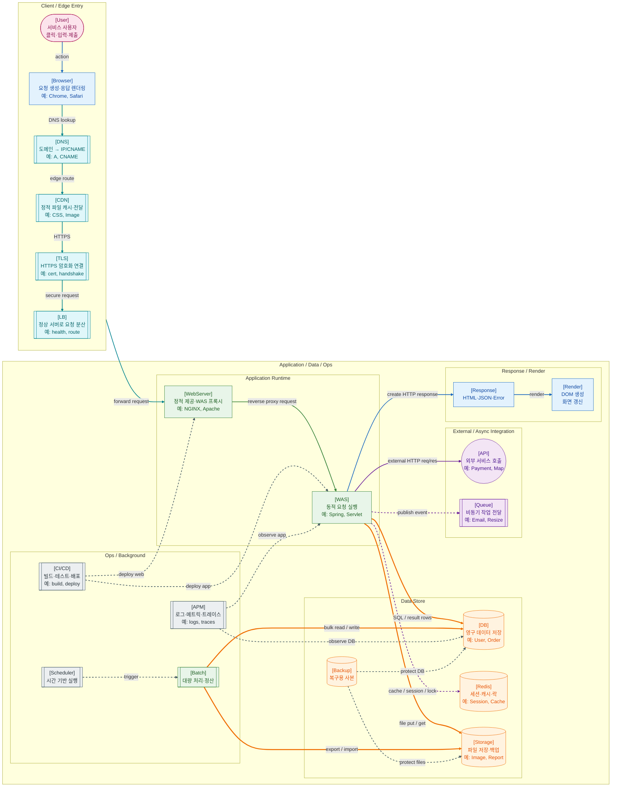

>[!success] 이 지도를 통해 아래 질문들에 답할 수 있게 됩니다.
>- 사용자의 클릭이나 입력은 웹 서비스 내부에서 어떤 큰 흐름으로 이동하는가?
>- DNS, CDN, TLS, LB, Web Server, WAS, DB, Redis는 각각 어느 위치에 놓이는가?
>- DB, Redis, Object Storage, Message Queue는 모두 데이터와 관련되는데, 서로 역할이 어떻게 다른가?
>- CI/CD, Scheduler, Batch, APM, Backup은 사용자 요청 흐름과 어떻게 다르게 움직이는가?

---

---
이 지도는 웹 서비스 전체를 “사용자 요청이 어디서 시작해서 어디를 거쳐 다시 화면으로 돌아오는가”라는 관점에서 압축한 지도다. 세부 기술을 전부 설명하려는 지도가 아니라, 각 기술이 웹 서비스 전체 흐름에서 어느 위치에 놓이는지 잡아주는 상위 지도라고 보면 된다.

웹 서비스의 기본 흐름은 사용자의 행위에서 시작된다. 사용자가 브라우저에서 주소를 입력하거나 버튼을 누르면 브라우저는 HTTP 요청을 만든다. HTTP는 클라이언트가 요청을 보내고 서버가 응답을 돌려주는 메시지 기반 프로토콜이며, 브라우저와 서버는 이 요청/응답 단위로 통신한다.

브라우저가 만든 요청은 곧바로 WAS로 가지 않는다. 먼저 도메인을 실제 네트워크 주소로 해석하기 위해 DNS를 거치고, 정적 리소스나 전 세계 사용자 대응을 위해 CDN을 지날 수 있다. HTTPS 요청이라면 TLS로 암호화된 연결을 수립하고, 이후 Load Balancer가 정상 서버 중 하나로 요청을 보낸다.

Web Server는 정적 파일을 직접 내려주거나, 동적 처리가 필요한 요청을 WAS로 전달한다. WAS는 애플리케이션 로직을 실행하는 영역이다. 여기서 Controller, Service, Repository 같은 서버 내부 계층이 동작하고, 필요한 경우 DB, Redis, 외부 API, Object Storage, Message Queue와 연결된다.

DB는 영구 데이터를 저장하고, Redis는 빠른 조회가 필요한 세션·캐시·락 같은 데이터를 다루며, Object Storage는 이미지나 첨부파일처럼 DB에 넣기 부담스러운 파일을 저장한다. Message Queue는 사용자가 기다릴 필요 없는 작업을 비동기로 넘길 때 사용한다. 이 지도에서 DB, Redis, Storage, Queue가 WAS 주변에 붙어 있는 이유는 모두 애플리케이션 처리 중 필요한 데이터 원천이기 때문이다.

CI/CD, Scheduler, Batch, APM, Backup은 사용자 요청 1건의 직접 흐름은 아니다. 그러나 실제 서비스를 운영하려면 반드시 필요하다. CI/CD는 코드를 운영 환경에 배포하고, Scheduler와 Batch는 정해진 시간에 대량 작업을 처리하며, APM은 시스템 상태를 관측하고, Backup은 장애나 실수로부터 데이터를 복구할 수 있게 한다.

이 지도의 핵심은 “웹 서비스는 브라우저와 서버만으로 끝나지 않는다”는 점이다. 사용자의 한 번의 클릭 뒤에는 DNS, CDN, TLS, LB, Web Server, WAS, DB, Redis, 외부 연동, 운영 관측, 배포 체계가 이어져 있다. 이후의 세부 지도들은 이 상위 지도에서 특정 구간만 확대해서 보는 방식이다.

지도에서 실선은 사용자의 동기 요청과 응답 흐름, 굵은 선은 DB나 파일 저장소 같은 주요 데이터 흐름, 점선은 캐시·비동기·운영 흐름을 뜻한다. 전체 지도는 모든 왕복 화살표를 다 넣으면 너무 커지므로 `SQL / result rows`, `external HTTP req/res`, `file put / get`처럼 중요한 왕복 의미를 라벨에 압축했다.

## 이 시리즈를 읽는 순서

처음에는 `1 → 2 → 3 → 4 → 5 → 6 → 7 → 8 → 9` 순서로 읽는 것이 좋다. 먼저 전체 요청 흐름을 잡고, Edge 진입, Spring MVC 내부, 데이터 접근, Redis, 비동기, 배포, 운영, 보안 순서로 확대해보는 흐름이다.

그 다음에는 실무 판단을 위해 `10 HTTP 상태 관리 → 11 DB 정합성 → 12 Queue 신뢰성 → 13 인증/인가 → 14 Docker → 15 Kubernetes → 16 장애 점검 → 17 운영 지표` 순서로 이어가면 된다. 앞부분이 “어디에 무엇이 있는가”라면, 뒷부분은 “문제가 생겼을 때 무엇을 보고 어떻게 선택하는가”에 가깝다.

## 장애가 났을 때 먼저 확인할 것

- 사용자가 실제로 실패를 보는 위치가 Browser, Edge, WAS, DB, Redis, Queue 중 어디인지 먼저 나눈다.
- HTTP status, timeout, DNS 오류, TLS 오류처럼 브라우저나 클라이언트가 받은 증상을 확인한다.
- WAS 로그가 없다면 DNS, CDN, WAF, LB, Web Server 앞단을 먼저 확인한다.
- WAS 로그는 있는데 응답이 느리다면 Thread Pool, DB Connection Pool, 외부 API, Redis 지연을 확인한다.
- 데이터가 틀리다면 DB 트랜잭션, 캐시 무효화, 비동기 작업 누락, 배치 결과를 확인한다.

## 설계할 때 선택 기준

- 사용자 응답에 즉시 필요한 일은 동기 요청 흐름에 둔다.
- 늦게 끝나도 되는 작업은 Queue, Worker, Scheduler, Batch로 분리한다.
- 자주 읽고 짧게 유지해도 되는 데이터는 Redis 후보로 보고, 정합성과 영속성이 중요하면 DB에 둔다.
- 파일 본문은 Object Storage에 두고, DB에는 key와 메타데이터를 두는 구조를 먼저 검토한다.
- 장애가 났을 때 사람이 볼 수 있어야 하는 구간에는 로그, 메트릭, 트레이스를 미리 심는다.

## 운영 중 볼 지표

- 사용자 체감: p95 latency, p99 latency, 4xx rate, 5xx rate, timeout count
- 서버 처리: QPS, active thread count, request queue length, JVM memory, GC time
- 데이터 계층: DB connection pool usage, slow query count, lock wait time, Redis memory usage, cache hit ratio
- 비동기 계층: queue depth, consumer lag, retry count, DLQ count, batch failure count
- 운영 계층: deploy failure count, rollback count, alert count, MTTA, MTTR, backup restore test result

## 흔한 오해

- 웹 서비스는 Browser와 WAS만으로 이루어진 것이 아니다.
- CDN 캐시 응답은 WAS 로그에 남지 않을 수 있다.
- Redis는 DB를 대체하는 저장소가 아니라, 빠른 상태와 보조 흐름에 주로 붙는다.
- CI/CD, APM, Backup은 사용자 요청 흐름 바깥에 있지만 서비스 안정성에는 직접 영향을 준다.
- 운영 지표의 임계치는 절대값으로 외우는 것이 아니라 서비스의 정상 기준선을 먼저 잡고 정해야 한다.

## 실전 체크리스트

- [ ] 사용자의 요청이 어느 구간까지 도달했는지 확인할 수 있는 로그가 있는가?
- [ ] DB, Redis, Queue, Storage의 역할이 서로 섞이지 않았는가?
- [ ] 동기 처리와 비동기 처리의 기준이 문서화되어 있는가?
- [ ] 배포, 장애 대응, 백업 복구 흐름이 사용자 요청 흐름과 별도로 관리되는가?
- [ ] 핵심 지표와 알림 기준이 서비스별로 정의되어 있는가?

## 질문에 대한 답변

1. 사용자의 클릭이나 입력은 웹 서비스 내부에서 어떤 큰 흐름으로 이동하는가?

   사용자의 행위는 `User → Browser → DNS → CDN → TLS → LB → WebServer → WAS` 흐름으로 서버에 도달한다. WAS는 필요한 데이터를 DB, Redis, Storage, External API, Queue와 주고받은 뒤 `Response → Render` 방향으로 브라우저 화면 갱신에 필요한 응답을 만든다. 이 문서에서는 세부 프로토콜보다 “요청이 어느 구역을 지나가는가”를 잡는 것이 핵심이다.

2. DNS, CDN, TLS, LB, Web Server, WAS, DB, Redis는 각각 어느 위치에 놓이는가?

   DNS, CDN, TLS, LB는 애플리케이션 서버 앞의 Edge 진입 구간에 있다. Web Server는 정적 파일을 직접 응답하거나 WAS로 동적 요청을 넘기는 앞단 서버이고, WAS는 실제 애플리케이션 로직을 실행한다. DB와 Redis는 WAS가 처리 중 접근하는 데이터 저장소에 가깝다. DB는 영구 데이터, Redis는 세션·캐시·락처럼 빠르고 짧게 쓰는 데이터를 담당한다.

3. DB, Redis, Object Storage, Message Queue는 모두 데이터와 관련되는데, 서로 역할이 어떻게 다른가?

   DB는 회원, 주문, 권한처럼 정합성과 영속성이 중요한 데이터를 저장한다. Redis는 빠른 읽기와 만료 시간이 중요한 세션, 캐시, 락에 어울린다. Object Storage는 이미지, 첨부파일, 리포트처럼 큰 파일을 저장하고 DB에는 보통 key나 메타데이터만 둔다. Message Queue는 데이터를 영구 조회하기 위한 저장소라기보다, 나중에 처리할 작업 메시지를 Worker에게 넘기는 통로다.

4. CI/CD, Scheduler, Batch, APM, Backup은 사용자 요청 흐름과 어떻게 다르게 움직이는가?

   이들은 사용자의 클릭 한 번에 직접 포함되는 흐름이 아니다. CI/CD는 코드를 운영 환경에 반영하고, Scheduler와 Batch는 정해진 시간에 대량 작업을 실행한다. APM은 WAS, DB, Queue 같은 시스템 상태를 관측하고, Backup은 장애나 실수에 대비해 복구 가능한 사본을 만든다. 그래서 지도에서도 사용자 요청 흐름과 구분되도록 점선 운영 흐름으로 표현했다.

## 관련 상세 문서

- [Web-Front 학습 로드맵](<../Web-Front/00. Web-Front 학습 로드맵.md>)
- [웹 요청 흐름 전체 지도 압축 정리](<../Web-Network/01. 웹 요청 흐름 전체 지도/00. 웹 요청 흐름 전체 지도 압축 정리.md>)
- [Spring MVC 요청 처리 흐름 압축 정리](<../Web-Back(Spring)/07. Spring MVC 요청 처리 흐름/00. Spring MVC 요청 처리 흐름 압축 정리.md>)
- [Database 기본 구조와 백엔드 개발자의 관점 압축 정리](<../Web-Database/01. Database 기본 구조와 백엔드 개발자의 관점/00. Database 기본 구조와 백엔드 개발자의 관점 압축 정리.md>)
- [Web Operations 전체 지도 압축 정리](<../Web-Operations/01. Web Operations 전체 지도/00. Web Operations 전체 지도 압축 정리.md>)
- [System Design 전체 지도 압축 정리](<../System Design/01. System Design 전체 지도/00. System Design 전체 지도 압축 정리.md>)

## 참고한 자료

- [MDN - Overview of HTTP](https://developer.mozilla.org/en-US/docs/Web/HTTP/Guides/Overview)
- [AWS - What is Amazon S3?](https://docs.aws.amazon.com/AmazonS3/latest/userguide/Welcome.html)
- [Redis Docs - Redis data types](https://redis.io/docs/latest/develop/data-types/)
- [RabbitMQ Docs - Queues](https://www.rabbitmq.com/docs/queues)
- [OpenTelemetry Docs - Signals](https://opentelemetry.io/docs/concepts/signals/)
