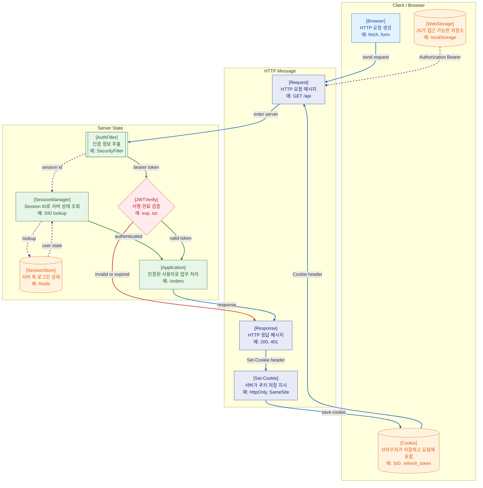

>[!success] 이 지도를 통해 아래 질문들에 답할 수 있게 됩니다.
>- HTTP 요청과 응답은 어떤 정보로 상태를 주고받는가?
>- Cookie, Session, JWT는 각각 어디에 상태를 두는 방식인가?
>- 로그인 장애가 났을 때 Cookie, Session Store, Token 중 무엇을 먼저 확인해야 하는가?
>- Session 방식과 JWT 방식은 언제 선택하는가?

---

---
이 지도는 HTTP 자체는 기본적으로 요청과 응답 단위로 움직이지만, 웹 서비스는 Cookie, Session, Token을 이용해 “이 요청이 누구의 요청인가”를 이어 붙인다는 점을 설명한다.

Cookie는 브라우저가 저장하고 같은 조건의 요청에 자동으로 실을 수 있는 작은 데이터다. 서버는 `Set-Cookie` 응답 헤더로 쿠키 저장을 지시하고, 브라우저는 이후 `Cookie` 요청 헤더에 값을 포함할 수 있다.

Session 방식은 브라우저에는 Session ID만 두고, 실제 로그인 상태는 서버 측 Session Store에 둔다. 이 구조는 서버가 상태를 관리하므로 강제 로그아웃, 권한 변경 반영, 세션 폐기가 비교적 쉽다.

JWT 방식은 서명된 토큰 안에 claim을 담고, 서버가 서명과 만료를 검증해 인증 상태를 판단한다. 서버 저장소 조회를 줄일 수 있지만, 토큰이 유효한 동안 폐기하기 어렵고 저장 위치와 만료 전략을 조심해야 한다.

## 장애가 났을 때 먼저 확인할 것

- 브라우저 요청에 Cookie나 Authorization header가 실제로 포함되는지 확인한다.
- 401이면 인증 정보 없음, 만료, 서명 실패, 세션 조회 실패를 먼저 본다.
- 403이면 인증은 되었지만 권한 정책에서 막혔는지 확인한다.
- Session 방식이면 Session Store 연결, TTL, key prefix, Redis 장애를 확인한다.
- JWT 방식이면 exp, iss, aud, 서명키, 키 회전, 서버 시간 차이를 확인한다.

## 설계할 때 선택 기준

- 같은 도메인 웹 서비스와 서버 렌더링 중심이면 HttpOnly Cookie + Session이 단순하다.
- 모바일 앱, 외부 API, 여러 서비스 간 인증 전달이 필요하면 Token 기반 흐름을 검토한다.
- JWT를 쓰면 access token은 짧게, refresh token은 더 엄격하게 저장하고 회전한다.
- XSS 위험을 줄이려면 민감 토큰을 JavaScript가 읽기 어려운 HttpOnly Cookie에 두는 방식을 검토한다.
- 즉시 폐기와 권한 변경 반영이 중요하면 서버 측 상태나 blacklist/allowlist 전략이 필요하다.

## 운영 중 볼 지표

- login success rate, login failure count, 401 rate, 403 rate
- session lookup latency, session store error count, session TTL 만료 수
- token verification failure count, expired token count, key id mismatch count
- cookie missing count, SameSite/CORS 관련 실패 후보
- refresh token reuse detection count, forced logout count

## 흔한 오해

- HTTP가 stateless라고 해서 웹 서비스가 상태를 가질 수 없다는 뜻은 아니다.
- Cookie는 저장소이고, Session은 서버 측 상태 관리 방식이다.
- JWT는 암호화가 아니라 보통 서명된 토큰이다. 내용은 base64url로 볼 수 있으므로 민감 정보를 넣으면 안 된다.
- localStorage에 토큰을 넣으면 구현은 쉽지만 XSS에 노출될 수 있다.
- CORS 문제와 인증 실패는 브라우저에서는 비슷해 보여도 원인이 다르다.

## 실전 체크리스트

- [ ] Cookie에 HttpOnly, Secure, SameSite가 업무 흐름에 맞게 설정되어 있는가?
- [ ] Session TTL과 로그인 유지 정책이 일치하는가?
- [ ] JWT 만료, 갱신, 폐기, 키 회전 전략이 있는가?
- [ ] 401과 403이 로그와 응답에서 구분되는가?
- [ ] 토큰 저장 위치가 XSS/CSRF 위험을 고려해 선택되었는가?

## 질문에 대한 답변

1. HTTP 요청과 응답은 어떤 정보로 상태를 주고받는가?

   요청은 Method, URL, Header, Body를 가지고 서버로 간다. 응답은 Status, Header, Body를 돌려준다. 로그인 상태처럼 다음 요청에도 이어져야 하는 정보는 Cookie, Authorization header, Session Store, Token 검증을 조합해 연결한다.

2. Cookie, Session, JWT는 각각 어디에 상태를 두는 방식인가?

   Cookie는 브라우저가 저장하는 값이다. Session은 브라우저에는 Session ID를 두고 실제 상태는 서버 저장소에 둔다. JWT는 서명된 토큰 자체에 claim을 담고 서버가 이를 검증하는 방식이다.

3. 로그인 장애가 났을 때 Cookie, Session Store, Token 중 무엇을 먼저 확인해야 하는가?

   먼저 브라우저 요청에 인증 정보가 실렸는지 본다. Cookie나 Authorization header가 없으면 클라이언트 저장·전송 문제다. 값이 있는데 실패하면 Session Store 조회, JWT 서명·만료, 권한 정책을 차례로 확인한다.

4. Session 방식과 JWT 방식은 언제 선택하는가?

   서버가 로그인 상태를 적극적으로 관리하고 폐기해야 하면 Session이 유리하다. 여러 클라이언트와 서비스가 토큰을 주고받아야 하면 JWT가 유리할 수 있다. 다만 JWT도 만료, 폐기, 저장 위치를 함께 설계해야 안전하다.

## 관련 상세 문서

- [HTTP 기본 구조 압축 정리](<../Web-Network/05. HTTP 기본 구조/00. HTTP 기본 구조 압축 정리.md>)
- [HTTP Method Status Code Header 압축 정리](<../Web-Network/06. HTTP Method Status Code Header/00. HTTP Method Status Code Header 압축 정리.md>)
- [Cookie Session SameSite CORS 압축 정리](<../Web-Network/08. Cookie Session SameSite CORS/00. Cookie Session SameSite CORS 압축 정리.md>)
- [Session Cookie JWT Token 압축 정리](<../Web-Security/04. Session Cookie JWT Token/00. Session Cookie JWT Token 압축 정리.md>)
- [Spring Security - Session JWT Cookie CSRF 설계](<../Web-Back(Spring)/14. Spring Security/04. Session JWT Cookie CSRF 설계.md>)
- [세션,JWT는 저장방식이며, 토큰은 값이며, 그리고 쿠키는 운반수단이다.](<../Web-Back(Spring)/03.Security,JWT,Session/세션,JWT는 저장방식이며, 토큰은 값이며, 그리고 쿠키는 운반수단이다..md>)

## 참고한 자료

- [MDN - An overview of HTTP](https://developer.mozilla.org/en-US/docs/Web/HTTP/Guides/Overview)
- [MDN - Using HTTP cookies](https://developer.mozilla.org/en-US/docs/Web/HTTP/Guides/Cookies)
- [MDN - Set-Cookie](https://developer.mozilla.org/en-US/docs/Web/HTTP/Headers/Set-Cookie)
- [RFC 7519 - JSON Web Token](https://www.rfc-editor.org/rfc/rfc7519)
- [OWASP - Session Management Cheat Sheet](https://cheatsheetseries.owasp.org/cheatsheets/Session_Management_Cheat_Sheet.html)
