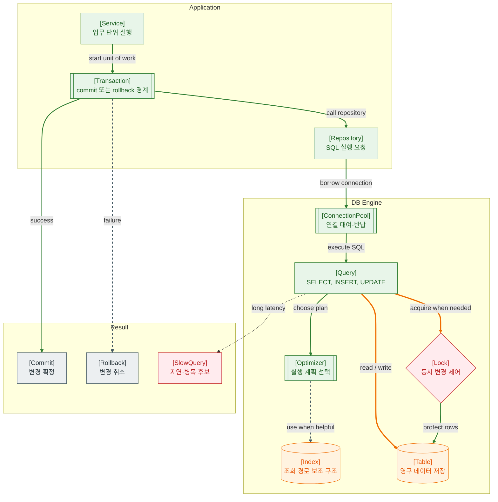

>[!success] 이 지도를 통해 아래 질문들에 답할 수 있게 됩니다.
>- DB 트랜잭션은 어떤 범위의 작업을 하나로 묶는가?
>- 인덱스는 왜 조회를 빠르게 하지만 쓰기 비용을 늘릴 수 있는가?
>- 락과 트랜잭션 격리는 어떤 정합성 문제를 막는가?
>- DB 장애가 났을 때 쿼리, 락, 커넥션 중 무엇을 먼저 확인해야 하는가?

---

---
이 지도는 DB를 단순 저장소가 아니라 정합성, 성능, 동시성을 동시에 다루는 실행 엔진으로 보는 관점이다. Service는 하나의 업무 단위를 시작하고, Transaction은 그 단위가 모두 성공하면 commit, 중간에 실패하면 rollback되도록 경계를 만든다.

인덱스는 테이블 전체를 훑지 않고 필요한 row를 더 빨리 찾게 해주는 보조 구조다. 하지만 인덱스는 쓰기 때 함께 갱신되어야 하므로 너무 많이 만들면 INSERT, UPDATE, DELETE 비용이 늘 수 있다.

락은 여러 요청이 같은 데이터를 동시에 바꾸면서 정합성이 깨지는 일을 줄인다. 트랜잭션 격리 수준은 다른 트랜잭션의 변경을 어느 정도까지 보게 할지 정하는 규칙이다. 격리를 높이면 정합성은 강해질 수 있지만 대기와 충돌 비용도 커질 수 있다.

## 장애가 났을 때 먼저 확인할 것

- DB 접속 실패인지, Connection Pool 고갈인지, 쿼리 지연인지 먼저 나눈다.
- slow query log와 실행 계획에서 full scan, 잘못된 index 선택을 확인한다.
- lock wait, deadlock, long transaction이 있는지 확인한다.
- 최근 배포나 Migration으로 인덱스, 컬럼, 쿼리가 바뀌었는지 확인한다.
- DB CPU, I/O, connection 수, replication lag를 함께 본다.

## 설계할 때 선택 기준

- 하나의 업무 결과가 모두 성공하거나 모두 실패해야 하면 Transaction으로 묶는다.
- 조회 조건, 정렬, 조인에 자주 쓰이는 컬럼은 인덱스 후보로 본다.
- 쓰기가 많은 테이블은 인덱스 추가가 쓰기 비용을 늘리는지 함께 본다.
- 동시 차감, 쿠폰 발급처럼 충돌이 중요한 업무는 락 전략이나 낙관적 락을 검토한다.
- 긴 외부 API 호출은 DB 트랜잭션 안에 오래 두지 않는다.

## 운영 중 볼 지표

- query latency, slow query count, rows examined, index hit ratio
- connection pool active/idle/wait, connection timeout count
- lock wait time, deadlock count, long transaction count
- commit/rollback count, transaction duration
- DB CPU, I/O wait, replication lag, disk usage

## 흔한 오해

- 인덱스는 많을수록 좋은 것이 아니다.
- 트랜잭션이 길수록 안전한 것이 아니라, 오래 잡은 락이 장애를 만들 수 있다.
- DB가 느리다고 항상 DB 서버 성능 문제는 아니다. 애플리케이션의 쿼리와 트랜잭션 경계가 원인일 수 있다.
- 격리 수준을 높이면 모든 문제가 사라지는 것이 아니라 동시성 비용이 커진다.
- Repository 계층이 있다고 자동으로 쿼리 품질이 보장되는 것은 아니다.

## 실전 체크리스트

- [ ] 주요 API의 DB 쿼리 실행 계획을 확인했는가?
- [ ] 트랜잭션 안에 외부 API나 긴 작업이 들어가지 않았는가?
- [ ] 인덱스 추가 전후로 읽기/쓰기 비용을 함께 보았는가?
- [ ] lock wait와 deadlock을 관측할 수 있는가?
- [ ] Connection Pool 크기와 DB max connection이 함께 설계되어 있는가?

## 질문에 대한 답변

1. DB 트랜잭션은 어떤 범위의 작업을 하나로 묶는가?

   트랜잭션은 하나의 업무 단위에서 여러 DB 변경이 모두 성공하거나 모두 취소되도록 묶는 경계다. 주문 생성과 재고 차감처럼 중간 일부만 성공하면 안 되는 흐름에 필요하다.

2. 인덱스는 왜 조회를 빠르게 하지만 쓰기 비용을 늘릴 수 있는가?

   인덱스는 필요한 row를 빨리 찾게 해준다. 하지만 테이블 데이터가 바뀔 때 인덱스도 함께 갱신되어야 하므로 쓰기 작업의 비용과 저장 공간이 늘 수 있다.

3. 락과 트랜잭션 격리는 어떤 정합성 문제를 막는가?

   락은 같은 데이터를 동시에 바꾸는 충돌을 제어한다. 격리 수준은 다른 트랜잭션의 중간 변경을 얼마나 볼지 정한다. 둘 다 동시 요청 속에서도 데이터가 말이 되게 유지되도록 돕는다.

4. DB 장애가 났을 때 쿼리, 락, 커넥션 중 무엇을 먼저 확인해야 하는가?

   먼저 접속 자체가 되는지와 Connection Pool 대기 여부를 본다. 그 다음 slow query와 실행 계획을 확인하고, 마지막으로 lock wait이나 long transaction 때문에 쿼리가 밀리는지 본다.

## 관련 상세 문서

- [Transaction 압축 정리](<../Web-Database/06. Transaction/00. Transaction 압축 정리.md>)
- [Isolation Level Lock Concurrency 압축 정리](<../Web-Database/07. Isolation Level Lock Concurrency/00. Isolation Level Lock Concurrency 압축 정리.md>)
- [Index 압축 정리](<../Web-Database/04. Index/00. Index 압축 정리.md>)
- [Execution Plan Query Optimizer 압축 정리](<../Web-Database/05. Execution Plan Query Optimizer/00. Execution Plan Query Optimizer 압축 정리.md>)
- [Connection Pool Timeout 장애 전파 압축 정리](<../Web-Database/10. Connection Pool Timeout 장애 전파/00. Connection Pool Timeout 장애 전파 압축 정리.md>)
- [Spring Transaction과 DB 연결](<../Web-Database/06. Transaction/04. Spring Transaction과 DB 연결 상세.md>)

## 참고한 자료

- [PostgreSQL Docs - Transaction Isolation](https://www.postgresql.org/docs/current/transaction-iso.html)
- [PostgreSQL Docs - Indexes](https://www.postgresql.org/docs/current/indexes.html)
- [PostgreSQL Docs - Explicit Locking](https://www.postgresql.org/docs/current/explicit-locking.html)
