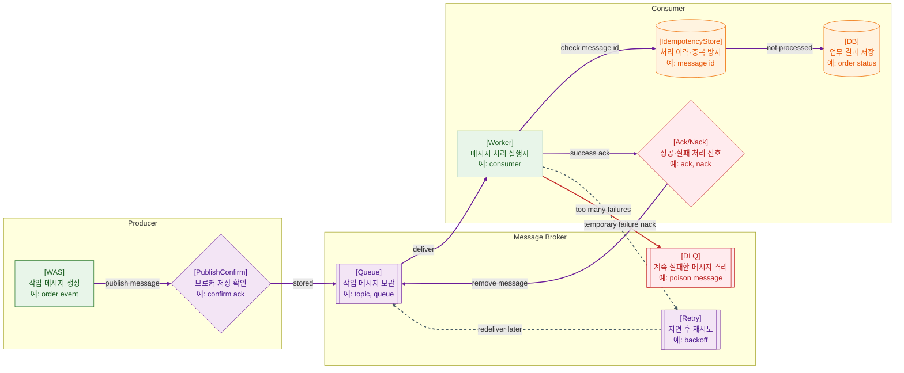

>[!success] 이 지도를 통해 아래 질문들에 답할 수 있게 됩니다.
>- Queue 메시지는 어떻게 성공 처리되거나 다시 처리되는가?
>- Ack, Retry, DLQ는 각각 어떤 실패를 다루는 장치인가?
>- 메시지가 두 번 처리되어도 안전하게 만들려면 무엇이 필요한가?
>- Queue 장애가 났을 때 어떤 지표를 먼저 봐야 하는가?

---

---
이 지도는 Queue를 단순히 “나중에 처리하는 통로”가 아니라 실패를 견디는 실행 모델로 설명한다. Producer는 메시지를 발행하고, Broker는 메시지를 보관하며, Worker는 메시지를 소비해 실제 작업을 수행한다.

Ack는 Worker가 메시지를 성공적으로 처리했다고 Broker에 알려주는 신호다. Ack 전에 Worker가 죽으면 메시지는 다시 전달될 수 있다. 그래서 Queue 기반 시스템에서는 같은 메시지가 두 번 처리될 수 있다는 전제를 두는 편이 안전하다.

Retry는 일시적인 실패를 다시 시도하는 장치다. 외부 API timeout, 일시적인 DB 장애 같은 경우에 유용하다. 하지만 실패 원인이 계속되는데 즉시 재시도하면 장애를 키울 수 있으므로 backoff와 최대 횟수가 필요하다.

DLQ는 계속 실패하는 메시지를 따로 격리하는 장소다. DLQ는 실패를 해결하는 장치가 아니라, 실패 메시지를 잃지 않고 사람이 분석하거나 재처리할 수 있게 만드는 장치다.

## 장애가 났을 때 먼저 확인할 것

- Producer가 메시지를 실제로 발행했는지 publish confirm 또는 발행 로그를 확인한다.
- Queue depth와 unacked message가 증가하는지 확인한다.
- Worker process, consumer count, 처리 시간, 에러 로그를 확인한다.
- retry count와 DLQ count가 급증하는지 확인한다.
- 같은 message id가 여러 번 처리되어 DB 결과가 중복되지 않았는지 확인한다.

## 설계할 때 선택 기준

- 메시지 유실이 치명적이면 durable queue, persistent message, publish confirm을 검토한다.
- 처리 성공 이후에만 ack를 보내는 방식을 기본으로 본다.
- 일시 실패는 retry backoff로 처리하고, 영구 실패는 DLQ로 격리한다.
- 같은 메시지가 여러 번 와도 안전해야 하면 idempotency key와 처리 이력을 둔다.
- 순서가 중요하면 하나의 key 기준으로 소비 순서를 제한하거나 업무 모델을 다시 나눈다.

## 운영 중 볼 지표

- publish rate, publish failure count, confirm latency
- queue depth, ready message count, unacked message count
- consumer count, consumer lag, processing latency
- retry count, retry age, DLQ count
- duplicate detected count, idempotency conflict count

## 흔한 오해

- Queue를 쓰면 정확히 한 번만 처리된다고 생각하기 쉽다.
- Ack는 로그를 남기는 것이 아니라 Broker에게 메시지 제거 가능성을 알려주는 신호다.
- DLQ가 있다고 실패 처리가 끝나는 것은 아니다. 누가 보고 어떻게 재처리할지가 필요하다.
- retry 간격이 짧으면 회복이 빨라지는 것이 아니라 장애 부하가 커질 수 있다.
- 순서 보장과 처리량은 자주 trade-off 관계가 된다.

## 실전 체크리스트

- [ ] 메시지 발행 성공을 확인할 수 있는가?
- [ ] Worker가 성공 후 ack, 실패 후 retry/DLQ를 명확히 처리하는가?
- [ ] 모든 메시지에 idempotency key나 중복 방지 기준이 있는가?
- [ ] DLQ 모니터링과 재처리 절차가 있는가?
- [ ] queue depth와 consumer lag에 대한 초기 경보 후보가 있는가?

## 질문에 대한 답변

1. Queue 메시지는 어떻게 성공 처리되거나 다시 처리되는가?

   Worker가 메시지를 처리한 뒤 ack를 보내면 Broker는 메시지를 제거할 수 있다. Worker가 실패하거나 ack 전에 죽으면 메시지는 다시 전달될 수 있다. 반복 실패하면 retry나 DLQ 흐름으로 이동한다.

2. Ack, Retry, DLQ는 각각 어떤 실패를 다루는 장치인가?

   Ack는 성공 처리를 확정하는 신호다. Retry는 일시 실패를 다시 시도하는 흐름이다. DLQ는 계속 실패하는 메시지를 일반 처리 흐름에서 격리해 분석과 재처리를 가능하게 한다.

3. 메시지가 두 번 처리되어도 안전하게 만들려면 무엇이 필요한가?

   message id나 business key를 기준으로 처리 이력을 남기고, 이미 처리된 메시지는 건너뛰어야 한다. DB unique constraint, idempotency table, 상태 전이 검증을 함께 사용할 수 있다.

4. Queue 장애가 났을 때 어떤 지표를 먼저 봐야 하는가?

   queue depth, unacked message, consumer count, processing latency, retry count, DLQ count를 먼저 본다. 이 지표들이 Producer 문제인지, Worker 문제인지, 외부 의존성 문제인지 방향을 잡아준다.

## 관련 상세 문서

- [Queue Async Event-driven Design 압축 정리](<../System Design/06. Queue Async Event-driven Design/00. Queue Async Event-driven Design 압축 정리.md>)
- [Retry Timeout Idempotency 압축 정리](<../System Design/07. Retry Timeout Idempotency/00. Retry Timeout Idempotency 압축 정리.md>)
- [Kafka Message Queue Event Stream 압축 정리](<../Data Engineering/06. Kafka Message Queue Event Stream/00. Kafka Message Queue Event Stream 압축 정리.md>)
- [Idempotent Consumer 설계 압축 정리](<../Data Engineering/10. Idempotent Consumer 설계/00. Idempotent Consumer 설계 압축 정리.md>)
- [CDC와 Outbox Pattern 압축 정리](<../Data Engineering/07. CDC와 Outbox Pattern/00. CDC와 Outbox Pattern 압축 정리.md>)
- [Retry DLQ Ordering 중복 상세](<../System Design/06. Queue Async Event-driven Design/04. Retry DLQ Ordering 중복 상세.md>)

## 참고한 자료

- [RabbitMQ Docs - Queues](https://www.rabbitmq.com/docs/queues)
- [RabbitMQ Docs - Consumer Acknowledgements](https://www.rabbitmq.com/docs/confirms)
- [RabbitMQ Docs - Dead Letter Exchanges](https://www.rabbitmq.com/docs/dlx)
- [AWS Builders' Library - Making retries safe with idempotent APIs](https://aws.amazon.com/builders-library/making-retries-safe-with-idempotent-APIs/)
