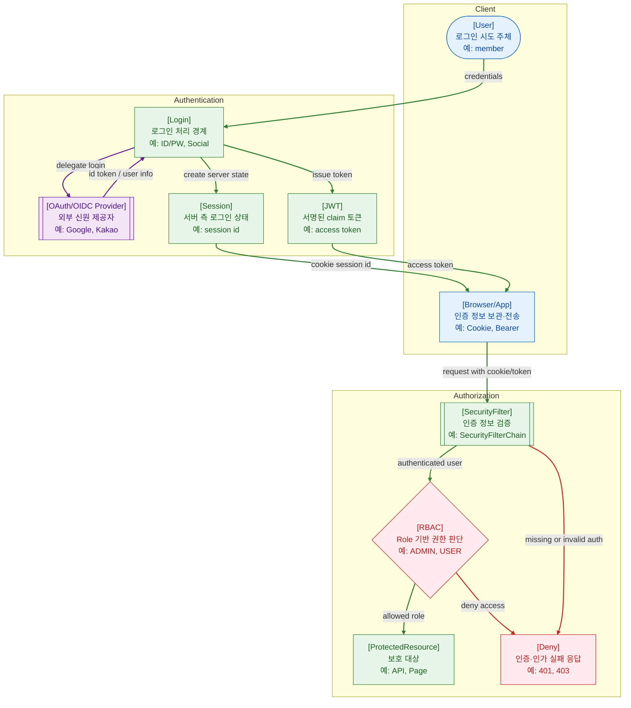

>[!success] 이 지도를 통해 아래 질문들에 답할 수 있게 됩니다.
>- 인증과 인가는 무엇이 다른가?
>- Session, OAuth/OIDC, JWT는 각각 어떤 위치에서 쓰이는가?
>- RBAC는 권한 판단을 어떻게 단순하게 만드는가?
>- 401, 403 장애가 났을 때 무엇을 먼저 확인해야 하는가?

---

---
이 지도는 웹 보안에서 가장 자주 섞이는 인증과 인가를 분리해서 설명한다. 인증은 “이 사용자가 누구인가”를 확인하는 일이고, 인가는 “이 사용자가 이 리소스를 사용할 수 있는가”를 판단하는 일이다.

Session은 서버가 로그인 상태를 저장하고 브라우저가 Session ID를 보내는 방식이다. OAuth는 사용자가 외부 제공자에게 권한을 위임하거나 로그인하게 하는 흐름이고, OIDC는 OAuth 위에서 사용자 신원 정보를 표준적으로 다루는 계층이다.

JWT는 claim을 담은 서명 토큰으로, access token이나 id token 형태로 쓰일 수 있다. JWT를 쓴다고 자동으로 OAuth/OIDC를 쓰는 것은 아니며, OAuth/OIDC를 쓴다고 내부 권한 모델이 자동으로 해결되는 것도 아니다.

RBAC는 사용자에게 role을 부여하고, role이 어떤 작업을 할 수 있는지 매핑하는 방식이다. 작은 서비스에서는 단순한 role로 충분하지만, 조직·소유자·리소스 상태까지 봐야 하면 ABAC 같은 더 세밀한 방식이 필요할 수 있다.

## 장애가 났을 때 먼저 확인할 것

- 401이면 인증 정보가 없거나 유효하지 않은지 확인한다.
- 403이면 인증은 되었지만 role, scope, resource owner 조건에서 막혔는지 확인한다.
- OAuth/OIDC는 redirect URI, client id, scope, issuer, clock skew를 확인한다.
- Session은 Cookie 전송, Session Store 조회, TTL, Redis 장애를 확인한다.
- JWT는 서명키, kid, exp, aud, iss, key rotation을 확인한다.

## 설계할 때 선택 기준

- 내부 웹 서비스는 Session 기반 인증이 운영과 폐기 측면에서 단순할 수 있다.
- 외부 로그인이나 여러 클라이언트 연동이 필요하면 OAuth/OIDC를 검토한다.
- 서비스 간 토큰 전달이 필요하면 JWT access token을 검토하되 짧은 만료를 둔다.
- 역할이 단순하면 RBAC로 시작하고, 리소스 소유자나 속성 조건이 많으면 ABAC를 검토한다.
- 권한 검사는 Controller 일부가 아니라 공통 보안 계층과 도메인 규칙에 함께 둔다.

## 운영 중 볼 지표

- 401 rate, 403 rate, login failure count, logout count
- OAuth callback failure count, token exchange failure count
- JWT verification failure count, expired token count, unknown kid count
- session lookup latency, session store error count
- permission denied by role/scope/resource owner count

## 흔한 오해

- 인증된 사용자는 모든 기능을 쓸 수 있다고 생각하면 안 된다.
- OAuth는 “로그인 기술”로만 이해하면 부족하고, 원래는 권한 위임 흐름이다.
- OIDC와 OAuth는 같지 않다. OIDC는 신원 정보를 다루는 계층을 추가한다.
- JWT는 폐기가 어렵기 때문에 만료와 키 회전 전략이 중요하다.
- RBAC role 이름만 만들고 실제 리소스 소유권을 확인하지 않으면 권한 우회가 생길 수 있다.

## 실전 체크리스트

- [ ] 401과 403의 의미가 API 응답과 로그에서 일관되는가?
- [ ] OAuth/OIDC 설정값이 환경별로 분리되어 있는가?
- [ ] JWT 서명키 회전과 만료 정책이 있는가?
- [ ] role, scope, resource owner 검사가 어디에서 이루어지는지 명확한가?
- [ ] 권한 실패 로그가 민감 정보를 노출하지 않으면서 원인 추적에 충분한가?

## 질문에 대한 답변

1. 인증과 인가는 무엇이 다른가?

   인증은 사용자의 신원을 확인하는 일이다. 인가는 인증된 사용자가 특정 리소스나 기능을 사용할 수 있는지 판단하는 일이다. 로그인 성공은 인증이고, 관리자 페이지 접근 허용은 인가다.

2. Session, OAuth/OIDC, JWT는 각각 어떤 위치에서 쓰이는가?

   Session은 서버 측 로그인 상태 관리에 쓰인다. OAuth/OIDC는 외부 제공자와 로그인·권한 위임을 표준 흐름으로 처리할 때 쓰인다. JWT는 claim을 담은 서명 토큰으로 인증 결과나 접근 권한을 전달하는 데 쓰인다.

3. RBAC는 권한 판단을 어떻게 단순하게 만드는가?

   사용자에게 role을 부여하고, role별로 허용되는 행동을 정의한다. 그러면 매번 사용자별 조건을 흩어 쓰지 않고 `ADMIN`, `USER`, `MANAGER` 같은 역할 기준으로 접근 제어를 관리할 수 있다.

4. 401, 403 장애가 났을 때 무엇을 먼저 확인해야 하는가?

   401은 인증 정보가 없거나 틀렸는지 먼저 본다. 403은 인증은 되었지만 권한이 부족한지 본다. 그 다음 Session, JWT, OAuth/OIDC 설정, role/scope/resource owner 조건을 차례로 확인한다.

## 관련 상세 문서

- [Authentication과 Identity 압축 정리](<../Web-Security/03. Authentication과 Identity/00. Authentication과 Identity 압축 정리.md>)
- [Authorization RBAC ABAC Permission 압축 정리](<../Web-Security/05. Authorization RBAC ABAC Permission/00. Authorization RBAC ABAC Permission 압축 정리.md>)
- [OAuth2 OIDC Social Login 압축 정리](<../Web-Security/08. OAuth2 OIDC Social Login/00. OAuth2 OIDC Social Login 압축 정리.md>)
- [Spring Security 압축 정리](<../Web-Back(Spring)/14. Spring Security/00. Spring Security 압축 정리.md>)
- [AuthenticationManager Provider SecurityContext](<../Web-Back(Spring)/14. Spring Security/02. AuthenticationManager Provider SecurityContext.md>)
- [AuthorizationFilter와 권한 규칙](<../Web-Back(Spring)/14. Spring Security/03. AuthorizationFilter와 권한 규칙.md>)

## 참고한 자료

- [Spring Security Reference - Authentication](https://docs.spring.io/spring-security/reference/servlet/authentication/index.html)
- [Spring Security Reference - Authorization](https://docs.spring.io/spring-security/reference/servlet/authorization/index.html)
- [OAuth 2.0 RFC 6749](https://www.rfc-editor.org/rfc/rfc6749)
- [OpenID Connect Core](https://openid.net/specs/openid-connect-core-1_0.html)
- [RFC 7519 - JSON Web Token](https://www.rfc-editor.org/rfc/rfc7519)
