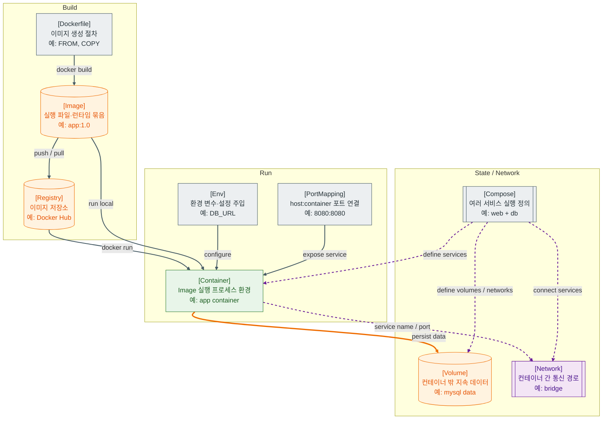

>[!success] 이 지도를 통해 아래 질문들에 답할 수 있게 됩니다.
>- Docker Image와 Container는 무엇이 다른가?
>- Volume과 Network는 컨테이너의 어떤 한계를 보완하는가?
>- Docker Compose는 여러 컨테이너를 어떻게 함께 실행하게 하는가?
>- 컨테이너 장애가 났을 때 로그, 포트, 환경 변수 중 무엇을 먼저 확인해야 하는가?

---

---
이 지도는 Docker를 “서버에 프로그램을 설치하는 방식”이 아니라 “실행 환경을 Image로 묶고 Container로 실행하는 방식”으로 설명한다. Image는 실행에 필요한 파일과 설정의 템플릿이고, Container는 그 Image를 실제 프로세스로 실행한 인스턴스다.

Container의 파일 시스템은 컨테이너 생명주기와 함께 사라질 수 있다. 그래서 DB 데이터, 업로드 파일, 개발 중 필요한 지속 데이터는 Volume에 둔다. Volume은 컨테이너가 교체되어도 데이터를 유지하기 위한 장치다.

Network는 컨테이너 사이의 통신 경로다. 로컬에서 여러 컨테이너를 함께 실행할 때는 서비스 이름으로 서로 접근하게 만들 수 있다. 외부 브라우저가 접근하려면 host port와 container port를 연결해야 한다.

Compose는 여러 컨테이너, 네트워크, 볼륨, 환경 변수를 하나의 파일에 정의하고 함께 실행하게 해준다. Spring 앱, DB, Redis를 로컬에서 함께 띄우는 개발 환경에 특히 자주 쓰인다.

## 장애가 났을 때 먼저 확인할 것

- 컨테이너가 실행 중인지와 exit code를 확인한다.
- `docker logs`로 애플리케이션 시작 실패, 환경 변수 누락, 포트 충돌을 확인한다.
- host port와 container port 매핑이 기대와 일치하는지 확인한다.
- 컨테이너 내부에서 DB/Redis/service name으로 접근 가능한지 네트워크를 확인한다.
- 데이터가 사라졌다면 Volume을 썼는지, bind mount 경로가 맞는지 확인한다.

## 설계할 때 선택 기준

- 실행 환경을 재현 가능하게 만들고 싶으면 Dockerfile로 Image를 만든다.
- 컨테이너 교체 후에도 남아야 하는 데이터는 Volume에 둔다.
- 컨테이너끼리만 통신하면 Docker network 내부 이름을 사용한다.
- 외부 사용자가 접근해야 하면 Port Mapping이나 앞단 프록시를 둔다.
- 여러 서비스를 함께 실행해야 하면 Compose로 의존성과 설정을 묶는다.

## 운영 중 볼 지표

- container restart count, exit code, health status
- CPU usage, memory usage, memory limit hit, OOM killed count
- container log error count, startup time
- network error count, port bind failure count
- volume disk usage, image size, image pull failure count

## 흔한 오해

- Image와 Container는 같은 것이 아니다.
- 컨테이너 안에 저장한 파일이 항상 영구 보존되는 것은 아니다.
- Docker가 있으면 환경 차이가 줄지만, 환경 변수와 외부 의존성 차이는 여전히 장애를 만든다.
- Compose는 로컬과 단일 호스트 구성에는 편하지만 Kubernetes 같은 클러스터 오케스트레이션과 역할이 다르다.
- 컨테이너가 떠 있다는 것과 애플리케이션이 준비되었다는 것은 다르다.

## 실전 체크리스트

- [ ] Dockerfile이 빌드와 실행 단계를 명확히 나누는가?
- [ ] 컨테이너 설정이 환경 변수로 주입되는가?
- [ ] 영구 데이터가 Volume에 연결되어 있는가?
- [ ] 필요한 포트만 외부로 공개되어 있는가?
- [ ] healthcheck나 로그로 준비 상태를 확인할 수 있는가?

## 질문에 대한 답변

1. Docker Image와 Container는 무엇이 다른가?

   Image는 실행 환경을 담은 읽기 중심 템플릿이고, Container는 그 Image를 실행한 실제 프로세스 환경이다. 같은 Image로 여러 Container를 만들 수 있다.

2. Volume과 Network는 컨테이너의 어떤 한계를 보완하는가?

   Volume은 컨테이너가 교체되어도 유지해야 하는 데이터를 보존한다. Network는 컨테이너끼리 이름과 포트로 통신할 수 있게 해준다.

3. Docker Compose는 여러 컨테이너를 어떻게 함께 실행하게 하는가?

   Compose 파일에 여러 service, environment, volume, network, port를 정의한다. 그러면 앱, DB, Redis 같은 구성요소를 하나의 개발 환경처럼 함께 실행할 수 있다.

4. 컨테이너 장애가 났을 때 로그, 포트, 환경 변수 중 무엇을 먼저 확인해야 하는가?

   먼저 컨테이너 상태와 로그를 본다. 시작 실패 원인이 환경 변수인지, 포트 충돌인지, 외부 의존성 연결 실패인지 로그에서 방향을 잡고, 그 다음 port mapping과 network를 확인한다.

## 관련 상세 문서

- [Docker Image Container Volume Network 압축 정리](<../Web-Operations/04. Docker Image Container Volume Network/00. Docker Image Container Volume Network 압축 정리.md>)
- [Docker Compose와 로컬 운영 환경 압축 정리](<../Web-Operations/05. Docker Compose와 로컬 운영 환경/00. Docker Compose와 로컬 운영 환경 압축 정리.md>)
- [Dockerfile Layer와 Image 상세](<../Web-Operations/04. Docker Image Container Volume Network/01. Dockerfile Layer와 Image 상세.md>)
- [Container Lifecycle 상세](<../Web-Operations/04. Docker Image Container Volume Network/02. Container Lifecycle 상세.md>)
- [Volume과 데이터 보존 상세](<../Web-Operations/04. Docker Image Container Volume Network/03. Volume과 데이터 보존 상세.md>)
- [Docker Network와 Port Mapping 상세](<../Web-Operations/04. Docker Image Container Volume Network/04. Docker Network와 Port Mapping 상세.md>)

## 참고한 자료

- [Docker Docs - Docker overview](https://docs.docker.com/get-started/docker-overview/)
- [Docker Docs - Dockerfile reference](https://docs.docker.com/reference/dockerfile/)
- [Docker Docs - Storage volumes](https://docs.docker.com/engine/storage/volumes/)
- [Docker Docs - Networking overview](https://docs.docker.com/engine/network/)
- [Docker Docs - Compose overview](https://docs.docker.com/compose/)
