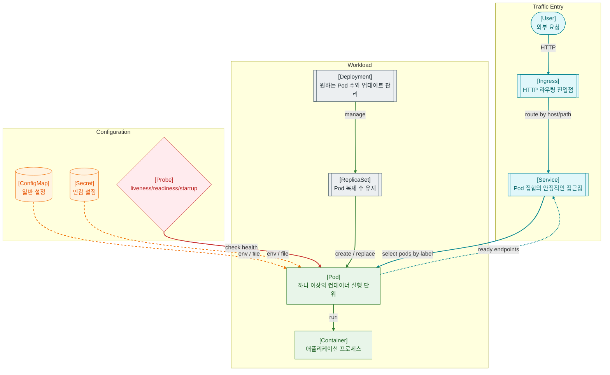

>[!success] 이 지도를 통해 아래 질문들에 답할 수 있게 됩니다.
>- Kubernetes에서 Pod, Deployment, Service, Ingress는 각각 어떤 위치에 있는가?
>- ConfigMap과 Secret은 애플리케이션 설정을 어떻게 주입하는가?
>- Pod는 떠 있는데 서비스가 안 될 때 무엇을 먼저 확인해야 하는가?
>- Docker와 Kubernetes는 어떤 관계로 이해해야 하는가?

---

---
이 지도는 Kubernetes를 컨테이너를 여러 서버 위에서 안정적으로 실행하고 연결하는 운영 계층으로 설명한다. Docker가 Image와 Container 실행 단위를 제공한다면, Kubernetes는 그 컨테이너를 Pod, Deployment, Service 같은 리소스로 운영한다.

Pod는 Kubernetes에서 컨테이너를 실행하는 기본 단위다. Deployment는 원하는 Pod 개수와 업데이트 방식을 관리하고, ReplicaSet은 실제 Pod 복제 수를 맞춘다.

Service는 Pod IP가 바뀌어도 안정적인 접근점을 제공한다. Service는 label selector로 대상 Pod를 찾고, 준비된 Pod endpoint로 트래픽을 보낸다. Ingress는 HTTP host/path 기준으로 Service에 요청을 라우팅하는 진입점이다.

ConfigMap은 일반 설정, Secret은 민감 설정을 Pod에 환경 변수나 파일로 주입한다. Secret도 기본적으로 “안전하게 암호화된 비밀 금고”라고만 믿으면 안 되고, 클러스터 설정과 접근 권한을 함께 관리해야 한다.

## 장애가 났을 때 먼저 확인할 것

- Pod 상태가 Running인지, CrashLoopBackOff인지, ImagePullBackOff인지 확인한다.
- Pod logs와 events에서 시작 실패, probe 실패, config 누락을 확인한다.
- readiness probe가 실패해 Service endpoint에서 빠졌는지 확인한다.
- Service selector와 Pod label이 일치하는지 확인한다.
- Ingress host/path, TLS, controller 로그, backend service 연결을 확인한다.

## 설계할 때 선택 기준

- 같은 앱을 여러 개 띄우고 rolling update가 필요하면 Deployment를 사용한다.
- Pod가 준비된 뒤에만 트래픽을 받아야 하면 readiness probe를 둔다.
- 죽은 컨테이너를 재시작해야 하면 liveness probe를 신중하게 둔다.
- 일반 설정은 ConfigMap, 민감 설정은 Secret으로 분리한다.
- 외부 HTTP 진입은 Ingress 또는 Gateway 계층을 두고, 내부 통신은 Service 이름을 사용한다.

## 운영 중 볼 지표

- pod restart count, pod ready count, CrashLoopBackOff count
- CPU usage, memory usage, CPU throttling, OOMKilled count
- deployment rollout status, unavailable replicas
- service endpoint count, ingress 4xx/5xx, request latency
- probe failure count, image pull failure count, config/secret mount failure count

## 흔한 오해

- Pod가 Running이라고 해서 트래픽을 받을 준비가 끝난 것은 아니다.
- Service는 Pod를 직접 고정하지 않고 label selector로 대상 Pod를 찾는다.
- Secret은 이름 때문에 완전한 보안을 보장한다고 오해하기 쉽지만, 접근 권한과 저장소 암호화 설정이 중요하다.
- liveness probe를 너무 공격적으로 잡으면 정상 복구 중인 앱을 계속 죽일 수 있다.
- Kubernetes는 Dockerfile을 대신 작성해주는 도구가 아니라 컨테이너 운영 계층이다.

## 실전 체크리스트

- [ ] Deployment, Service, Pod label/selector가 서로 맞는가?
- [ ] readiness/liveness/startup probe가 앱 특성에 맞게 설정되어 있는가?
- [ ] ConfigMap과 Secret 변경 시 rollout 전략이 있는가?
- [ ] resource requests/limits가 설정되어 있는가?
- [ ] Ingress에서 Service, Service에서 Endpoint까지 경로를 추적할 수 있는가?

## 질문에 대한 답변

1. Kubernetes에서 Pod, Deployment, Service, Ingress는 각각 어떤 위치에 있는가?

   Pod는 컨테이너 실행 단위다. Deployment는 Pod 개수와 업데이트를 관리한다. Service는 Pod 집합에 대한 안정적인 접근점을 제공한다. Ingress는 외부 HTTP 요청을 Service로 라우팅한다.

2. ConfigMap과 Secret은 애플리케이션 설정을 어떻게 주입하는가?

   ConfigMap은 일반 설정, Secret은 민감 설정을 담아 Pod에 환경 변수나 파일로 주입할 수 있다. 둘 다 설정과 이미지를 분리하는 데 쓰이지만, Secret은 접근 권한을 더 엄격히 관리해야 한다.

3. Pod는 떠 있는데 서비스가 안 될 때 무엇을 먼저 확인해야 하는가?

   먼저 readiness probe와 Service endpoint를 본다. 그 다음 Service selector와 Pod label이 맞는지, Ingress가 올바른 Service로 라우팅하는지 확인한다.

4. Docker와 Kubernetes는 어떤 관계로 이해해야 하는가?

   Docker는 Image를 만들고 Container를 실행하는 도구로 이해하면 쉽다. Kubernetes는 그런 컨테이너를 여러 노드에서 배포, 복구, 연결, 확장하는 운영 계층이다.

## 관련 상세 문서

- [Kubernetes 입문과 도입 판단 압축 정리](<../Web-Operations/14. Kubernetes 입문과 도입 판단/00. Kubernetes 입문과 도입 판단 압축 정리.md>)
- [Pod Deployment Service Ingress 상세](<../Web-Operations/14. Kubernetes 입문과 도입 판단/01. Pod Deployment Service Ingress 상세.md>)
- [APM Health Check Alert 압축 정리](<../Web-Operations/10. APM Health Check Alert/00. APM Health Check Alert 압축 정리.md>)
- [Cloud Infra VM VPC LB Object Storage 압축 정리](<../Web-Operations/13. Cloud Infra VM VPC LB Object Storage/00. Cloud Infra VM VPC LB Object Storage 압축 정리.md>)
- [Scale Up Scale Out Partitioning Sharding 압축 정리](<../System Design/10. Scale Up Scale Out Partitioning Sharding/00. Scale Up Scale Out Partitioning Sharding 압축 정리.md>)

## 참고한 자료

- [Kubernetes Docs - Pods](https://kubernetes.io/docs/concepts/workloads/pods/)
- [Kubernetes Docs - Deployments](https://kubernetes.io/docs/concepts/workloads/controllers/deployment/)
- [Kubernetes Docs - Service](https://kubernetes.io/docs/concepts/services-networking/service/)
- [Kubernetes Docs - Ingress](https://kubernetes.io/docs/concepts/services-networking/ingress/)
- [Kubernetes Docs - ConfigMaps](https://kubernetes.io/docs/concepts/configuration/configmap/)
- [Kubernetes Docs - Secrets](https://kubernetes.io/docs/concepts/configuration/secret/)
- [Kubernetes Docs - Probes](https://kubernetes.io/docs/concepts/configuration/liveness-readiness-startup-probes/)
