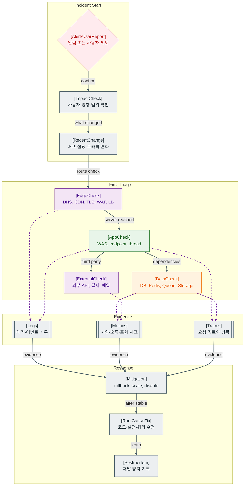

>[!success] 이 지도를 통해 아래 질문들에 답할 수 있게 됩니다.
>- 장애가 났을 때 어디부터 확인해야 하는가?
>- 사용자 영향, 최근 변경, 의존성 문제는 어떤 순서로 보는가?
>- 로그, 메트릭, 트레이스는 장애 조사에서 어떻게 연결되는가?
>- 임시 조치와 근본 수정은 어떻게 구분하는가?

---

---
이 지도는 특정 기술 하나가 아니라 장애가 났을 때의 조사 순서를 설명한다. 장애 대응의 첫 목적은 원인을 완벽히 설명하는 것이 아니라 사용자 영향을 줄이고, 증거를 잃지 않으면서 원인을 좁히는 것이다.

첫 번째는 사용자 영향 확인이다. 전체 장애인지, 특정 기능인지, 특정 지역인지, 특정 사용자군인지 확인해야 대응 우선순위가 정해진다. 두 번째는 최근 변경 확인이다. 배포, 설정 변경, 인프라 변경, 트래픽 급증은 장애 원인을 빠르게 좁히는 단서가 된다.

그 다음에는 요청 경로를 바깥에서 안쪽으로 본다. DNS, CDN, TLS, WAF, LB를 지나 WAS에 도달했는지 확인하고, WAS에 도달했다면 endpoint, thread, DB, Redis, Queue, 외부 API를 본다.

## 장애가 났을 때 먼저 확인할 것

- 사용자 영향 범위와 시작 시각을 확인한다.
- 최근 배포, 설정 변경, DB Migration, 트래픽 급증을 확인한다.
- 클라이언트 오류와 서버 로그를 연결해 요청이 어느 지점까지 도달했는지 본다.
- p95 latency, 5xx rate, queue depth, DB connection pool usage를 먼저 본다.
- 복구가 급하면 rollback, scale-out, feature flag off, circuit breaker open 같은 임시 조치를 검토한다.

## 설계할 때 선택 기준

- 장애 대응이 중요한 서비스는 runbook과 dashboard를 기능 출시와 함께 만든다.
- 전체 장애를 빨리 줄여야 하면 원인 분석보다 rollback이나 traffic shift를 먼저 선택할 수 있다.
- 데이터 손상 가능성이 있으면 서비스 복구보다 쓰기 중단과 backup 확인을 먼저 둘 수 있다.
- 외부 API 장애가 잦으면 timeout, fallback, circuit breaker를 설계에 포함한다.
- 반복 장애는 postmortem과 재발 방지 작업을 backlog가 아니라 운영 작업으로 관리한다.

## 운영 중 볼 지표

- impact: affected user count, failed request count, region별 error rate
- change: deployment time, config change time, migration time
- service: p95/p99 latency, 5xx rate, timeout count
- saturation: CPU, memory, thread pool, connection pool, queue depth
- response: MTTA, MTTR, rollback duration, recurrence count

## 흔한 오해

- 장애 대응은 처음부터 정확한 원인을 맞히는 게임이 아니다.
- CPU가 낮아도 Thread Pool, DB Connection Pool, 외부 API 대기로 서비스는 멈출 수 있다.
- 로그만 보고 판단하면 지연시간과 포화 상태를 놓칠 수 있다.
- 임시 조치는 근본 수정이 아니지만 사용자 영향을 줄이는 중요한 단계다.
- Postmortem 없이 넘어가면 같은 장애가 다른 이름으로 반복된다.

## 실전 체크리스트

- [ ] 장애 시작 시각과 영향 범위를 적었는가?
- [ ] 최근 변경 사항을 확인했는가?
- [ ] 요청이 Edge, WAS, DB, Queue 중 어디서 막히는지 구분했는가?
- [ ] 임시 조치와 근본 수정 작업을 분리했는가?
- [ ] 재발 방지 항목과 담당자를 남겼는가?

## 질문에 대한 답변

1. 장애가 났을 때 어디부터 확인해야 하는가?

   사용자 영향 범위와 최근 변경부터 확인한다. 그 다음 요청이 Edge에서 막히는지, WAS에 도달하는지, DB나 외부 의존성에서 느려지는지를 바깥에서 안쪽으로 좁힌다.

2. 사용자 영향, 최근 변경, 의존성 문제는 어떤 순서로 보는가?

   먼저 영향 범위를 확인해 심각도를 정한다. 그 다음 최근 변경으로 원인 후보를 줄인다. 이후 DB, Redis, Queue, 외부 API 같은 의존성을 확인해 실제 병목을 찾는다.

3. 로그, 메트릭, 트레이스는 장애 조사에서 어떻게 연결되는가?

   메트릭은 어디가 이상한지 알려주고, 트레이스는 요청 경로 중 어디서 시간이 걸렸는지 보여주며, 로그는 그 시점에 어떤 에러나 이벤트가 있었는지 설명한다.

4. 임시 조치와 근본 수정은 어떻게 구분하는가?

   임시 조치는 사용자 영향을 줄이는 즉시 대응이다. rollback, scale-out, feature off가 여기에 해당한다. 근본 수정은 원인이 다시 발생하지 않도록 코드, 설정, 쿼리, 설계를 고치는 작업이다.

## 관련 상세 문서

- [네트워크 장애 대응과 트러블슈팅 압축 정리](<../Web-Network/14. 네트워크 장애 대응과 트러블슈팅/00. 네트워크 장애 대응과 트러블슈팅 압축 정리.md>)
- [Incident Response 장애 보고서 압축 정리](<../Web-Operations/12. Incident Response 장애 보고서/00. Incident Response 장애 보고서 압축 정리.md>)
- [Web Operations Runbook 압축 정리](<../Web-Operations/90. Web Operations Runbook/00. Web Operations Runbook 압축 정리.md>)
- [OS 관점의 성능 병목 분석 압축 정리](<../Computer System/10. OS 관점의 성능 병목 분석/00. OS 관점의 성능 병목 분석 압축 정리.md>)
- [실전 DB 시나리오 압축 정리](<../Web-Database/13. 실전 DB 시나리오와 판단 기준/00. 실전 DB 시나리오 압축 정리.md>)
- [AI 실전 플레이북 압축 정리](<../AI/90. AI 실전 플레이북/00. AI 실전 플레이북 압축 정리.md>)

## 참고한 자료

- [Google SRE Book - Monitoring Distributed Systems](https://sre.google/sre-book/monitoring-distributed-systems/)
- [Google SRE Book - Emergency Response](https://sre.google/sre-book/emergency-response/)
- [OpenTelemetry Docs - Signals](https://opentelemetry.io/docs/concepts/signals/)
- [Atlassian - Incident management](https://www.atlassian.com/incident-management)
