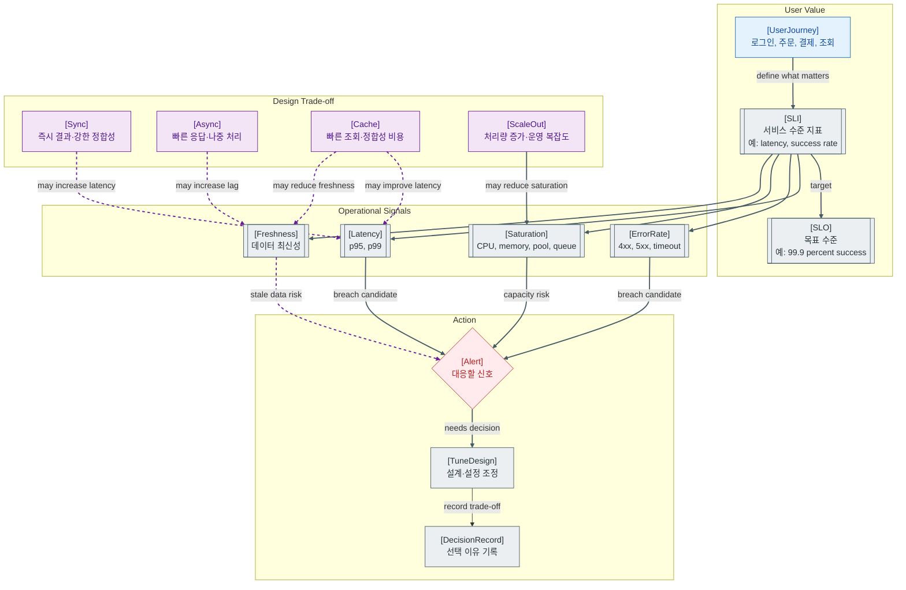

>[!success] 이 지도를 통해 아래 질문들에 답할 수 있게 됩니다.
>- SLI, SLO, Alert는 각각 무엇이 다른가?
>- 운영 지표의 임계치는 어떻게 정해야 하는가?
>- 설계 선택은 성능, 정합성, 비용, 운영 복잡도 사이에서 어떻게 trade-off 되는가?
>- 어떤 지표를 보면 설계 선택이 잘못되었는지 알 수 있는가?

---

---
이 지도는 운영 지표를 단순 숫자가 아니라 설계 선택을 검증하는 언어로 보는 관점이다. 좋은 지표는 “서버가 바쁜가”보다 “사용자가 기대한 일을 성공적으로 하고 있는가”에 가까워야 한다.

SLI는 서비스 수준을 나타내는 지표다. 예를 들어 로그인 성공률, 결제 성공률, API p95 latency, 데이터 freshness가 SLI가 될 수 있다. SLO는 그 SLI가 어느 정도 수준을 만족해야 하는지 정한 목표다.

Alert는 SLO나 사용자 영향과 연결되어야 한다. 모든 숫자 변화가 Alert가 되면 운영자는 금방 무시하게 된다. 반대로 너무 늦게 울리면 사용자가 먼저 장애를 발견한다.

설계 선택은 trade-off다. 동기 처리는 결과가 즉시 확정되지만 지연시간과 의존성 장애에 취약할 수 있다. 비동기는 응답을 빠르게 만들지만 지연 처리와 중복 처리 문제가 생긴다. 캐시는 조회를 빠르게 하지만 freshness와 무효화 문제가 생긴다.

## 장애가 났을 때 먼저 확인할 것

- 어떤 사용자 여정의 SLI가 깨졌는지 먼저 확인한다.
- latency, error rate, saturation, freshness 중 어떤 축이 먼저 나빠졌는지 본다.
- 최근 설계 변경이나 설정 변경이 특정 지표를 악화시켰는지 확인한다.
- Alert가 너무 늦거나 너무 자주 울렸다면 임계치와 조건을 조정할 후보로 기록한다.
- SLO 위반이 반복되면 단순 튜닝이 아니라 설계 선택을 다시 본다.

## 설계할 때 선택 기준

- 강한 정합성과 즉시 결과가 중요하면 동기 처리와 DB 트랜잭션을 우선한다.
- 사용자 응답 속도와 장애 격리가 중요하면 비동기 처리와 Queue를 검토한다.
- 읽기 부하가 크고 약간의 stale을 허용하면 Cache를 검토한다.
- 처리량이 부족하면 Scale-out을 보되 DB, Redis, Queue 병목이 이동하는지 함께 본다.
- 운영 복잡도가 늘어나는 선택은 지표와 runbook을 함께 준비할 수 있을 때 도입한다.

## 운영 중 볼 지표

- Latency: p50, p95, p99, timeout count
- Error: 4xx rate, 5xx rate, business failure rate
- Saturation: CPU, memory, thread pool usage, DB connection pool usage, queue depth
- Freshness: replication lag, cache age, batch delay, consumer lag
- Reliability: SLO compliance, error budget burn rate, alert count, MTTR

## 흔한 오해

- 평균 응답 시간은 꼬리 지연을 숨길 수 있다.
- CPU가 낮다고 서비스가 여유로운 것은 아니다. 외부 API 대기나 pool 고갈이 병목일 수 있다.
- 임계치는 인터넷에서 가져온 절대값보다 자기 서비스의 정상 기준선이 더 중요하다.
- 지표가 많으면 좋은 것이 아니라 행동으로 이어지는 지표가 중요하다.
- 캐시, 비동기, scale-out은 장점과 함께 운영 복잡도를 가져온다.

## 실전 체크리스트

- [ ] 핵심 사용자 여정별 SLI가 정의되어 있는가?
- [ ] SLO와 Alert가 사용자 영향에 연결되어 있는가?
- [ ] latency, error, saturation, freshness 축을 함께 보고 있는가?
- [ ] 설계 선택의 trade-off가 문서화되어 있는가?
- [ ] 반복되는 SLO 위반을 설계 개선 작업으로 연결하는가?

## 질문에 대한 답변

1. SLI, SLO, Alert는 각각 무엇이 다른가?

   SLI는 서비스 수준을 재는 지표다. SLO는 그 지표가 달성해야 하는 목표다. Alert는 사람이 대응해야 할 조건이 되었을 때 울리는 신호다.

2. 운영 지표의 임계치는 어떻게 정해야 하는가?

   절대값으로 외우기보다 정상 트래픽에서의 기준선을 먼저 잡고, 사용자 영향과 SLO를 기준으로 정한다. 초기에는 p95 latency 급증, 5xx rate 상승, queue depth 지속 증가처럼 명확한 악화 신호를 후보로 둘 수 있다.

3. 설계 선택은 성능, 정합성, 비용, 운영 복잡도 사이에서 어떻게 trade-off 되는가?

   동기 처리는 정합성과 단순성이 좋지만 느려질 수 있다. 비동기는 응답을 빠르게 하지만 중복 처리와 관측이 필요하다. 캐시는 빠르지만 stale 문제가 생긴다. scale-out은 처리량을 늘리지만 운영 복잡도와 비용이 늘어난다.

4. 어떤 지표를 보면 설계 선택이 잘못되었는지 알 수 있는가?

   동기 외부 호출 때문에 thread pool이 고갈되거나, 캐시 때문에 stale data가 늘거나, Queue 때문에 consumer lag가 계속 쌓이면 설계 선택을 다시 봐야 한다. SLO 위반이 반복되는 지표는 설계 개선의 강한 신호다.

## 관련 상세 문서

- [APM Health Check Alert 압축 정리](<../Web-Operations/10. APM Health Check Alert/00. APM Health Check Alert 압축 정리.md>)
- [System Design 전체 지도 압축 정리](<../System Design/01. System Design 전체 지도/00. System Design 전체 지도 압축 정리.md>)
- [Functional Non-functional Requirement 압축 정리](<../System Design/02. Functional Non-functional Requirement/00. Functional Non-functional Requirement 압축 정리.md>)
- [Traffic Estimation Capacity Planning 압축 정리](<../System Design/03. Traffic Estimation Capacity Planning/00. Traffic Estimation Capacity Planning 압축 정리.md>)
- [Consistency Availability Partition 압축 정리](<../System Design/09. Consistency Availability Partition/00. Consistency Availability Partition 압축 정리.md>)
- [Circuit Breaker Bulkhead 장애 격리 압축 정리](<../System Design/12. Circuit Breaker Bulkhead 장애 격리/00. Circuit Breaker Bulkhead 장애 격리 압축 정리.md>)

## 참고한 자료

- [Google SRE Book - Service Level Objectives](https://sre.google/sre-book/service-level-objectives/)
- [Google SRE Workbook - Alerting on SLOs](https://sre.google/workbook/alerting-on-slos/)
- [OpenTelemetry Docs - Metrics](https://opentelemetry.io/docs/concepts/signals/metrics/)
- [Prometheus Docs - Alerting overview](https://prometheus.io/docs/alerting/latest/overview/)
