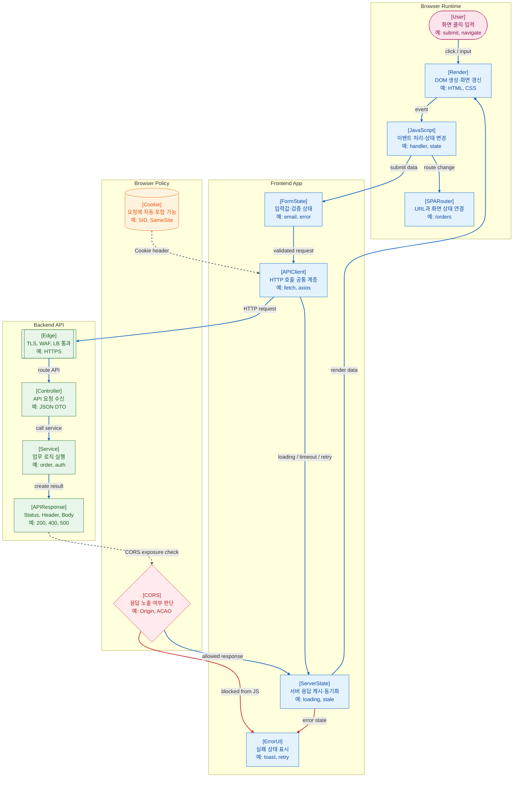

>[!success] 이 지도를 통해 아래 질문들에 답할 수 있게 됩니다.
>- 브라우저 화면의 클릭은 어떤 흐름으로 백엔드 API까지 이어지는가?
>- SPA Router, API Client, Server State는 각각 프론트엔드 어디에 놓이는가?
>- CORS, Cookie, Loading/Error State는 API 호출 흐름의 어느 위치에서 문제가 되는가?
>- 프론트와 백엔드가 함께 장애를 볼 때 어떤 경계부터 확인해야 하는가?

---

---
이 지도는 브라우저 화면의 이벤트가 프론트엔드 코드와 브라우저 정책을 지나 백엔드 API로 이어지는 흐름을 설명한다. 프론트엔드는 단순히 화면을 그리는 영역이 아니라, 사용자 입력, 라우팅, API 호출, 서버 상태, 오류 표시를 함께 관리한다.

사용자가 버튼을 누르면 JavaScript 이벤트 핸들러가 실행되고, 필요하면 FormState를 검증한 뒤 APIClient가 HTTP 요청을 만든다. Cookie는 조건이 맞으면 요청에 자동 포함될 수 있고, 백엔드 응답은 CORS 정책에 따라 JavaScript에 노출될 수도 있고 막힐 수도 있다.

ServerState는 API 응답 데이터를 화면 상태로 연결하는 위치다. 여기에는 loading, error, stale, retry 같은 상태가 함께 붙는다. 따라서 API 장애는 백엔드 로그만으로 끝나지 않고, 프론트 화면의 loading 상태나 error UI까지 함께 봐야 한다.

## 장애가 났을 때 먼저 확인할 것

- 브라우저 Network 탭에서 요청이 실제로 나갔는지 확인한다.
- 요청 URL, Method, Status Code, Request/Response Header를 확인한다.
- Cookie나 Authorization header가 빠졌는지 확인한다.
- CORS 오류라면 서버 미도달인지, 응답 노출 차단인지 구분한다.
- 프론트 상태가 loading에 멈췄는지, error state로 전환되는지 확인한다.

## 설계할 때 선택 기준

- 화면 URL과 상태가 중요하면 SPA Router로 라우팅 책임을 분리한다.
- 반복되는 API 설정은 APIClient에 모아 timeout, retry, auth header를 일관되게 처리한다.
- 서버 응답을 여러 화면에서 공유하면 ServerState 관리 도구나 캐시 전략을 검토한다.
- 인증 상태가 Cookie 기반이면 SameSite, Secure, CORS credentials 설정을 함께 설계한다.
- 실패가 사용자에게 의미 있는 경우 Loading, Empty, Error, Retry UI를 명시적으로 둔다.

## 운영 중 볼 지표

- frontend route별 error count, page load time, API call failure rate
- browser-side timeout count, retry count, aborted request count
- API p95 latency, 4xx rate, 5xx rate
- CORS failure 후보, cookie missing count, auth failure rate
- loading duration, client error boundary count

## 흔한 오해

- CORS 오류가 보인다고 항상 서버가 요청을 받지 못한 것은 아니다.
- 프론트에서 error UI가 없으면 사용자는 장애를 빈 화면이나 무한 loading으로 경험한다.
- Cookie가 저장되어 있어도 SameSite, domain, path 조건 때문에 요청에 실리지 않을 수 있다.
- APIClient가 화면마다 흩어지면 timeout, 인증, 에러 처리 정책이 쉽게 달라진다.
- 서버 응답이 빨라도 렌더링이나 클라이언트 상태 관리 문제로 화면은 느릴 수 있다.

## 실전 체크리스트

- [ ] API 요청이 Network 탭에서 URL, Method, Header까지 확인되는가?
- [ ] APIClient에 timeout, auth, error handling 기준이 모여 있는가?
- [ ] Loading, Empty, Error, Retry 상태가 화면에 정의되어 있는가?
- [ ] CORS와 Cookie credentials 설정이 백엔드와 함께 맞춰져 있는가?
- [ ] 주요 사용자 흐름별 프론트 오류와 API 오류를 함께 볼 수 있는가?

## 질문에 대한 답변

1. 브라우저 화면의 클릭은 어떤 흐름으로 백엔드 API까지 이어지는가?

   사용자의 클릭은 DOM 이벤트가 되고, JavaScript handler가 FormState나 Router 상태를 바꾼다. APIClient가 HTTP 요청을 만들고, Edge를 지나 Controller와 Service가 처리한 뒤 APIResponse가 다시 브라우저로 돌아온다.

2. SPA Router, API Client, Server State는 각각 프론트엔드 어디에 놓이는가?

   SPA Router는 URL과 화면을 연결한다. APIClient는 백엔드 HTTP 호출의 공통 계층이다. ServerState는 API 응답과 loading/error/stale 상태를 화면 렌더링에 연결한다.

3. CORS, Cookie, Loading/Error State는 API 호출 흐름의 어느 위치에서 문제가 되는가?

   Cookie는 요청이 만들어질 때 포함 조건이 맞아야 한다. CORS는 응답이 돌아온 뒤 브라우저 JavaScript에 노출 가능한지 판단한다. Loading/Error State는 API 호출 전후의 사용자 경험을 결정한다.

4. 프론트와 백엔드가 함께 장애를 볼 때 어떤 경계부터 확인해야 하는가?

   먼저 브라우저 Network 탭에서 요청이 나갔는지, 어떤 status와 header를 받았는지 본다. 그 다음 백엔드 Controller 로그와 API 지표를 연결해 클라이언트 문제인지 서버 문제인지 나눈다.

## 관련 상세 문서

- [Web-Front 학습 로드맵](<../Web-Front/00. Web-Front 학습 로드맵.md>)
- [브라우저와 Web 기본](<../Web-Front/03. 브라우저와 Web 기본.md>)
- [API와 서버 상태](<../Web-Front/06. API와 서버 상태.md>)
- [Form Validation UX](<../Web-Front/07. Form Validation UX.md>)
- [Auth Security](<../Web-Front/08. Auth Security.md>)
- [Cookie Session SameSite CORS 압축 정리](<../Web-Network/08. Cookie Session SameSite CORS/00. Cookie Session SameSite CORS 압축 정리.md>)
- [Spring MVC 요청 처리 흐름 압축 정리](<../Web-Back(Spring)/07. Spring MVC 요청 처리 흐름/00. Spring MVC 요청 처리 흐름 압축 정리.md>)

## 참고한 자료

- [MDN - Fetch API](https://developer.mozilla.org/en-US/docs/Web/API/Fetch_API)
- [MDN - Cross-Origin Resource Sharing](https://developer.mozilla.org/en-US/docs/Web/HTTP/Guides/CORS)
- [MDN - Using HTTP cookies](https://developer.mozilla.org/en-US/docs/Web/HTTP/Guides/Cookies)
- [MDN - History API](https://developer.mozilla.org/en-US/docs/Web/API/History_API)
