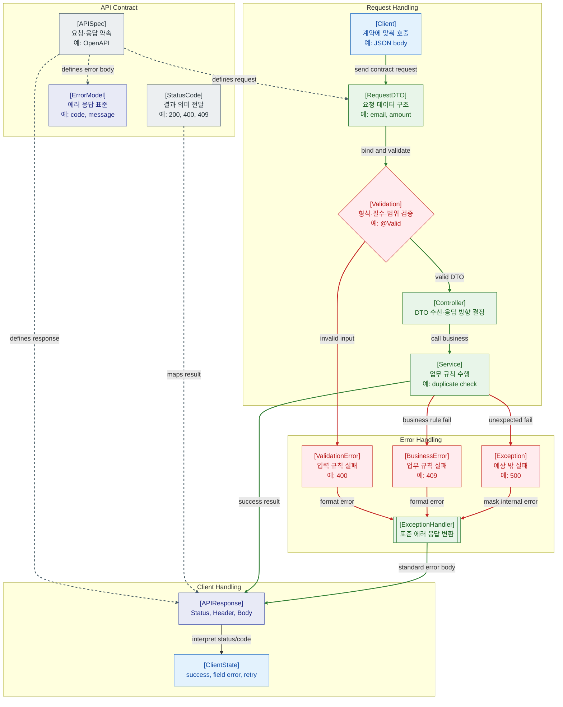

>[!success] 이 지도를 통해 아래 질문들에 답할 수 있게 됩니다.
>- API Contract는 요청 처리 흐름의 어느 위치에 놓이는가?
>- Validation 실패와 비즈니스 실패, 서버 예외는 어떻게 다른 응답으로 나뉘는가?
>- Status Code와 Error Response는 프론트엔드 처리와 어떻게 연결되는가?
>- API 장애가 났을 때 Request DTO, Validation, Exception Handler 중 무엇을 먼저 확인해야 하는가?

---

---
이 지도는 API를 Controller 메서드 하나가 아니라 클라이언트와 서버 사이의 계약으로 보는 관점이다. API Contract는 요청 DTO, 성공 응답, 실패 응답, Status Code가 어떤 의미를 갖는지 미리 정하는 약속이다.

Validation은 사용자가 보낸 데이터가 API 계약의 기본 형식에 맞는지 확인한다. 필수값 누락, 길이 초과, 타입 오류는 Service로 들어가기 전에 걸러지는 것이 좋다. 반면 중복 주문, 잔액 부족, 권한 부족 같은 문제는 업무 규칙이나 보안 정책에 가깝다.

ExceptionHandler는 여러 실패를 프론트엔드가 해석할 수 있는 표준 에러 응답으로 바꾸는 경계다. 내부 예외, stack trace, SQL, 환경 변수 같은 정보는 응답으로 노출하지 않고, 클라이언트가 처리할 수 있는 code와 message를 제공하는 것이 핵심이다.

## 장애가 났을 때 먼저 확인할 것

- 클라이언트 요청 body가 API Contract와 맞는지 확인한다.
- 400이면 Request DTO binding과 Validation 실패 원인을 본다.
- 401/403이면 인증·인가 경계에서 막혔는지 확인한다.
- 409나 422 계열이면 비즈니스 규칙 실패인지 확인한다.
- 500이면 ExceptionHandler가 내부 정보를 숨기면서 추적 가능한 error code를 남기는지 확인한다.

## 설계할 때 선택 기준

- 클라이언트와 서버가 함께 개발하면 API Contract를 먼저 문서화한다.
- 입력 형식 오류는 Validation에서 처리하고, 업무 규칙 실패는 Service의 도메인 에러로 구분한다.
- 프론트가 field error를 표시해야 하면 field별 error 구조를 둔다.
- 재시도 가능한 실패와 사용자가 수정해야 하는 실패는 status/code를 다르게 준다.
- 예외 응답은 Controller마다 만들지 말고 공통 Handler에서 표준화한다.

## 운영 중 볼 지표

- endpoint별 2xx/4xx/5xx rate, validation failure count
- error code별 발생 수, business error count, exception type count
- request body binding failure count, payload size error count
- client retry count, user correction rate, field error count
- API contract mismatch report, backward compatibility break count

## 흔한 오해

- 모든 실패를 500으로 주면 클라이언트는 사용자가 고칠 문제와 서버 장애를 구분할 수 없다.
- Validation은 보안 전체가 아니라 입력 계약의 기본 방어선이다.
- Error message를 친절하게 쓰는 것과 내부 정보를 노출하는 것은 다르다.
- API 문서가 있어도 실제 응답과 다르면 계약은 깨진 것이다.
- 프론트 오류 처리는 백엔드 status/code 설계와 함께 봐야 한다.

## 실전 체크리스트

- [ ] 요청 DTO와 응답 DTO가 API Contract에 명확히 정의되어 있는가?
- [ ] Validation error와 business error가 구분되는가?
- [ ] Error Response 형식이 모든 API에서 일관되는가?
- [ ] 클라이언트가 status/code를 기준으로 표시와 재시도를 구분할 수 있는가?
- [ ] 내부 예외 정보가 외부 응답에 노출되지 않는가?

## 질문에 대한 답변

1. API Contract는 요청 처리 흐름의 어느 위치에 놓이는가?

   API Contract는 클라이언트 요청 생성부터 서버의 Request DTO, Validation, Response, ErrorModel까지 흐름 전체에 걸친 약속이다. Controller 한 곳에만 있는 것이 아니라 양쪽 구현의 기준이다.

2. Validation 실패와 비즈니스 실패, 서버 예외는 어떻게 다른 응답으로 나뉘는가?

   Validation 실패는 요청 형식이 계약에 맞지 않는 경우라 보통 400 계열로 응답한다. 비즈니스 실패는 업무 규칙상 처리할 수 없는 경우라 409 같은 의미 있는 상태를 쓸 수 있다. 서버 예외는 내부 장애이므로 500 계열로 마스킹해 응답한다.

3. Status Code와 Error Response는 프론트엔드 처리와 어떻게 연결되는가?

   프론트엔드는 status와 error code를 보고 field error, toast, 재시도, 로그인 이동 같은 처리를 결정한다. 그래서 백엔드의 응답 표준은 곧 프론트 UX의 입력이 된다.

4. API 장애가 났을 때 Request DTO, Validation, Exception Handler 중 무엇을 먼저 확인해야 하는가?

   status code로 먼저 나눈다. 400이면 DTO binding과 Validation, 4xx 업무 실패면 Service 규칙, 500이면 ExceptionHandler와 내부 로그를 확인한다.

## 관련 상세 문서

- [Validation 압축 정리](<../Web-Back(Spring)/09. Validation/00. Validation 압축 정리.md>)
- [BindingResult와 에러 응답 설계](<../Web-Back(Spring)/09. Validation/03. BindingResult와 에러 응답 설계.md>)
- [Exception Handling 압축 정리](<../Web-Back(Spring)/10. Exception Handling/00. Exception Handling 압축 정리.md>)
- [API 에러 응답 설계](<../Web-Back(Spring)/10. Exception Handling/04. API 에러 응답 설계.md>)
- [HTTP Method Status Code Header 압축 정리](<../Web-Network/06. HTTP Method Status Code Header/00. HTTP Method Status Code Header 압축 정리.md>)
- [API Security SQL Injection Validation 압축 정리](<../Web-Security/07. API Security SQL Injection Validation/00. API Security SQL Injection Validation 압축 정리.md>)

## 참고한 자료

- [Spring Framework Reference - Validation](https://docs.spring.io/spring-framework/reference/core/validation/beanvalidation.html)
- [Spring Framework Reference - ExceptionHandler](https://docs.spring.io/spring-framework/reference/web/webmvc/mvc-controller/ann-exceptionhandler.html)
- [RFC 9110 - HTTP Semantics](https://www.rfc-editor.org/rfc/rfc9110)
- [RFC 9457 - Problem Details for HTTP APIs](https://www.rfc-editor.org/rfc/rfc9457)
