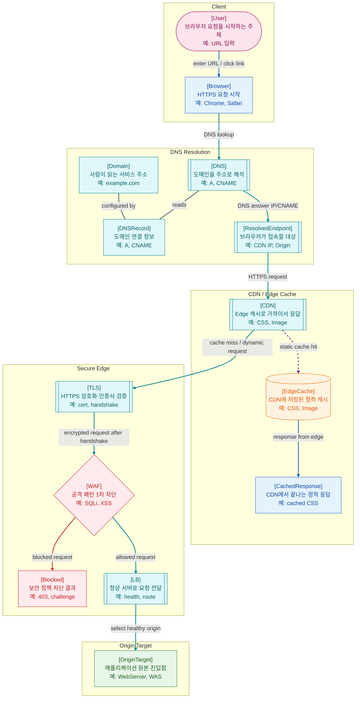

>[!success] 이 지도를 통해 아래 질문들에 답할 수 있게 됩니다.
>- 브라우저 요청은 애플리케이션 서버에 도착하기 전에 어떤 구간을 거치는가?
>- DNS, CDN, TLS, WAF, LB는 각각 어떤 문제를 해결하기 위해 존재하는가?
>- CDN 캐시가 적중하면 왜 WAS 로그에 요청이 남지 않을 수 있는가?
>- 서버 코드는 정상인데도 접속 장애가 나면 Edge 구간에서 무엇을 확인해야 하는가?

---

---
이 지도는 사용자의 브라우저 요청이 실제 애플리케이션 서버에 도착하기 전까지의 구간을 설명한다. 이 구간을 이해하면 “내 서버는 정상인데 사용자는 접속이 안 되는 이유”, “정적 파일 요청이 WAS 로그에 남지 않는 이유”, “TLS나 WAF 문제가 애플리케이션 오류처럼 보이는 이유”를 구분할 수 있다.

가장 먼저 브라우저는 도메인 이름을 해석한다. 사용자는 `example.com` 같은 사람이 읽기 쉬운 주소를 입력하지만, 실제 네트워크 통신은 IP 주소를 기준으로 이루어진다. 도메인 이름은 DNS 체계 안에서 특정 인터넷 자원을 찾기 위한 이름이다.

DNS 이후 요청은 CDN으로 향할 수 있다. CDN은 사용자와 가까운 Edge 위치에서 정적 파일을 캐시하여 응답 속도를 높이고 Origin 서버의 부담을 줄인다. 캐시가 적중하면 요청은 Web Server나 WAS까지 가지 않는다. 따라서 CDN 캐시 응답은 애플리케이션 로그에 남지 않을 수 있다.

동적 요청이거나 CDN 캐시가 없는 요청은 Origin 방향으로 전달된다. HTTPS 요청이라면 TLS가 통신을 암호화하고 서버 인증서를 통해 안전한 연결을 만든다. TLS는 신뢰할 수 없는 네트워크 위에서 클라이언트와 서버가 안전하게 통신하도록 해주는 프로토콜이며, 웹에서는 HTTPS의 기반이 된다.

TLS 이후 또는 Edge 구간에서 WAF가 요청을 검사할 수 있다. WAF는 SQL Injection, XSS 패턴, 비정상적인 요청 크기, 의심스러운 경로 같은 공격 징후를 1차로 차단한다. 다만 WAF는 보조 방어선이다. 애플리케이션 내부의 인증, 인가, 입력 검증, SQL 방어를 대체하지 않는다.

Load Balancer는 여러 서버 중 정상적인 대상으로 요청을 분산한다. 이때 중요한 것은 단순 분산이 아니라 “정상 서버를 잘 식별 했는가? 그리고 그곳으로 보낼 수 있는가?”이다. Health Check가 잘못되면 정상 서버가 제외되거나, 반대로 비정상 서버로 트래픽이 계속 갈 수 있다.

이 지도에서 중요한 관점은 “서버에 도착하기 전에도 많은 일이 발생한다”는 것이다. DNS 오류, CDN 캐시, TLS 인증서 문제, WAF 차단, LB Health Check 실패는 모두 애플리케이션 코드와 무관하게 사용자 접속 실패를 만들 수 있다.

지도에서 실선은 서버 쪽으로 진행되는 동기 요청 흐름, 점선은 CDN 캐시 적중처럼 Origin까지 가지 않는 보조 흐름, 빨간 선은 WAF 차단 흐름을 뜻한다. 그래프 크기를 유지하기 위해 TLS의 세부 handshake 단계나 DNS 재귀 조회 과정은 별도 노드로 늘리지 않고 라벨과 설명에 압축했다.

실제 구성에서는 CDN, TLS 종료, WAF, LB의 순서가 벤더와 아키텍처에 따라 달라질 수 있다. 예를 들어 TLS가 CDN에서 종료될 수도 있고, LB에서 종료될 수도 있으며, WAF가 CDN에 통합되어 있을 수도 있다. 이 문서는 특정 제품의 물리 순서가 아니라 “애플리케이션 서버 앞에서 확인해야 하는 경계들”을 잡기 위한 지도다.

## 장애가 났을 때 먼저 확인할 것

- 도메인이 올바른 IP나 CNAME으로 해석되는지 DNS 레코드와 TTL을 확인한다.
- CDN 캐시 적중, Origin 연결 실패, 캐시된 오래된 응답 여부를 확인한다.
- TLS 인증서 만료, 체인 오류, SNI 설정, HTTPS 리다이렉트 루프를 확인한다.
- WAF 차단 로그에서 정상 요청이 공격으로 오탐되지 않았는지 확인한다.
- LB Health Check, 대상 서버 등록 상태, 502/503/504 발생 위치를 확인한다.

## 설계할 때 선택 기준

- 전 세계 사용자와 정적 리소스가 중요하면 CDN을 앞단에 둔다.
- 공격 패턴을 앞에서 줄이고 싶으면 WAF를 쓰되, 애플리케이션 보안을 대체하지 않는다.
- 서버가 여러 대라면 LB와 Health Check 기준을 먼저 설계한다.
- TLS 종료 위치는 인증서 관리, 내부 트래픽 암호화 요구, 운영 편의성을 함께 보고 정한다.
- 캐시 가능한 리소스는 URL 버전 관리와 Cache-Control 정책을 함께 설계한다.

## 운영 중 볼 지표

- DNS: lookup failure rate, NXDOMAIN count, record change time
- CDN: cache hit ratio, origin fetch error rate, edge 4xx/5xx rate
- TLS: certificate expiry days, handshake failure count
- WAF: blocked request count, false positive 후보, rule별 차단 수
- LB: target healthy count, target response time, 502/503/504 rate

## 흔한 오해

- 서버가 정상이어도 DNS, CDN, TLS, WAF, LB 문제로 사용자는 접속하지 못할 수 있다.
- CDN에 캐시된 응답은 애플리케이션 배포 직후에도 남아 있을 수 있다.
- WAF는 보조 방어선이지 인증, 인가, 입력 검증을 대신하지 않는다.
- Health Check가 너무 얕으면 실제 장애 서버도 정상으로 보일 수 있다.
- Edge 순서는 모든 회사에서 동일하지 않다.

## 실전 체크리스트

- [ ] DNS 레코드와 CDN Origin이 현재 운영 대상과 일치하는가?
- [ ] TLS 인증서 만료 알림이 있는가?
- [ ] WAF 차단 로그를 애플리케이션 장애와 함께 볼 수 있는가?
- [ ] LB Health Check가 실제 서비스 준비 상태를 반영하는가?
- [ ] 정적 리소스 캐시 무효화 절차가 있는가?

## 질문에 대한 답변

1. 브라우저 요청은 애플리케이션 서버에 도착하기 전에 어떤 구간을 거치는가?

   브라우저는 먼저 DNS를 통해 도메인을 IP나 CNAME으로 해석하고, 해석된 Endpoint로 HTTPS 요청을 보낸다. 요청은 CDN을 거칠 수 있고, 캐시가 없거나 동적 요청이면 TLS 연결, WAF 검사, LB 라우팅을 거쳐 OriginTarget인 WebServer 또는 WAS로 향한다. 그래프에서는 `Browser → DNS → ResolvedEndpoint → CDN → TLS → WAF → LB → OriginTarget` 흐름을 보면 된다.

2. DNS, CDN, TLS, WAF, LB는 각각 어떤 문제를 해결하기 위해 존재하는가?

   DNS는 사람이 읽는 도메인을 네트워크가 사용할 주소로 바꾼다. CDN은 정적 리소스를 사용자 가까운 Edge에서 응답해 속도와 Origin 부하를 개선한다. TLS는 HTTPS 통신을 암호화하고 서버 인증서를 검증한다. WAF는 알려진 공격 패턴이나 비정상 요청을 앞단에서 줄인다. LB는 여러 서버 중 정상 대상에 요청을 분산한다.

3. CDN 캐시가 적중하면 왜 WAS 로그에 요청이 남지 않을 수 있는가?

   캐시가 적중하면 `CDN → EdgeCache → CachedResponse`에서 응답이 끝난다. 이 경우 요청은 WebServer나 WAS까지 전달되지 않으므로 애플리케이션 로그에 남지 않을 수 있다. 따라서 정적 파일 요청이 안 보인다고 해서 항상 WAS 로깅 문제가 생긴 것은 아니다.

4. 서버 코드는 정상인데도 접속 장애가 나면 Edge 구간에서 무엇을 확인해야 하는가?

   먼저 DNS 레코드와 전파 상태, CDN 캐시 정책과 Origin 연결 상태, TLS 인증서 만료나 체인 오류, WAF 차단 로그, LB Health Check와 대상 서버 상태를 확인해야 한다. 애플리케이션 코드가 정상이어도 이 중 하나가 깨지면 사용자는 접속 실패를 경험할 수 있다.

## 관련 상세 문서

- [URL URI DNS 압축 정리](<../Web-Network/02. URL URI DNS/00. URL URI DNS 압축 정리.md>)
- [HTTPS TLS 인증서 압축 정리](<../Web-Network/07. HTTPS TLS 인증서/00. HTTPS TLS 인증서 압축 정리.md>)
- [Cache CDN Conditional Request 압축 정리](<../Web-Network/09. Cache CDN Conditional Request/00. Cache CDN Conditional Request 압축 정리.md>)
- [Proxy Reverse Proxy Gateway 압축 정리](<../Web-Network/10. Proxy Reverse Proxy Gateway/00. Proxy Reverse Proxy Gateway 압축 정리.md>)
- [Load Balancer Health Check Traffic Routing 압축 정리](<../Web-Network/11. Load Balancer Health Check Traffic Routing/00. Load Balancer Health Check Traffic Routing 압축 정리.md>)
- [Nginx Reverse Proxy Static TLS 압축 정리](<../Web-Operations/06. Nginx Reverse Proxy Static TLS/00. Nginx Reverse Proxy Static TLS 압축 정리.md>)

## 참고한 자료

- [MDN - What is a domain name?](https://developer.mozilla.org/en-US/docs/Learn/Common_questions/Web_mechanics/What_is_a_domain_name)
- [MDN - Transport Layer Security](https://developer.mozilla.org/en-US/docs/Web/Security/Transport_Layer_Security)
- [AWS CloudFront - Managing how long content stays in the cache](https://docs.aws.amazon.com/AmazonCloudFront/latest/DeveloperGuide/Expiration.html)
- [AWS WAF - What is AWS WAF?](https://docs.aws.amazon.com/waf/latest/developerguide/what-is-aws-waf.html)
