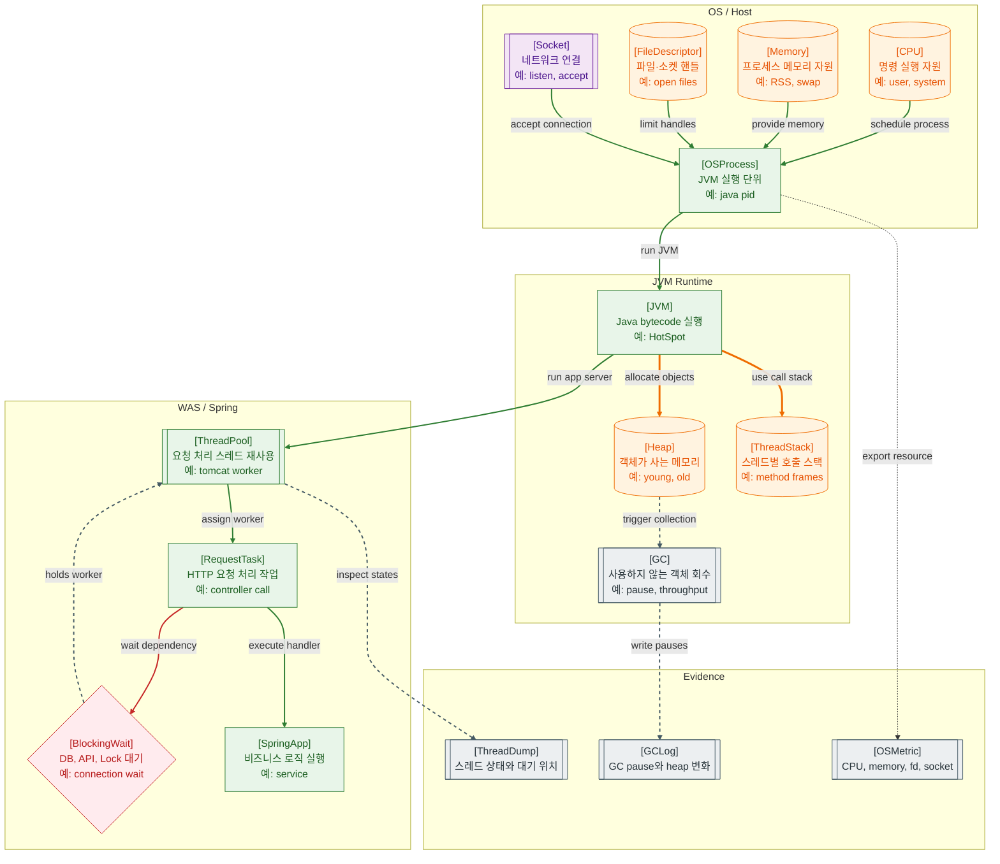

>[!success] 이 지도를 통해 아래 질문들에 답할 수 있게 됩니다.
>- Spring WAS는 OS Process, JVM, Thread, Heap 위에서 어떻게 실행되는가?
>- Thread Pool, GC, Socket, File Descriptor는 장애 분석에서 어디에 놓이는가?
>- CPU가 낮은데도 요청이 밀릴 수 있는 이유는 무엇인가?
>- WAS 장애가 났을 때 Thread Dump, GC Log, OS 지표 중 무엇을 먼저 확인해야 하는가?

---

---
이 지도는 Spring 애플리케이션이 추상적인 서버 코드가 아니라 OS Process 안의 JVM에서 실행된다는 점을 보여준다. 브라우저 요청이 WAS에 도착하면 Socket을 통해 프로세스로 들어오고, WAS Thread Pool의 worker가 요청 작업을 실행한다.

Heap은 Java 객체가 쌓이는 공간이고, GC는 사용하지 않는 객체를 회수한다. GC pause가 길어지면 CPU가 높지 않아도 요청 처리가 멈춘 것처럼 보일 수 있다. Thread Stack은 각 스레드의 호출 경로를 담고, Thread Dump는 스레드가 실행 중인지, DB나 Lock에서 기다리는지 확인하게 해준다.

장애 분석에서 중요한 점은 CPU만 보지 않는 것이다. Thread Pool이 모두 외부 API나 DB Connection 대기에서 막히면 CPU는 낮아도 사용자는 timeout을 본다. File Descriptor나 Socket backlog 같은 OS 자원도 WAS 장애처럼 보일 수 있다.

## 장애가 났을 때 먼저 확인할 것

- 프로세스가 살아 있는지, 포트가 listen 중인지 확인한다.
- CPU, memory, open file descriptor, socket 상태를 확인한다.
- Thread Pool active 수와 대기 요청 수를 확인한다.
- Thread Dump로 worker가 어디에서 blocking 중인지 본다.
- GC Log와 heap 사용량으로 긴 pause나 memory pressure를 확인한다.

## 설계할 때 선택 기준

- 요청마다 오래 blocking되는 작업이 많으면 Thread Pool과 timeout을 함께 설계한다.
- 외부 API나 DB 대기가 길면 bulkhead, circuit breaker, 비동기 분리를 검토한다.
- heap 사용량이 큰 작업은 streaming, pagination, batch chunking을 먼저 고려한다.
- 파일과 소켓을 많이 쓰면 file descriptor limit과 connection pool 크기를 함께 본다.
- 운영 환경에는 Thread Dump, GC Log, OS metric을 수집할 수 있는 경로를 미리 둔다.

## 운영 중 볼 지표

- process uptime, CPU usage, load average, context switch count
- RSS memory, heap used, old generation usage, GC pause time
- active thread count, blocked/waiting thread count, request queue length
- open file descriptor count, socket states, connection accept error
- thread dump hotspot, OOMKilled count, full GC count

## 흔한 오해

- CPU가 낮으면 서버가 한가하다고 볼 수 없다.
- JVM heap과 OS memory는 같은 지표가 아니다.
- Thread가 많으면 처리량이 무조건 늘어나는 것이 아니라 context switching과 memory 비용이 늘 수 있다.
- GC 튜닝은 마지막 단계에 가깝고, 먼저 객체 생성량과 요청 패턴을 봐야 한다.
- WAS 장애는 Java 코드만이 아니라 OS 자원 한계에서 시작될 수 있다.

## 실전 체크리스트

- [ ] 장애 시 Thread Dump를 뜰 수 있는 절차가 있는가?
- [ ] GC Log와 heap 지표를 APM에서 볼 수 있는가?
- [ ] Thread Pool, DB Pool, 외부 API timeout이 서로 맞물려 있는가?
- [ ] file descriptor와 socket 상태를 확인하는 운영 명령이 정리되어 있는가?
- [ ] CPU, memory, thread, GC를 같은 시간축에서 비교할 수 있는가?

## 질문에 대한 답변

1. Spring WAS는 OS Process, JVM, Thread, Heap 위에서 어떻게 실행되는가?

   OS는 Java 프로세스를 실행하고, 그 안에서 JVM이 Spring 애플리케이션을 구동한다. 요청은 Socket을 통해 들어오고, WAS Thread Pool의 worker가 Controller와 Service 로직을 실행하며, 객체는 Heap에 할당된다.

2. Thread Pool, GC, Socket, File Descriptor는 장애 분석에서 어디에 놓이는가?

   Socket과 File Descriptor는 OS 자원 경계에 있다. Thread Pool은 WAS 요청 처리 경계에 있고, GC는 JVM memory 관리 경계에 있다. 각각 요청 미도달, 요청 적체, 일시 정지 같은 다른 증상을 만든다.

3. CPU가 낮은데도 요청이 밀릴 수 있는 이유는 무엇인가?

   worker thread가 DB, 외부 API, Lock, Connection Pool 대기에서 막히면 CPU를 많이 쓰지 않으면서도 새 요청을 처리하지 못한다. 이때는 CPU보다 thread 상태와 pool 지표가 더 중요하다.

4. WAS 장애가 났을 때 Thread Dump, GC Log, OS 지표 중 무엇을 먼저 확인해야 하는가?

   먼저 프로세스와 OS 자원이 살아 있는지 보고, 요청이 밀리면 Thread Dump로 대기 위치를 확인한다. 응답이 주기적으로 멈추거나 memory가 높으면 GC Log와 heap 지표를 함께 본다.

## 관련 상세 문서

- [Computer System 전체 지도 압축 정리](<../Computer System/01. Computer System 전체 지도/00. Computer System 전체 지도 압축 정리.md>)
- [CPU Process Thread Scheduling 압축 정리](<../Computer System/02. CPU Process Thread Scheduling/00. CPU Process Thread Scheduling 압축 정리.md>)
- [Memory Stack Heap Virtual Memory 압축 정리](<../Computer System/04. Memory Stack Heap Virtual Memory/00. Memory Stack Heap Virtual Memory 압축 정리.md>)
- [Socket과 OS Network 압축 정리](<../Computer System/06. Socket과 OS Network/00. Socket과 OS Network 압축 정리.md>)
- [JVM Runtime GC Thread 압축 정리](<../Computer System/09. JVM Runtime GC Thread/00. JVM Runtime GC Thread 압축 정리.md>)
- [OS 관점의 성능 병목 분석 압축 정리](<../Computer System/10. OS 관점의 성능 병목 분석/00. OS 관점의 성능 병목 분석 압축 정리.md>)
- [APM Health Check Alert 압축 정리](<../Web-Operations/10. APM Health Check Alert/00. APM Health Check Alert 압축 정리.md>)

## 참고한 자료

- [OpenJDK - Troubleshooting Guide](https://docs.oracle.com/en/java/javase/21/troubleshoot/)
- [Spring Boot Reference - Actuator](https://docs.spring.io/spring-boot/reference/actuator/index.html)
- [Eclipse Temurin - Troubleshooting and diagnostics](https://adoptium.net/docs/)
- [Linux man-pages - proc](https://man7.org/linux/man-pages/man5/proc.5.html)
