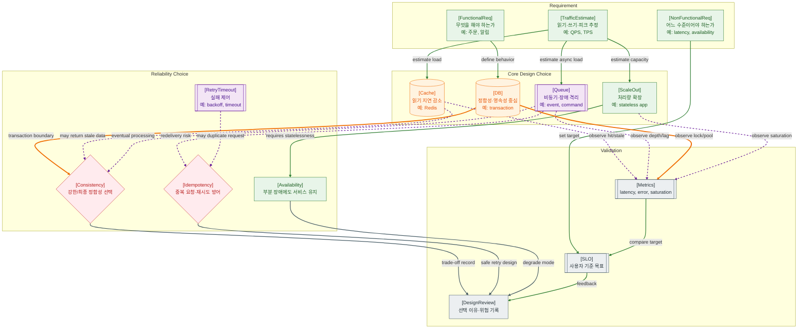

>[!success] 이 지도를 통해 아래 질문들에 답할 수 있게 됩니다.
>- 요구사항은 어떻게 DB, Cache, Queue, Scale-out 같은 설계 선택으로 이어지는가?
>- 성능, 정합성, 가용성, 운영 복잡도는 어떤 trade-off를 만드는가?
>- Cache와 Queue는 언제 도입하고, 언제 오히려 복잡도를 키우는가?
>- 설계 선택이 잘못되었는지 어떤 지표로 확인할 수 있는가?

---

---
이 지도는 시스템 설계를 기술 나열이 아니라 요구사항에서 선택으로 이어지는 흐름으로 보는 관점이다. 기능 요구사항은 무엇을 해야 하는지를 정하고, 비기능 요구사항은 얼마나 빠르고 안정적이어야 하는지를 정한다. 트래픽 추정은 그 요구를 감당하기 위해 어떤 구성요소가 필요한지 판단하게 해준다.

DB는 정합성과 영속성을 담당하지만, 모든 부하를 DB에만 두면 병목이 될 수 있다. Cache는 읽기 지연을 줄이지만 stale data와 무효화 문제가 생긴다. Queue는 응답과 후속 작업을 분리하지만 중복 처리와 지연 처리 문제가 생긴다. Scale-out은 처리량을 늘리지만 stateless 설계와 운영 복잡도를 요구한다.

중요한 것은 선택 자체보다 선택의 이유와 trade-off를 기록하는 것이다. 설계 선택은 Metrics와 SLO로 검증되어야 한다. cache hit ratio, queue depth, DB lock wait, p95 latency 같은 지표가 설계가 버티는지 알려준다.

## 장애가 났을 때 먼저 확인할 것

- 어떤 사용자 요구사항이나 SLO가 깨졌는지 확인한다.
- latency 문제인지, error 문제인지, saturation 문제인지 먼저 나눈다.
- DB lock/pool, cache miss/stale, queue depth/lag, app saturation을 비교한다.
- retry가 장애를 줄이는지 증폭시키는지 확인한다.
- 임시 조치 후 설계 선택의 trade-off가 기록되어 있는지 확인한다.

## 설계할 때 선택 기준

- 강한 정합성이 필요하면 DB 트랜잭션과 제약을 우선한다.
- 읽기 부하가 크고 약간의 stale을 허용하면 Cache를 검토한다.
- 오래 걸리거나 재시도 가능한 작업은 Queue로 분리한다.
- Scale-out은 앱이 stateless하거나 상태를 외부 저장소로 분리할 수 있을 때 효과적이다.
- retry를 넣는 작업은 idempotency를 먼저 설계한다.

## 운영 중 볼 지표

- p95/p99 latency, throughput, 4xx/5xx rate, timeout count
- DB connection pool usage, lock wait time, slow query count
- cache hit ratio, stale data report, eviction count
- queue depth, consumer lag, retry count, DLQ count
- SLO compliance, error budget burn, saturation trend

## 흔한 오해

- Cache를 붙이면 성능 문제가 자동으로 해결된다고 생각하기 쉽다.
- Queue를 쓰면 장애가 사라지는 것이 아니라 다른 실행 모델로 이동한다.
- Scale-out은 DB나 외부 API 병목을 해결하지 못할 수 있다.
- CAP 같은 개념은 외우는 것보다 사용자 경험과 데이터 정합성 선택으로 해석해야 한다.
- 설계 문서가 없으면 나중에 왜 그 선택을 했는지 운영자가 알 수 없다.

## 실전 체크리스트

- [ ] 기능 요구사항과 비기능 요구사항이 분리되어 있는가?
- [ ] 읽기/쓰기 비율과 피크 트래픽을 추정했는가?
- [ ] Cache, Queue, Scale-out을 도입하는 이유와 비용을 적었는가?
- [ ] retry가 있는 곳에 idempotency가 있는가?
- [ ] 설계 선택을 검증할 지표와 SLO가 정의되어 있는가?

## 질문에 대한 답변

1. 요구사항은 어떻게 DB, Cache, Queue, Scale-out 같은 설계 선택으로 이어지는가?

   기능 요구사항은 필요한 데이터와 동작을 정하고, 비기능 요구사항과 트래픽 추정은 성능·가용성 목표를 정한다. 이 목표에 따라 DB 트랜잭션, Cache, Queue, Scale-out 같은 선택지가 결정된다.

2. 성능, 정합성, 가용성, 운영 복잡도는 어떤 trade-off를 만드는가?

   Cache는 성능을 높이지만 정합성 비용이 생긴다. Queue는 가용성과 응답성을 높이지만 지연과 중복 처리를 감당해야 한다. Scale-out은 처리량을 늘리지만 운영 복잡도가 증가한다.

3. Cache와 Queue는 언제 도입하고, 언제 오히려 복잡도를 키우는가?

   Cache는 반복 조회가 많고 stale을 허용할 때 유리하다. Queue는 오래 걸리거나 재시도 가능한 작업에 유리하다. 정합성이 강하게 필요하거나 작업 순서와 즉시 결과가 중요하면 오히려 복잡도를 키울 수 있다.

4. 설계 선택이 잘못되었는지 어떤 지표로 확인할 수 있는가?

   cache hit ratio가 낮거나 stale report가 많고, queue depth와 lag가 계속 늘거나, DB lock wait과 pool usage가 치솟으면 설계 선택을 다시 봐야 한다. SLO 위반이 반복되는 지표가 가장 강한 신호다.

## 관련 상세 문서

- [System Design 전체 지도 압축 정리](<../System Design/01. System Design 전체 지도/00. System Design 전체 지도 압축 정리.md>)
- [Functional Non-functional Requirement 압축 정리](<../System Design/02. Functional Non-functional Requirement/00. Functional Non-functional Requirement 압축 정리.md>)
- [Traffic Estimation Capacity Planning 압축 정리](<../System Design/03. Traffic Estimation Capacity Planning/00. Traffic Estimation Capacity Planning 압축 정리.md>)
- [Cache 전략과 정합성 압축 정리](<../System Design/05. Cache 전략과 정합성/00. Cache 전략과 정합성 압축 정리.md>)
- [Queue Async Event-driven Design 압축 정리](<../System Design/06. Queue Async Event-driven Design/00. Queue Async Event-driven Design 압축 정리.md>)
- [Consistency Availability Partition 압축 정리](<../System Design/09. Consistency Availability Partition/00. Consistency Availability Partition 압축 정리.md>)
- [Scale Up Scale Out Partitioning Sharding 압축 정리](<../System Design/10. Scale Up Scale Out Partitioning Sharding/00. Scale Up Scale Out Partitioning Sharding 압축 정리.md>)

## 참고한 자료

- [Google SRE Book - Service Level Objectives](https://sre.google/sre-book/service-level-objectives/)
- [AWS Builders' Library - Timeouts, retries, and backoff with jitter](https://aws.amazon.com/builders-library/timeouts-retries-and-backoff-with-jitter/)
- [AWS Builders' Library - Caching challenges and strategies](https://aws.amazon.com/builders-library/caching-challenges-and-strategies/)
- [Microsoft Azure Architecture Center - Design patterns](https://learn.microsoft.com/en-us/azure/architecture/patterns/)
