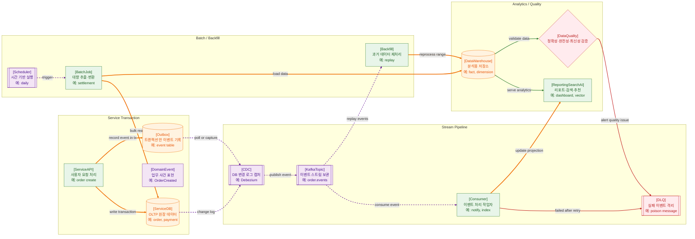

>[!success] 이 지도를 통해 아래 질문들에 답할 수 있게 됩니다.
>- 서비스 DB의 데이터는 어떻게 이벤트와 배치를 통해 다른 시스템으로 이동하는가?
>- Outbox와 CDC는 Dual Write 문제를 어디에서 줄이는가?
>- Kafka, Consumer, DLQ, Batch, Backfill은 각각 어떤 실패와 운영 문제를 다루는가?
>- Data Warehouse와 Data Quality는 서비스 데이터 흐름의 어느 위치에 놓이는가?

---

---
이 지도는 서비스 DB의 데이터가 이벤트와 배치를 통해 알림, 검색, 분석, 추천 같은 다른 시스템으로 이동하는 흐름을 설명한다. 서비스 API는 사용자 요청을 처리하며 ServiceDB에 트랜잭션을 기록한다. 동시에 이벤트를 발행해야 한다면 DB 쓰기와 메시지 발행이 따로 성공하는 Dual Write 문제가 생길 수 있다.

Outbox는 이 문제를 줄이기 위해 서비스 트랜잭션 안에 이벤트 기록을 함께 남기는 패턴이다. 이후 CDC나 polling이 Outbox 또는 DB 변경 로그를 읽어 Kafka 같은 스트림으로 발행한다. Consumer는 이벤트를 읽어 알림, 검색 인덱스, 분석 저장소 같은 후속 시스템을 갱신한다.

Batch와 Backfill은 스트림만으로 해결하기 어려운 대량 처리와 과거 데이터 재처리를 담당한다. Data Warehouse는 분석용 저장소이고, Data Quality는 데이터가 최신이고 완전하며 정확한지 검증한다.

## 장애가 났을 때 먼저 확인할 것

- 서비스 DB 트랜잭션은 성공했는지, Outbox 기록은 남았는지 확인한다.
- CDC가 변경 로그를 읽고 있는지, lag가 증가하는지 확인한다.
- Kafka topic의 consumer lag, retry, DLQ를 확인한다.
- Batch 마지막 성공 시각과 처리 건수, checkpoint를 확인한다.
- Data Warehouse 적재 지연과 Data Quality rule 실패를 확인한다.

## 설계할 때 선택 기준

- 서비스 트랜잭션과 이벤트 발행을 함께 보장해야 하면 Outbox를 검토한다.
- DB 변경을 지속적으로 스트림화해야 하면 CDC를 검토한다.
- 이벤트 재처리와 여러 consumer가 필요하면 Kafka 같은 event stream을 검토한다.
- 정해진 시간의 대량 집계나 정산은 Batch로 분리한다.
- 과거 데이터 수정이나 로직 변경이 잦으면 Backfill과 idempotent consumer를 함께 설계한다.

## 운영 중 볼 지표

- outbox pending count, outbox age, CDC lag
- Kafka consumer lag, offset commit failure, retry count, DLQ count
- batch duration, last success time, checkpoint age, backfill throughput
- warehouse freshness, row count diff, completeness failure count
- duplicate event count, schema compatibility failure count

## 흔한 오해

- DB에 저장한 뒤 메시지를 보내면 항상 둘 다 성공한다고 생각하면 위험하다.
- Kafka를 쓰면 정확히 한 번 처리된다고 기대하기보다 중복 처리에 대비해야 한다.
- Batch는 낡은 방식이 아니라 대량 처리와 재처리에 여전히 중요하다.
- Data Warehouse의 숫자가 서비스 DB와 다르면 원인은 ETL, CDC, 지연, 중복 어디든 있을 수 있다.
- Data Quality는 분석팀만의 문제가 아니라 서비스 변경이 만든 데이터 영향까지 포함한다.

## 실전 체크리스트

- [ ] 서비스 트랜잭션과 이벤트 발행 사이의 Dual Write 위험을 줄였는가?
- [ ] 이벤트 schema와 versioning 기준이 있는가?
- [ ] Consumer가 중복 이벤트를 안전하게 처리하는가?
- [ ] DLQ와 Backfill 재처리 절차가 있는가?
- [ ] Data Warehouse freshness와 품질 rule을 관측하는가?

## 질문에 대한 답변

1. 서비스 DB의 데이터는 어떻게 이벤트와 배치를 통해 다른 시스템으로 이동하는가?

   서비스 API가 DB에 데이터를 기록하고, Outbox나 CDC가 변경을 이벤트로 추출한다. Kafka topic을 거쳐 Consumer가 알림, 검색, 분석 저장소를 갱신한다. 대량 집계나 재처리는 Batch와 Backfill이 담당한다.

2. Outbox와 CDC는 Dual Write 문제를 어디에서 줄이는가?

   Outbox는 서비스 트랜잭션 안에 이벤트 기록을 함께 남겨 DB 쓰기와 이벤트 기록을 같은 경계에 둔다. CDC는 DB 변경 로그를 읽어 그 기록을 스트림으로 발행한다.

3. Kafka, Consumer, DLQ, Batch, Backfill은 각각 어떤 실패와 운영 문제를 다루는가?

   Kafka는 이벤트를 보관하고 재생할 수 있게 한다. Consumer는 이벤트를 처리한다. DLQ는 반복 실패 이벤트를 격리한다. Batch는 대량 작업을 수행하고, Backfill은 과거 데이터를 다시 처리한다.

4. Data Warehouse와 Data Quality는 서비스 데이터 흐름의 어느 위치에 놓이는가?

   Data Warehouse는 운영 DB와 분리된 분석용 저장소다. Data Quality는 적재된 데이터가 최신성, 완전성, 정확성을 만족하는지 검증하는 운영 경계다.

## 관련 상세 문서

- [Data Engineering 전체 지도 압축 정리](<../Data Engineering/01. Data Engineering 전체 지도/00. Data Engineering 전체 지도 압축 정리.md>)
- [ETL ELT Data Pipeline 압축 정리](<../Data Engineering/05. ETL ELT Data Pipeline/00. ETL ELT Data Pipeline 압축 정리.md>)
- [Kafka Message Queue Event Stream 압축 정리](<../Data Engineering/06. Kafka Message Queue Event Stream/00. Kafka Message Queue Event Stream 압축 정리.md>)
- [CDC와 Outbox Pattern 압축 정리](<../Data Engineering/07. CDC와 Outbox Pattern/00. CDC와 Outbox Pattern 압축 정리.md>)
- [중복 처리 재처리 Backfill 압축 정리](<../Data Engineering/09. 중복 처리 재처리 Backfill/00. 중복 처리 재처리 Backfill 압축 정리.md>)
- [Data Quality Monitoring 압축 정리](<../Data Engineering/12. Data Quality Monitoring/00. Data Quality Monitoring 압축 정리.md>)
- [백엔드 서비스와 데이터 파이프라인 연결 압축 정리](<../Data Engineering/13. 백엔드 서비스와 데이터 파이프라인 연결/00. 백엔드 서비스와 데이터 파이프라인 연결 압축 정리.md>)

## 참고한 자료

- [Apache Kafka Documentation](https://kafka.apache.org/documentation/)
- [Debezium Documentation](https://debezium.io/documentation/)
- [Microservices.io - Transactional Outbox](https://microservices.io/patterns/data/transactional-outbox.html)
- [Airflow Documentation](https://airflow.apache.org/docs/)
