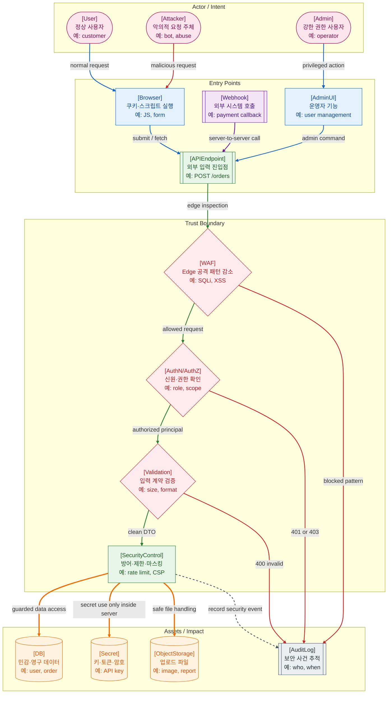

>[!success] 이 지도를 통해 아래 질문들에 답할 수 있게 됩니다.
>- Threat Model은 웹 시스템의 어떤 위치와 경계를 보는가?
>- Actor, Asset, Entry Point, Trust Boundary, Attack Surface는 서로 어떻게 연결되는가?
>- WAF, Auth, Validation, Encoding, Audit Log는 각각 어떤 위험을 줄이는가?
>- 보안 사고가 의심될 때 어떤 로그와 경계부터 확인해야 하는가?

---

---
이 지도는 보안을 방어 기능 목록이 아니라 공격자, 진입점, 신뢰 경계, 자산, 감사 로그의 관계로 보는 Threat Model 관점이다. 정상 사용자와 공격자는 같은 Entry Point를 사용할 수 있으므로, 시스템은 요청이 들어오는 경계마다 신뢰 수준을 다시 확인해야 한다.

Entry Point는 외부 입력이 들어오는 지점이다. Browser, API Endpoint, Webhook, Admin UI는 모두 공격 표면이 될 수 있다. Trust Boundary는 신뢰할 수 없는 입력이 더 민감한 영역으로 넘어가기 전에 검사되는 경계다.

Asset은 보호해야 할 대상이다. DB의 개인정보와 주문 데이터, Secret의 API Key, Object Storage의 파일, Admin 기능은 모두 사고 영향이 크다. Audit Log는 공격을 막는 장치라기보다, 무슨 일이 있었는지 나중에 추적할 수 있게 하는 운영 장치다.

## 장애가 났을 때 먼저 확인할 것

- 비정상 401/403/429/5xx 증가가 특정 Entry Point에 집중되는지 확인한다.
- WAF 차단 로그와 애플리케이션 보안 로그를 시간순으로 맞춰 본다.
- 인증된 사용자인데 권한 없는 자산에 접근했는지 확인한다.
- 입력 검증 실패, 파일 업로드 실패, Webhook 서명 실패를 확인한다.
- Audit Log에 actor, action, resource, result가 남아 있는지 확인한다.

## 설계할 때 선택 기준

- 외부 입력이 들어오는 모든 Entry Point를 먼저 식별한다.
- Entry Point마다 보호해야 할 Asset과 가능한 공격 시나리오를 연결한다.
- 인증은 누구인지, 인가는 무엇을 할 수 있는지를 분리해 설계한다.
- Secret은 코드와 로그에 남기지 않고 서버 내부 경계에서만 사용한다.
- 보안 이벤트는 방어 실패 여부와 별개로 Audit Log에 남길 기준을 정한다.

## 운영 중 볼 지표

- WAF blocked count, 401/403/429 rate, suspicious request rate
- validation failure count, webhook signature failure count
- admin action count, privilege change count, denied access count
- secret scanning finding count, dependency vulnerability count
- audit log missing field count, security incident count

## 흔한 오해

- WAF가 있으면 애플리케이션 검증이 필요 없다고 생각하면 안 된다.
- Admin UI는 내부용이라는 이유만으로 안전하지 않다.
- Webhook은 서버 간 호출이라도 서명 검증과 replay 방어가 필요하다.
- Audit Log는 일반 debug log와 다르며, 누가 무엇을 했는지 추적 가능해야 한다.
- Threat Model은 보안 전문가만 하는 문서가 아니라 기능 설계 초기에 함께 할 수 있는 질문이다.

## 실전 체크리스트

- [ ] Actor, Entry Point, Asset이 목록화되어 있는가?
- [ ] 각 Entry Point 앞에 인증, 인가, 검증, rate limit 기준이 있는가?
- [ ] Secret이 코드, 이미지, 로그에 노출되지 않는가?
- [ ] 보안 이벤트가 Audit Log로 추적되는가?
- [ ] 새 기능을 만들 때 공격 표면이 늘어나는지 검토하는가?

## 질문에 대한 답변

1. Threat Model은 웹 시스템의 어떤 위치와 경계를 보는가?

   Threat Model은 누가 들어오는지, 어디로 들어오는지, 어떤 자산을 노리는지, 어떤 신뢰 경계를 통과하는지 본다. 그래서 Actor, Entry Point, Trust Boundary, Asset을 함께 그린다.

2. Actor, Asset, Entry Point, Trust Boundary, Attack Surface는 서로 어떻게 연결되는가?

   Actor는 Entry Point를 통해 시스템에 접근한다. Entry Point가 Attack Surface가 되고, Trust Boundary는 요청이 민감한 Asset에 접근하기 전에 검증되는 경계다.

3. WAF, Auth, Validation, Encoding, Audit Log는 각각 어떤 위험을 줄이는가?

   WAF는 앞단 공격 패턴을 줄이고, Auth는 신원과 권한을 확인한다. Validation은 입력 계약을 지키게 하고, Encoding은 출력 기반 공격을 줄인다. Audit Log는 사고 추적과 책임 범위 확인을 돕는다.

4. 보안 사고가 의심될 때 어떤 로그와 경계부터 확인해야 하는가?

   먼저 Entry Point별 요청 패턴과 WAF/Auth/Validation 실패 로그를 본다. 그 다음 보호 자산 접근 이력과 Audit Log를 확인해 누가 어떤 리소스에 접근했는지 추적한다.

## 관련 상세 문서

- [Web Security 전체 지도 압축 정리](<../Web-Security/01. Web Security 전체 지도/00. Web Security 전체 지도 압축 정리.md>)
- [Threat Model Trust Boundary 압축 정리](<../Web-Security/02. Threat Model Trust Boundary/00. Threat Model Trust Boundary 압축 정리.md>)
- [Authentication과 Identity 압축 정리](<../Web-Security/03. Authentication과 Identity/00. Authentication과 Identity 압축 정리.md>)
- [Authorization RBAC ABAC Permission 압축 정리](<../Web-Security/05. Authorization RBAC ABAC Permission/00. Authorization RBAC ABAC Permission 압축 정리.md>)
- [API Security SQL Injection Validation 압축 정리](<../Web-Security/07. API Security SQL Injection Validation/00. API Security SQL Injection Validation 압축 정리.md>)
- [Security Log Audit Abuse Detection 압축 정리](<../Web-Security/10. Security Log Audit Abuse Detection/00. Security Log Audit Abuse Detection 압축 정리.md>)

## 참고한 자료

- [OWASP - Threat Modeling Cheat Sheet](https://cheatsheetseries.owasp.org/cheatsheets/Threat_Modeling_Cheat_Sheet.html)
- [OWASP - Application Security Verification Standard](https://owasp.org/www-project-application-security-verification-standard/)
- [OWASP - API Security Top 10](https://owasp.org/API-Security/)
- [NIST - Secure Software Development Framework](https://csrc.nist.gov/Projects/ssdf)
