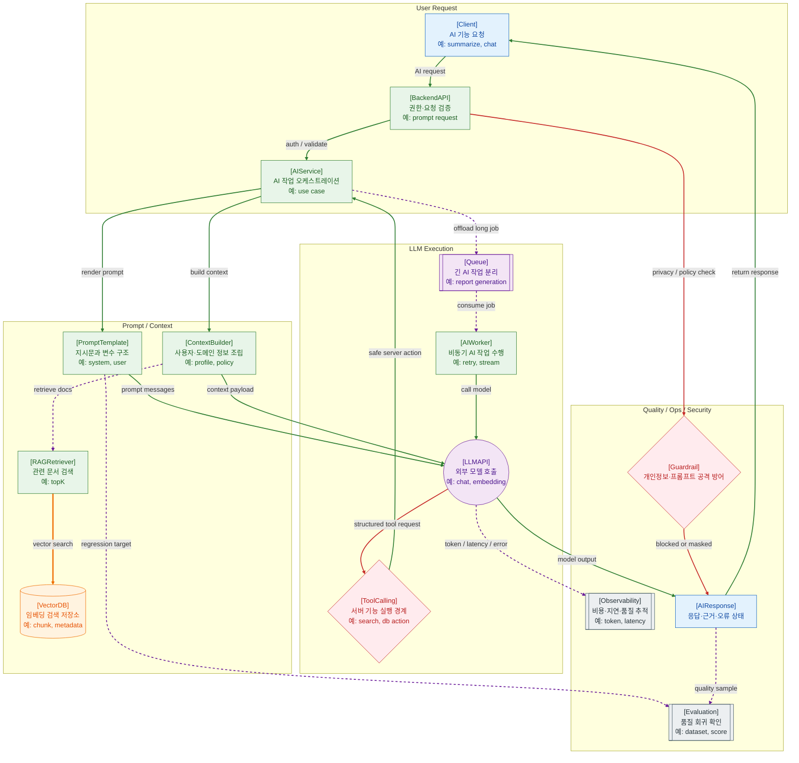

>[!success] 이 지도를 통해 아래 질문들에 답할 수 있게 됩니다.
>- AI/LLM 기능은 웹 백엔드 시스템 안에서 어느 위치에 붙는가?
>- Prompt, Context, RAG, Vector DB, Tool Calling은 서로 어떻게 연결되는가?
>- LLM API 호출은 왜 Queue, Worker, Timeout, Observability와 함께 설계해야 하는가?
>- AI 기능 장애가 났을 때 품질, 비용, 지연, 보안 중 무엇을 먼저 확인해야 하는가?

---

---
이 지도는 AI/LLM 기능을 별도 장난감 기능이 아니라 웹 백엔드 시스템에 붙는 하나의 실행 흐름으로 설명한다. 클라이언트가 AI 기능을 요청하면 Backend API는 인증, 권한, 입력 검증을 수행하고 AIService가 prompt, context, retrieval, model call을 조립한다.

PromptTemplate은 모델에게 줄 지시와 변수 구조를 담고, ContextBuilder는 사용자 정보와 업무 규칙을 조립한다. RAG가 필요하면 VectorDB에서 관련 문서를 찾아 context에 붙인다. 이때 권한이 없는 문서가 context에 들어가지 않도록 보안 경계를 함께 봐야 한다.

LLM API 호출은 지연시간, 비용, rate limit, provider 장애의 영향을 크게 받는다. 짧은 요청은 동기로 처리할 수 있지만, 긴 리포트 생성이나 대량 작업은 Queue와 Worker로 분리하는 편이 안전하다. 품질은 Evaluation으로, 운영은 Observability로 추적해야 한다.

## 장애가 났을 때 먼저 확인할 것

- LLM API timeout, 429, 5xx, provider 장애 여부를 확인한다.
- token 사용량과 비용이 평소보다 급증했는지 확인한다.
- RAG 검색 결과가 비어 있거나 권한 없는 문서를 포함했는지 확인한다.
- Queue 기반 작업이면 queue depth, worker retry, DLQ를 확인한다.
- 품질 문제가 있으면 prompt version, context source, evaluation regression을 확인한다.

## 설계할 때 선택 기준

- 짧고 즉시 필요한 답변은 동기 API로 시작할 수 있다.
- 오래 걸리거나 비용이 큰 작업은 Queue와 Worker로 분리한다.
- 도메인 문서 기반 답변이 필요하면 RAG와 VectorDB를 검토한다.
- 서버 기능을 실행해야 하면 Tool Calling 경계에 권한, validation, audit log를 둔다.
- 품질이 중요한 기능은 prompt 변경을 코드 변경처럼 versioning하고 evaluation을 붙인다.

## 운영 중 볼 지표

- LLM latency, timeout count, provider error rate, 429 rate
- prompt token, completion token, cost per request, cache hit ratio
- RAG retrieval hit rate, no-context rate, source freshness
- queue depth, worker retry count, AI DLQ count
- evaluation score, hallucination report, human review rate, policy block count

## 흔한 오해

- LLM API를 호출하는 것만으로 AI 기능 설계가 끝나지 않는다.
- Prompt는 문장 조각이 아니라 versioning, test, rollback 대상이다.
- RAG를 붙이면 항상 정확해지는 것이 아니라 검색 품질과 권한 경계가 중요해진다.
- Tool Calling은 모델이 서버 기능을 실행하게 하는 경계라 보안 검증이 필요하다.
- AI 기능의 장애는 500 오류뿐 아니라 품질 저하, 비용 폭증, 지연 증가로도 나타난다.

## 실전 체크리스트

- [ ] AI 요청에 인증, 권한, 입력 검증이 적용되는가?
- [ ] prompt와 model 설정이 versioning되고 rollback 가능한가?
- [ ] RAG source, chunk, metadata, 권한 필터가 관리되는가?
- [ ] LLM API timeout, retry, rate limit, fallback 기준이 있는가?
- [ ] 비용, 지연, 품질, 보안 이벤트를 함께 관측하는가?

## 질문에 대한 답변

1. AI/LLM 기능은 웹 백엔드 시스템 안에서 어느 위치에 붙는가?

   AI 기능은 Backend API 뒤의 AIService에 붙는다. AIService는 prompt와 context를 조립하고, 필요하면 RAG 검색과 Queue/Worker를 거쳐 LLM API를 호출한다.

2. Prompt, Context, RAG, Vector DB, Tool Calling은 서로 어떻게 연결되는가?

   PromptTemplate은 지시 구조를 만들고, ContextBuilder는 사용자와 도메인 정보를 붙인다. RAG는 VectorDB에서 관련 문서를 찾아 context를 보강한다. Tool Calling은 모델 출력이 서버 기능 실행으로 이어지는 별도 보안 경계다.

3. LLM API 호출은 왜 Queue, Worker, Timeout, Observability와 함께 설계해야 하는가?

   LLM 호출은 느릴 수 있고, 비용이 크며, provider 장애와 rate limit의 영향을 받는다. 긴 작업은 Queue/Worker로 분리하고, timeout과 retry를 둔 뒤 token, latency, error, quality를 관측해야 한다.

4. AI 기능 장애가 났을 때 품질, 비용, 지연, 보안 중 무엇을 먼저 확인해야 하는가?

   증상에 따라 나눈다. 응답 실패는 provider error와 timeout, 느림은 latency와 queue depth, 비용은 token usage, 품질은 prompt/context/eval, 보안은 policy block과 tool 실행 로그를 먼저 본다.

## 관련 상세 문서

- [AI 백엔드 개발자 로드맵 압축 정리](<../AI/01. AI 백엔드 개발자 로드맵/00. AI 백엔드 개발자 로드맵 압축 정리.md>)
- [Prompt Context Harness Engineering 압축 정리](<../AI/03. Prompt Context Harness Engineering/00. Prompt Context Harness Engineering 압축 정리.md>)
- [LLM API 연동과 서버 통합 압축 정리](<../AI/04. LLM API 연동과 서버 통합/00. LLM API 연동과 서버 통합 압축 정리.md>)
- [Structured Output과 Tool Calling 압축 정리](<../AI/05. Structured Output과 Tool Calling/00. Structured Output과 Tool Calling 압축 정리.md>)
- [RAG 설계 압축 정리](<../AI/07. RAG 설계/00. RAG 설계 압축 정리.md>)
- [Evaluation과 Observability 압축 정리](<../AI/09. Evaluation과 Observability/00. Evaluation과 Observability 압축 정리.md>)
- [AI 운영과 장애 대응 압축 정리](<../AI/10. AI 운영과 장애 대응/00. AI 운영과 장애 대응 압축 정리.md>)

## 참고한 자료

- [OWASP - Top 10 for LLM Applications](https://owasp.org/www-project-top-10-for-large-language-model-applications/)
- [NIST - AI Risk Management Framework](https://www.nist.gov/itl/ai-risk-management-framework)
- [OpenTelemetry Docs - Signals](https://opentelemetry.io/docs/concepts/signals/)
- [Microsoft Azure Architecture Center - AI workload architecture](https://learn.microsoft.com/en-us/azure/architecture/ai-ml/)
