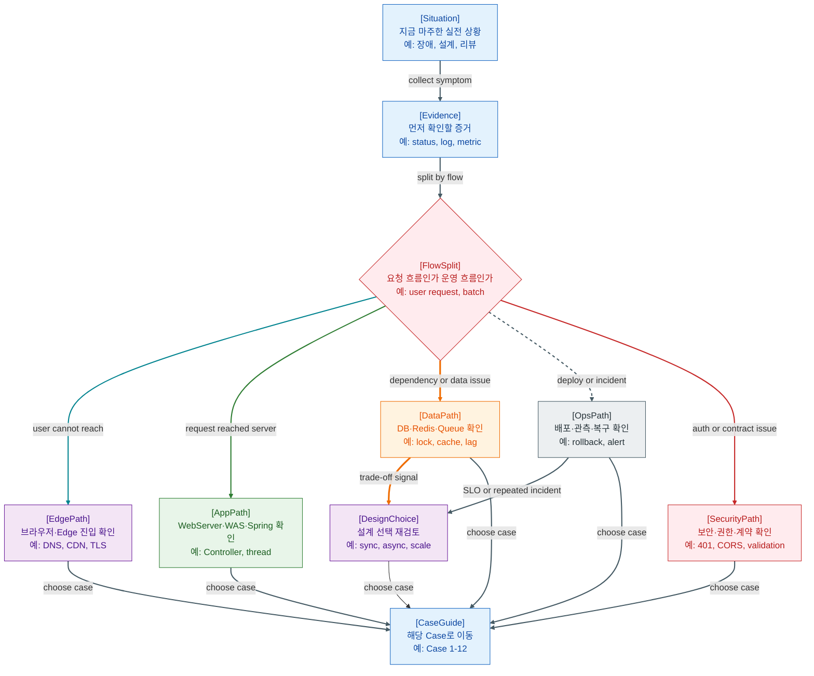

>[!success] 이 가이드북을 통해 아래 질문들에 답할 수 있게 됩니다.
>- 처음 보는 웹 서비스에서 전체 흐름을 어떻게 빠르게 잡는가?
>- 장애가 났을 때 Browser, Edge, WAS, DB, Queue 중 어디부터 확인하는가?
>- DB, Redis, Queue, Docker, Kubernetes 같은 선택지는 언제 다시 봐야 하는가?
>- 보안, API 계약, 인증/인가 문제는 요청 흐름의 어느 경계에서 나누는가?
>- AI/LLM 기능을 웹 백엔드에 붙일 때 어떤 운영 지점까지 함께 봐야 하는가?

---

---
이 문서는 `Web-지도` 1~24번을 다시 찾아가기 위한 실전 가이드북이다. 요약본처럼 모든 내용을 짧게 다시 설명하려는 문서가 아니다. 상황을 먼저 던지고, 어떤 증거를 보고, 어떤 질문으로 나누고, 어떤 지도를 다시 펼칠지 안내하는 문서다.

Web-지도 시리즈는 웹 서비스를 하나의 긴 요청·운영 흐름으로 보는 문서들이다. 그래서 이 가이드북도 “정답을 외우기”보다 “지금 어디를 보고 있는지”를 찾는 데 집중한다. 장애를 보든 설계를 보든, 먼저 흐름을 나누면 다음 문서가 자연스럽게 보인다.

## 이 가이드북을 쓰는 법

처음 읽는다면 Case 1부터 Case 12까지 순서대로 읽어도 좋다. 전체 요청 흐름, 장애 대응, 데이터 선택, 비동기, 배포, 보안, AI 확장까지 한 번에 이어진다.

이미 겪고 있는 상황이 있다면 `## 상황별 빠른 길찾기`에서 가까운 Case로 바로 이동한다. 각 Case의 `찾아볼 문서`는 해당 상황에서 다시 펼칠 지도다. 문서를 모두 읽으라는 뜻이 아니라, 지금 판단에 필요한 지도부터 보라는 뜻이다.

## 실전 판단 지도

실전에서는 먼저 증상을 모으고, 그 증상이 어느 흐름에 속하는지 나눈다.

- 사용자가 아예 도달하지 못하면 Browser, DNS, CDN, TLS, WAF, LB부터 본다.
- 요청이 WAS까지 왔는데 느리거나 실패하면 Spring MVC, Thread, DB, Redis, 외부 API를 본다.
- 응답은 성공했는데 데이터가 이상하면 DB 트랜잭션, 캐시, Queue, Batch를 본다.
- 배포 직후 문제가 생기면 CI/CD, Migration, Rollback, APM, Incident 흐름을 본다.
- 401, 403, CORS, Validation, Error Response가 보이면 보안 경계와 API 계약을 나눈다.
- 같은 문제가 반복되면 운영 지표와 설계 선택 지도로 돌아간다.

## 상황별 실전 가이드

### Case 1. 처음 보는 서비스의 큰 흐름을 잡아야 한다

#### 상황

새 프로젝트에 들어왔는데 문서는 많고, 서버는 여러 개고, 요청이 어디로 들어와 어디서 끝나는지 아직 감이 없다.

#### 관찰할 증거 또는 확인할 단서

- 사용자 진입 URL, API base URL, CDN 사용 여부
- Web Server와 WAS 배치
- DB, Redis, Queue, Storage, 외부 API 목록
- 배포 파이프라인과 APM 대시보드 유무

#### 먼저 생각해보기

이 서비스는 “사용자 요청 1건의 흐름”과 “운영·배포·배치 흐름”이 분리되어 보이는가?

#### 찾아볼 문서

- [1. 웹 전체 지도.md](<1. 웹 전체 지도.md>) - 전체 요청, 데이터, 운영 흐름을 한 장으로 잡는다.
- [2. Edge 진입 지도 - DNS, CDN, TLS, WAF, LB.md](<2. Edge 진입 지도 - DNS, CDN, TLS, WAF, LB.md>) - 서버 앞단에서 요청이 지나가는 길을 확인한다.
- [3. Web Server, WAS, Spring MVC 지도.md](<3. Web Server, WAS, Spring MVC 지도.md>) - 애플리케이션 내부 진입점을 본다.
- [4. 데이터, Redis, 외부 연동 지도.md](<4. 데이터, Redis, 외부 연동 지도.md>) - WAS 주변 의존성을 구분한다.
- [8. APM , Backup , 장애 대응 지도.md](<8. APM , Backup , 장애 대응 지도.md>) - 운영 중 무엇으로 상태를 보는지 확인한다.

#### 정리

처음에는 기술 이름을 모두 외우지 말고 위치부터 잡는다. Edge는 서버 앞, Web Server와 WAS는 애플리케이션 실행 구간, DB와 Redis는 데이터 접근, Queue와 Batch는 비동기·배경 흐름, APM과 Backup은 운영 흐름이다.

#### 가져갈 한 문장

처음 보는 시스템은 기술 목록보다 요청의 여행 경로를 먼저 그려야 덜 헤맨다.

### Case 2. 사용자는 접속 실패를 보는데 WAS 로그가 없다

#### 상황

사용자는 “사이트가 안 열린다”고 말하는데 WAS 로그에는 요청이 없다. 서버 코드를 아무리 봐도 증거가 잘 나오지 않는다.

#### 관찰할 증거 또는 확인할 단서

- 브라우저의 DNS 오류, TLS 오류, 403, 502, 504
- CDN cache hit/miss, WAF block log, LB health check
- Web Server access log와 upstream log
- 장애 시작 시각과 최근 배포·설정 변경

#### 먼저 생각해보기

요청이 애플리케이션에 도착하지 않은 문제인가, 도착했지만 로그를 남기지 못한 문제인가?

#### 찾아볼 문서

- [2. Edge 진입 지도 - DNS, CDN, TLS, WAF, LB.md](<2. Edge 진입 지도 - DNS, CDN, TLS, WAF, LB.md>) - WAS 앞단의 장애 위치를 나눈다.
- [16. 실전 장애 점검 체크리스트 지도.md](<16. 실전 장애 점검 체크리스트 지도.md>) - 영향 범위와 최근 변경부터 확인한다.
- [8. APM , Backup , 장애 대응 지도.md](<8. APM , Backup , 장애 대응 지도.md>) - 로그, 메트릭, 트레이스를 연결한다.
- [7. CI.CD , 배포 지도.md](<7. CI.CD , 배포 지도.md>) - 배포·설정 변경이 앞단 장애를 만들었는지 본다.

#### 정리

WAS 로그가 없으면 먼저 WAS 안쪽으로 들어가지 않는다. DNS, CDN, TLS, WAF, LB, Web Server 순서로 요청이 어디까지 도달했는지 확인한다. 이후 최근 변경과 대시보드 시간축을 맞춘다.

#### 가져갈 한 문장

로그가 없는 곳을 오래 파기보다, 요청이 그곳까지 왔는지부터 확인한다.

### Case 3. Controller 로그는 있는데 응답이 이상하거나 500이 난다

#### 상황

요청은 Controller에 들어온다. 그런데 HTML 대신 JSON이 오거나, Validation 실패가 500으로 보이거나, 예외 응답 형식이 endpoint마다 다르다.

#### 관찰할 증거 또는 확인할 단서

- Controller, Interceptor, ExceptionHandler 로그
- HTTP status와 response body 구조
- Validation error와 business error 구분
- Thread dump나 GC log가 필요한 지연 증상

#### 먼저 생각해보기

이 문제는 MVC 응답 경로 문제인가, API 계약 문제인가, JVM·Thread 실행 문제인가?

#### 찾아볼 문서

- [3. Web Server, WAS, Spring MVC 지도.md](<3. Web Server, WAS, Spring MVC 지도.md>) - Controller 전후의 흐름을 확인한다.
- [19. API Contract, Error Response, Validation 지도.md](<19. API Contract, Error Response, Validation 지도.md>) - 실패 응답을 계약 관점에서 나눈다.
- [9. 보안 검증 위치 지도.md](<9. 보안 검증 위치 지도.md>) - Filter, Validation, Repository, Response Boundary를 구분한다.
- [20. JVM, OS, Thread, Memory 지도.md](<20. JVM, OS, Thread, Memory 지도.md>) - CPU가 낮아도 요청이 멈추는 실행 지점을 본다.

#### 정리

Controller에 도착했다면 Spring MVC 내부 경계를 본다. 요청 바인딩과 Validation은 Controller 앞뒤, 비즈니스 실패는 Service, 예상 밖 예외는 ExceptionHandler, 응답 형식은 ViewResolver나 MessageConverter와 연결된다.

#### 가져갈 한 문장

Controller 로그는 출발점일 뿐이고, 응답이 만들어지는 경계는 그 뒤에도 여러 개다.

### Case 4. 로그인은 했는데 API가 401, 403, CORS로 흔들린다

#### 상황

프론트엔드에서는 로그인했다고 보이는데 일부 API는 401이나 403을 돌려준다. 어떤 요청은 CORS 오류처럼 보이고, 어떤 요청은 Cookie가 빠진다.

#### 관찰할 증거 또는 확인할 단서

- Cookie, Authorization header, SameSite, Secure, HttpOnly
- 401과 403의 차이
- CORS preflight와 실제 요청의 status
- SecurityFilter, RBAC, API error response

#### 먼저 생각해보기

인증 정보가 없는 문제인가, 인증은 되었지만 권한이 없는 문제인가, 브라우저가 응답 노출을 막은 문제인가?

#### 찾아볼 문서

- [10. HTTP, Cookie, Session, JWT 지도.md](<10. HTTP, Cookie, Session, JWT 지도.md>) - Cookie, Session, JWT의 위치를 본다.
- [13. 인증과 인가 지도 - Session, OAuth, JWT, RBAC.md](<13. 인증과 인가 지도 - Session, OAuth, JWT, RBAC.md>) - 401과 403을 나눈다.
- [18. Browser, Frontend, API 호출 지도.md](<18. Browser, Frontend, API 호출 지도.md>) - 브라우저와 API Client 경계를 본다.
- [19. API Contract, Error Response, Validation 지도.md](<19. API Contract, Error Response, Validation 지도.md>) - 클라이언트가 해석할 실패 응답을 확인한다.
- [23. Security Threat Model 지도 - Trust Boundary, Attack Surface.md](<23. Security Threat Model 지도 - Trust Boundary, Attack Surface.md>) - Entry Point와 Trust Boundary를 점검한다.

#### 정리

401은 보통 신원 확인 실패, 403은 권한 판단 실패에 가깝다. CORS는 서버 API 자체를 보호한다기보다 브라우저가 응답을 JS에 노출할지 결정하는 경계다. Cookie 저장과 전송 조건도 함께 봐야 한다.

#### 가져갈 한 문장

인증, 인가, CORS를 한 덩어리로 보면 문제는 더 오래 숨어 있다.

### Case 5. 조회가 느려서 DB, Redis, Cache 중 무엇을 볼지 모르겠다

#### 상황

조회 API가 느려졌다. 누군가는 인덱스를 보자고 하고, 누군가는 Redis 캐시를 붙이자고 한다. 하지만 데이터가 틀리면 안 되는 기능이다.

#### 관찰할 증거 또는 확인할 단서

- p95/p99 latency, slow query, connection pool usage
- cache hit ratio, stale data report, eviction count
- lock wait, transaction duration
- 읽기/쓰기 비율과 freshness 허용 범위

#### 먼저 생각해보기

이 문제는 DB 실행 계획 문제인가, connection pool 포화인가, 캐시로 해결할 수 있는 읽기 부하인가, 정합성을 먼저 지켜야 하는 흐름인가?

#### 찾아볼 문서

- [4. 데이터, Redis, 외부 연동 지도.md](<4. 데이터, Redis, 외부 연동 지도.md>) - DB, Redis, 외부 연동 위치를 잡는다.
- [5. Redis 상세 지도 - Session, Cache, Rate Limit, Lock, Pub-Sub.md](<5. Redis 상세 지도 - Session, Cache, Rate Limit, Lock, Pub-Sub.md>) - Redis를 캐시·세션·락 관점으로 나눈다.
- [11. DB 트랜잭션, 인덱스, 락 지도.md](<11. DB 트랜잭션, 인덱스, 락 지도.md>) - 인덱스, 락, 트랜잭션 경계를 본다.
- [17. 운영 지표와 설계 선택 지도 - SLI, SLO, 임계치, Trade-off.md](<17. 운영 지표와 설계 선택 지도 - SLI, SLO, 임계치, Trade-off.md>) - latency와 freshness를 지표로 본다.
- [21. System Design 선택 지도 - Cache, Queue, DB, Scale, Consistency.md](<21. System Design 선택 지도 - Cache, Queue, DB, Scale, Consistency.md>) - 캐시 도입의 trade-off를 본다.

#### 정리

캐시는 빠른 버튼이 아니라 정합성 비용을 함께 가져오는 선택지다. 먼저 DB 쿼리와 pool, lock을 확인하고, 읽기 부하가 크며 stale을 허용할 수 있을 때 캐시를 검토한다.

#### 가져갈 한 문장

느린 조회를 캐시로 덮기 전에, 무엇을 늦게 봐도 되는지부터 정해야 한다.

### Case 6. 이메일, 이미지 변환, 정산을 요청 안에서 처리하고 있다

#### 상황

주문 API가 이메일 발송, 이미지 변환, 정산 이벤트 발행까지 한 요청 안에서 처리한다. 사용자는 오래 기다리고, 실패하면 어디까지 처리됐는지 애매하다.

#### 관찰할 증거 또는 확인할 단서

- API response time, timeout count
- queue depth, retry count, DLQ count
- 중복 처리 여부와 idempotency key
- batch delay, consumer lag, outbox 적재 상태

#### 먼저 생각해보기

사용자 응답에 반드시 필요한 일과 나중에 처리해도 되는 일을 분리했는가?

#### 찾아볼 문서

- [6. 비동기, Scheduler, Batch 지도.md](<6. 비동기, Scheduler, Batch 지도.md>) - 동기와 비동기 작업의 경계를 본다.
- [12. Queue 신뢰성 지도 - Ack, Retry, DLQ, Idempotency.md](<12. Queue 신뢰성 지도 - Ack, Retry, DLQ, Idempotency.md>) - 실패·재시도·중복 처리를 본다.
- [22. Data Pipeline 지도 - Event, Outbox, CDC, Kafka, Batch.md](<22. Data Pipeline 지도 - Event, Outbox, CDC, Kafka, Batch.md>) - 이벤트와 배치가 다른 시스템으로 흐르는 방식을 본다.
- [21. System Design 선택 지도 - Cache, Queue, DB, Scale, Consistency.md](<21. System Design 선택 지도 - Cache, Queue, DB, Scale, Consistency.md>) - Queue 도입이 만드는 trade-off를 확인한다.

#### 정리

사용자가 지금 알아야 하는 결과는 동기로 남기고, 늦게 처리해도 되는 작업은 Queue, Worker, Scheduler, Batch로 분리한다. 단, 비동기는 실패를 숨기기 쉬우므로 Ack, Retry, DLQ, idempotency를 함께 설계해야 한다.

#### 가져갈 한 문장

비동기는 일을 없애는 장치가 아니라 기다릴 일을 다른 흐름으로 옮기는 장치다.

### Case 7. 배포 직후 장애가 났고 롤백도 조심스럽다

#### 상황

배포 후 오류율이 올라갔다. 앱만 되돌리면 될지, DB Migration 때문에 더 조심해야 할지 판단이 필요하다.

#### 관찰할 증거 또는 확인할 단서

- 배포 시각, artifact version, image tag
- migration 실행 여부와 schema 변경 내용
- health check, error rate, rollback duration
- Docker image, Kubernetes rollout 상태

#### 먼저 생각해보기

이 장애는 코드 배포 실패인가, 설정·Secret 문제인가, DB 변경 호환성 문제인가, 인프라 rollout 문제인가?

#### 찾아볼 문서

- [7. CI.CD , 배포 지도.md](<7. CI.CD , 배포 지도.md>) - build, test, deploy, rollback 흐름을 본다.
- [14. Docker 지도 - Image, Container, Volume, Network, Compose.md](<14. Docker 지도 - Image, Container, Volume, Network, Compose.md>) - image와 container 실행 조건을 확인한다.
- [15. Kubernetes 지도 - Pod, Deployment, Service, Ingress, ConfigMap, Secret.md](<15. Kubernetes 지도 - Pod, Deployment, Service, Ingress, ConfigMap, Secret.md>) - rollout, Service, Probe를 확인한다.
- [16. 실전 장애 점검 체크리스트 지도.md](<16. 실전 장애 점검 체크리스트 지도.md>) - 사용자 영향과 최근 변경을 먼저 본다.
- [8. APM , Backup , 장애 대응 지도.md](<8. APM , Backup , 장애 대응 지도.md>) - 관측과 복구 흐름을 확인한다.

#### 정리

배포 장애는 “되돌리면 끝”으로만 보면 위험하다. 애플리케이션 버전, 설정, 이미지, DB Migration, traffic routing이 함께 움직였는지 나눠 보고, 데이터 변경이 있으면 rollback보다 호환성 확인을 먼저 둔다.

#### 가져갈 한 문장

배포는 파일을 바꾸는 일이 아니라 운영 중인 흐름을 새 버전으로 갈아타게 하는 일이다.

### Case 8. Docker에서는 되는데 Kubernetes에서는 안 된다

#### 상황

로컬 Docker Compose에서는 잘 뜨던 앱이 Kubernetes에서는 Ready가 되지 않거나 Service를 통해 접근되지 않는다.

#### 관찰할 증거 또는 확인할 단서

- container log, exit code, image tag
- Pod phase, readiness/liveness probe
- Service selector, port, targetPort
- ConfigMap, Secret, env 주입 여부
- Node 자원과 OOMKilled 여부

#### 먼저 생각해보기

컨테이너 자체가 실패하는가, Pod는 뜨지만 Service 연결이 안 되는가, 설정 주입이나 Probe가 운영 환경에 맞지 않는가?

#### 찾아볼 문서

- [14. Docker 지도 - Image, Container, Volume, Network, Compose.md](<14. Docker 지도 - Image, Container, Volume, Network, Compose.md>) - container 실행 조건을 확인한다.
- [15. Kubernetes 지도 - Pod, Deployment, Service, Ingress, ConfigMap, Secret.md](<15. Kubernetes 지도 - Pod, Deployment, Service, Ingress, ConfigMap, Secret.md>) - Kubernetes 객체 간 연결을 본다.
- [20. JVM, OS, Thread, Memory 지도.md](<20. JVM, OS, Thread, Memory 지도.md>) - 프로세스와 메모리 관점의 실패를 본다.
- [8. APM , Backup , 장애 대응 지도.md](<8. APM , Backup , 장애 대응 지도.md>) - 로그와 지표를 연결한다.

#### 정리

Docker 문제는 “컨테이너가 실행되는가”에서 시작하고, Kubernetes 문제는 “컨테이너가 클러스터 객체와 연결되는가”로 확장된다. Pod, Probe, Service, Ingress, ConfigMap, Secret을 순서대로 확인한다.

#### 가져갈 한 문장

Kubernetes에서 안 되는 앱은 코드만이 아니라 연결 규칙도 함께 디버깅해야 한다.

### Case 9. CPU는 낮은데 요청이 계속 timeout 된다

#### 상황

대시보드상 CPU는 여유로워 보인다. 그런데 사용자는 timeout을 보고, 일부 endpoint의 p99가 튄다.

#### 관찰할 증거 또는 확인할 단서

- active thread count, blocked/waiting thread
- DB connection pool usage, lock wait
- external API latency, timeout
- GC pause, heap pressure, file descriptor

#### 먼저 생각해보기

CPU가 바쁜 문제가 아니라 thread, connection, lock, socket, GC 중 어느 대기 지점에서 멈춘 문제인가?

#### 찾아볼 문서

- [20. JVM, OS, Thread, Memory 지도.md](<20. JVM, OS, Thread, Memory 지도.md>) - CPU가 낮아도 멈출 수 있는 실행 지점을 본다.
- [3. Web Server, WAS, Spring MVC 지도.md](<3. Web Server, WAS, Spring MVC 지도.md>) - WAS와 ThreadPool 흐름을 확인한다.
- [4. 데이터, Redis, 외부 연동 지도.md](<4. 데이터, Redis, 외부 연동 지도.md>) - DB와 외부 API 대기 지점을 본다.
- [11. DB 트랜잭션, 인덱스, 락 지도.md](<11. DB 트랜잭션, 인덱스, 락 지도.md>) - connection, lock, slow query를 본다.
- [17. 운영 지표와 설계 선택 지도 - SLI, SLO, 임계치, Trade-off.md](<17. 운영 지표와 설계 선택 지도 - SLI, SLO, 임계치, Trade-off.md>) - latency, saturation, error를 함께 본다.

#### 정리

CPU는 전체 상태의 일부다. 요청 처리 worker가 DB나 외부 API에서 기다리면 CPU는 낮아도 사용자는 timeout을 본다. Thread dump와 pool 지표를 먼저 보고, dependency 지연과 lock을 이어서 확인한다.

#### 가져갈 한 문장

서버가 바쁘지 않아 보여도, 요청을 처리할 손이 모두 기다리고 있을 수 있다.

### Case 10. 알림이 울렸는데 임계치가 맞는지 모르겠다

#### 상황

Alert가 자주 울려서 피로도가 높다. 반대로 어떤 장애는 사용자가 먼저 발견한다. SLI, SLO, Alert 기준을 다시 잡아야 한다.

#### 관찰할 증거 또는 확인할 단서

- p95/p99 latency, 5xx rate, timeout count
- queue depth, consumer lag, freshness
- alert count, MTTA, MTTR
- error budget burn rate와 반복 incident

#### 먼저 생각해보기

이 알림은 사용자가 기대한 행동의 실패와 연결되어 있는가, 아니면 사람이 대응하지 않아도 되는 숫자 변화인가?

#### 찾아볼 문서

- [16. 실전 장애 점검 체크리스트 지도.md](<16. 실전 장애 점검 체크리스트 지도.md>) - incident 대응 순서를 잡는다.
- [8. APM , Backup , 장애 대응 지도.md](<8. APM , Backup , 장애 대응 지도.md>) - logs, metrics, traces, alert를 연결한다.
- [17. 운영 지표와 설계 선택 지도 - SLI, SLO, 임계치, Trade-off.md](<17. 운영 지표와 설계 선택 지도 - SLI, SLO, 임계치, Trade-off.md>) - 운영 지표와 설계 선택을 연결한다.
- [21. System Design 선택 지도 - Cache, Queue, DB, Scale, Consistency.md](<21. System Design 선택 지도 - Cache, Queue, DB, Scale, Consistency.md>) - 반복되는 SLO 위반을 설계 선택으로 되돌린다.

#### 정리

좋은 Alert는 “숫자가 바뀌었다”가 아니라 “사용자 경험이나 SLO가 깨지고 있다”를 알려준다. 자주 울리면 기준선과 noise를 보고, 늦게 울리면 사용자 여정 중심의 SLI를 다시 잡는다.

#### 가져갈 한 문장

알림은 소리가 아니라 행동으로 이어지는 조건이어야 한다.

### Case 11. 새 Admin 기능과 Webhook을 보안 리뷰해야 한다

#### 상황

관리자 기능과 외부 결제 Webhook이 추가된다. 기능은 간단해 보이지만 권한, 입력 검증, Audit Log 기준을 정해야 한다.

#### 관찰할 증거 또는 확인할 단서

- Entry Point 목록과 호출 주체
- 인증, 인가, role, scope, resource owner
- Webhook signature, replay 방어
- Validation failure, audit log field
- API error response와 정보 노출 여부

#### 먼저 생각해보기

누가 들어오고, 어디로 들어오며, 어떤 자산에 접근하고, 어느 신뢰 경계를 통과하는가?

#### 찾아볼 문서

- [9. 보안 검증 위치 지도.md](<9. 보안 검증 위치 지도.md>) - 요청 흐름에서 보안 검증 위치를 본다.
- [13. 인증과 인가 지도 - Session, OAuth, JWT, RBAC.md](<13. 인증과 인가 지도 - Session, OAuth, JWT, RBAC.md>) - 신원과 권한 판단을 분리한다.
- [19. API Contract, Error Response, Validation 지도.md](<19. API Contract, Error Response, Validation 지도.md>) - 입력 실패와 에러 응답을 표준화한다.
- [23. Security Threat Model 지도 - Trust Boundary, Attack Surface.md](<23. Security Threat Model 지도 - Trust Boundary, Attack Surface.md>) - Actor, Entry Point, Asset, Trust Boundary를 연결한다.
- [10. HTTP, Cookie, Session, JWT 지도.md](<10. HTTP, Cookie, Session, JWT 지도.md>) - Cookie, Token, Session 저장·전송 방식을 확인한다.

#### 정리

보안 리뷰는 기능 뒤에 붙이는 확인란이 아니다. Entry Point를 먼저 적고, Actor와 Asset을 연결한 뒤, 인증·인가·Validation·Audit Log가 어느 경계에 놓이는지 확인한다.

#### 가져갈 한 문장

보안은 기능의 옆문이 아니라 요청 흐름 안의 경계다.

### Case 12. AI/LLM 기능을 웹 서비스에 붙이려 한다

#### 상황

요약, 채팅, 추천 같은 AI 기능을 백엔드 API에 붙이려 한다. 처음에는 LLM API만 호출하면 될 것 같지만, 비용, 지연, 품질, 보안, Queue까지 함께 보인다.

#### 관찰할 증거 또는 확인할 단서

- prompt version, context source, RAG hit rate
- LLM latency, 429, provider error, token cost
- queue depth, worker retry, DLQ
- policy block, tool calling log, audit log
- API contract와 streaming/error response

#### 먼저 생각해보기

이 기능은 짧은 동기 응답인가, 긴 비동기 작업인가, 도메인 문서 검색이 필요한가, 서버 기능 실행 경계가 있는가?

#### 찾아볼 문서

- [24. AI LLM 서버 연동 지도 - Prompt, Context, LLM API, Worker, Queue.md](<24. AI LLM 서버 연동 지도 - Prompt, Context, LLM API, Worker, Queue.md>) - AI 기능의 웹 백엔드 위치를 잡는다.
- [18. Browser, Frontend, API 호출 지도.md](<18. Browser, Frontend, API 호출 지도.md>) - 프론트 요청과 상태 흐름을 본다.
- [19. API Contract, Error Response, Validation 지도.md](<19. API Contract, Error Response, Validation 지도.md>) - AI 응답과 오류를 계약으로 만든다.
- [6. 비동기, Scheduler, Batch 지도.md](<6. 비동기, Scheduler, Batch 지도.md>) - 긴 작업을 Queue/Worker로 분리할지 판단한다.
- [12. Queue 신뢰성 지도 - Ack, Retry, DLQ, Idempotency.md](<12. Queue 신뢰성 지도 - Ack, Retry, DLQ, Idempotency.md>) - retry와 DLQ를 설계한다.
- [22. Data Pipeline 지도 - Event, Outbox, CDC, Kafka, Batch.md](<22. Data Pipeline 지도 - Event, Outbox, CDC, Kafka, Batch.md>) - RAG source와 데이터 freshness를 본다.
- [23. Security Threat Model 지도 - Trust Boundary, Attack Surface.md](<23. Security Threat Model 지도 - Trust Boundary, Attack Surface.md>) - prompt attack, tool boundary, audit를 점검한다.

#### 정리

AI 기능은 모델 호출 한 줄로 끝나지 않는다. Backend API, AIService, Prompt, Context, RAG, LLM API, Queue, Worker, Observability, Guardrail을 함께 봐야 운영 가능한 기능이 된다.

#### 가져갈 한 문장

AI 기능은 답변을 만드는 흐름이면서 동시에 비용, 품질, 보안 이벤트를 만드는 흐름이다.

## 커버리지 지도

| 기존 문서 | 연결된 Case | 역할 |
|---|---:|---|
| [1. 웹 전체 지도.md](<1. 웹 전체 지도.md>) | Case 1 | 전체 흐름 기준 |
| [2. Edge 진입 지도 - DNS, CDN, TLS, WAF, LB.md](<2. Edge 진입 지도 - DNS, CDN, TLS, WAF, LB.md>) | Case 1, Case 2 | 서버 앞단 장애 구분 |
| [3. Web Server, WAS, Spring MVC 지도.md](<3. Web Server, WAS, Spring MVC 지도.md>) | Case 1, Case 3, Case 9 | WAS와 Spring MVC 경계 |
| [4. 데이터, Redis, 외부 연동 지도.md](<4. 데이터, Redis, 외부 연동 지도.md>) | Case 1, Case 5, Case 9 | 데이터 의존성 위치 |
| [5. Redis 상세 지도 - Session, Cache, Rate Limit, Lock, Pub-Sub.md](<5. Redis 상세 지도 - Session, Cache, Rate Limit, Lock, Pub-Sub.md>) | Case 5 | Redis 사용 판단 |
| [6. 비동기, Scheduler, Batch 지도.md](<6. 비동기, Scheduler, Batch 지도.md>) | Case 6, Case 12 | 비동기 작업 분리 |
| [7. CI.CD , 배포 지도.md](<7. CI.CD , 배포 지도.md>) | Case 2, Case 7 | 배포와 최근 변경 확인 |
| [8. APM , Backup , 장애 대응 지도.md](<8. APM , Backup , 장애 대응 지도.md>) | Case 1, Case 2, Case 7, Case 8, Case 10 | 관측과 복구 흐름 |
| [9. 보안 검증 위치 지도.md](<9. 보안 검증 위치 지도.md>) | Case 3, Case 11 | 보안 검증 위치 |
| [10. HTTP, Cookie, Session, JWT 지도.md](<10. HTTP, Cookie, Session, JWT 지도.md>) | Case 4, Case 11 | HTTP 상태와 인증 정보 운반 |
| [11. DB 트랜잭션, 인덱스, 락 지도.md](<11. DB 트랜잭션, 인덱스, 락 지도.md>) | Case 5, Case 9 | DB 정합성·성능 판단 |
| [12. Queue 신뢰성 지도 - Ack, Retry, DLQ, Idempotency.md](<12. Queue 신뢰성 지도 - Ack, Retry, DLQ, Idempotency.md>) | Case 6, Case 12 | 메시지 신뢰성 |
| [13. 인증과 인가 지도 - Session, OAuth, JWT, RBAC.md](<13. 인증과 인가 지도 - Session, OAuth, JWT, RBAC.md>) | Case 4, Case 11 | 인증·인가 분리 |
| [14. Docker 지도 - Image, Container, Volume, Network, Compose.md](<14. Docker 지도 - Image, Container, Volume, Network, Compose.md>) | Case 7, Case 8 | 컨테이너 실행 환경 |
| [15. Kubernetes 지도 - Pod, Deployment, Service, Ingress, ConfigMap, Secret.md](<15. Kubernetes 지도 - Pod, Deployment, Service, Ingress, ConfigMap, Secret.md>) | Case 7, Case 8 | 클러스터 배포와 연결 |
| [16. 실전 장애 점검 체크리스트 지도.md](<16. 실전 장애 점검 체크리스트 지도.md>) | Case 2, Case 7, Case 10 | 장애 대응 순서 |
| [17. 운영 지표와 설계 선택 지도 - SLI, SLO, 임계치, Trade-off.md](<17. 운영 지표와 설계 선택 지도 - SLI, SLO, 임계치, Trade-off.md>) | Case 5, Case 9, Case 10 | 지표 기반 판단 |
| [18. Browser, Frontend, API 호출 지도.md](<18. Browser, Frontend, API 호출 지도.md>) | Case 4, Case 12 | 프론트와 API 경계 |
| [19. API Contract, Error Response, Validation 지도.md](<19. API Contract, Error Response, Validation 지도.md>) | Case 3, Case 4, Case 11, Case 12 | API 계약과 실패 응답 |
| [20. JVM, OS, Thread, Memory 지도.md](<20. JVM, OS, Thread, Memory 지도.md>) | Case 3, Case 8, Case 9 | JVM·OS 실행 병목 |
| [21. System Design 선택 지도 - Cache, Queue, DB, Scale, Consistency.md](<21. System Design 선택 지도 - Cache, Queue, DB, Scale, Consistency.md>) | Case 5, Case 6, Case 10 | 설계 선택과 trade-off |
| [22. Data Pipeline 지도 - Event, Outbox, CDC, Kafka, Batch.md](<22. Data Pipeline 지도 - Event, Outbox, CDC, Kafka, Batch.md>) | Case 6, Case 12 | 데이터 이동과 파이프라인 |
| [23. Security Threat Model 지도 - Trust Boundary, Attack Surface.md](<23. Security Threat Model 지도 - Trust Boundary, Attack Surface.md>) | Case 4, Case 11, Case 12 | 신뢰 경계와 공격 표면 |
| [24. AI LLM 서버 연동 지도 - Prompt, Context, LLM API, Worker, Queue.md](<24. AI LLM 서버 연동 지도 - Prompt, Context, LLM API, Worker, Queue.md>) | Case 12 | AI/LLM 연동 흐름 |

## 상황별 빠른 길찾기

- 처음 공부한다면 Case 1부터 시작한다.
- 사용자가 접속 실패를 본다면 Case 2를 본다.
- Spring MVC나 API 응답이 이상하면 Case 3, Case 4를 본다.
- DB, Redis, Cache 선택이 애매하면 Case 5를 본다.
- 비동기 처리와 Queue 설계가 필요하면 Case 6을 본다.
- 배포 직후 장애나 rollout 문제라면 Case 7, Case 8을 본다.
- CPU는 낮은데 timeout이면 Case 9를 본다.
- Alert와 SLO 기준이 애매하면 Case 10을 본다.
- 보안 리뷰나 권한 설계가 필요하면 Case 11을 본다.
- AI/LLM 기능을 붙인다면 Case 12를 본다.

## 실전 체크리스트

- [ ] 지금 보고 있는 문제가 사용자 요청 흐름인지 운영·배치 흐름인지 나눴는가?
- [ ] 요청이 Browser, Edge, Web Server, WAS 중 어디까지 도달했는지 확인했는가?
- [ ] WAS에 도달한 요청이라면 Controller, Thread, DB, Redis, 외부 API 대기 지점을 나눴는가?
- [ ] 데이터 문제라면 DB 정합성, 캐시 freshness, Queue 지연, Batch 결과를 구분했는가?
- [ ] 401, 403, CORS, Validation, 500을 같은 실패로 묶지 않았는가?
- [ ] 배포 장애라면 코드, 설정, 이미지, migration, rollout을 따로 확인했는가?
- [ ] 반복 장애라면 단순 튜닝이 아니라 SLO와 설계 선택으로 되돌렸는가?
- [ ] AI/LLM 기능이라면 품질, 비용, 지연, 보안, Queue, Observability를 함께 봤는가?
- [ ] 각 판단에서 다시 펼칠 Web-지도 문서를 남겼는가?

## 흔한 오해

- WAS 로그가 없다고 애플리케이션 문제가 아닌 것은 아니지만, 먼저 Edge와 Web Server를 확인해야 한다.
- Redis를 붙이면 성능 문제가 자동으로 해결되는 것이 아니라 freshness와 장애 fallback을 함께 가져온다.
- Queue를 쓰면 실패가 사라지는 것이 아니라 실패가 나중에 보이는 형태로 이동한다.
- CPU가 낮다고 서버가 여유로운 것은 아니다. thread, pool, lock, socket 대기가 병목일 수 있다.
- CORS, 인증, 인가는 서로 다른 경계다. 한 화면에서 같이 보여도 같은 원인은 아니다.
- Kubernetes 장애는 코드와 클러스터 객체 연결을 함께 봐야 한다.
- AI/LLM 기능은 모델 호출이 아니라 웹 백엔드의 운영 흐름으로 설계해야 한다.

## 참고한 기존 문서

- [1. 웹 전체 지도.md](<1. 웹 전체 지도.md>)
- [2. Edge 진입 지도 - DNS, CDN, TLS, WAF, LB.md](<2. Edge 진입 지도 - DNS, CDN, TLS, WAF, LB.md>)
- [3. Web Server, WAS, Spring MVC 지도.md](<3. Web Server, WAS, Spring MVC 지도.md>)
- [4. 데이터, Redis, 외부 연동 지도.md](<4. 데이터, Redis, 외부 연동 지도.md>)
- [8. APM , Backup , 장애 대응 지도.md](<8. APM , Backup , 장애 대응 지도.md>)
- [16. 실전 장애 점검 체크리스트 지도.md](<16. 실전 장애 점검 체크리스트 지도.md>)
- [17. 운영 지표와 설계 선택 지도 - SLI, SLO, 임계치, Trade-off.md](<17. 운영 지표와 설계 선택 지도 - SLI, SLO, 임계치, Trade-off.md>)
- [21. System Design 선택 지도 - Cache, Queue, DB, Scale, Consistency.md](<21. System Design 선택 지도 - Cache, Queue, DB, Scale, Consistency.md>)
- [23. Security Threat Model 지도 - Trust Boundary, Attack Surface.md](<23. Security Threat Model 지도 - Trust Boundary, Attack Surface.md>)
- [24. AI LLM 서버 연동 지도 - Prompt, Context, LLM API, Worker, Queue.md](<24. AI LLM 서버 연동 지도 - Prompt, Context, LLM API, Worker, Queue.md>)
