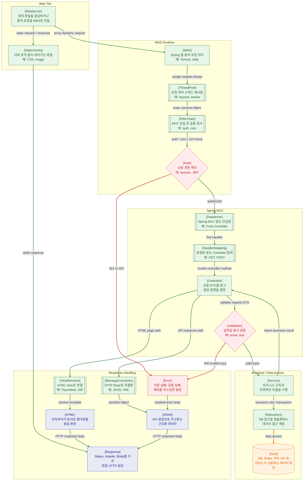

>[!success] 이 지도를 통해 아래 질문들에 답할 수 있게 됩니다.
>- Web Server와 WAS는 왜 분리해서 보는가?
>- 요청은 Controller에 도착하기 전에 어떤 관문을 통과하는가?
>- Controller, Service, Repository는 각각 어떤 책임을 가져야 하는가?
>- HTML 응답과 JSON 응답은 Spring MVC 내부에서 어떻게 갈라지는가?

---

---
이 지도는 요청이 Web Server를 지나 WAS와 Spring MVC 내부에서 어떻게 처리되는지 설명한다. 웹 서버 개발을 배울 때 가장 먼저 잡아야 할 구조가 바로 이 구간이다. 사용자가 보낸 HTTP 요청은 곧바로 Service로 들어가는 것이 아니라 여러 단계의 관문을 지난다.

Web Server는 정적 파일과 동적 요청을 구분하는 앞단 역할을 한다. CSS, JavaScript, 이미지 같은 정적 파일은 Web Server가 직접 응답할 수 있다. 반대로 로그인, 주문, 게시글 작성처럼 비즈니스 로직이 필요한 요청은 Reverse Proxy를 통해 WAS로 전달된다. NGINX의 proxy 모듈은 요청을 다른 서버로 전달하는 기능을 제공한다.

WAS에 도착한 요청은 Thread Pool에서 처리 스레드를 할당받는다. 서버는 요청마다 무한히 새 스레드를 만들지 않고, 제한된 스레드를 재사용한다. 그래서 트래픽이 몰리면 CPU보다 먼저 Thread Pool, Connection Pool, 외부 API 대기 시간이 병목이 될 수 있다.

Filter Chain은 Controller에 들어가기 전의 공통 처리 구간이다. 인증, 인가, CORS, CSRF, 로깅, 인코딩, Rate Limit 같은 횡단 관심사가 이 위치에 놓인다. 이 단계에서 실패하면 요청은 Controller까지 가지 않고 401, 403 또는 별도 오류 응답으로 끝난다.

Spring MVC의 핵심 진입점은 DispatcherServlet이다. HandlerMapping은 요청과 handler 객체 사이의 매핑을 정의하는 역할을 한다. 즉, 어떤 URL과 HTTP Method가 어떤 Controller 메서드로 갈지 찾는 과정이 필요하다.

Controller는 비즈니스 로직을 직접 길게 처리하는 곳이 아니다. 입력 검증을 거친 뒤 Service에 작업을 위임하고, Service는 업무 규칙과 트랜잭션 흐름을 담당한다. Repository는 DB 접근을 캡슐화한다. 이 구분이 흐려지면 Controller가 비대해지고, 테스트와 유지보수가 어려워진다.

응답은 HTML과 JSON 경로로 나뉜다. HTML 페이지를 반환하는 경우 ViewResolver가 View를 찾고, API 응답을 반환하는 경우 MessageConverter가 객체를 JSON 같은 HTTP Body로 변환한다. 따라서 `Service가 HTML/JSON을 만든다`가 아니라, `Controller가 응답 경로를 선택하고 Spring MVC 인프라가 변환한다`고 이해하는 편이 정확하다.

지도에서 실선은 요청 처리와 응답 조립 흐름, 굵은 선은 데이터 원천 접근, 빨간 선은 인증이나 검증 실패 흐름을 뜻한다. Controller 앞에 FilterChain, Auth, DispatcherServlet, HandlerMapping이 놓인 이유는 Spring MVC가 Controller 메서드만으로 동작하는 구조가 아니라, 요청을 표준화하고 적절한 handler로 분배하는 인프라 위에서 동작하기 때문이다.

Spring MVC 실무에서는 HandlerMapping 뒤에 HandlerAdapter가 Controller 호출 방식을 맞추고, Interceptor가 Controller 전후의 애플리케이션 공통 처리를 담당할 수 있다. 또한 예외는 `@ExceptionHandler`나 `@ControllerAdvice`에서 공통 응답으로 바꾸고, 트랜잭션 경계는 보통 Controller가 아니라 Service 계층에 둔다.

## 장애가 났을 때 먼저 확인할 것

- Web Server access log에 요청이 들어왔는지 확인한다.
- WAS 로그가 없다면 proxy 설정, path rewrite, upstream 오류를 확인한다.
- Controller 로그가 없다면 Filter, Security, CORS, CSRF, HandlerMapping을 확인한다.
- Controller는 실행됐지만 DB 반영이 없다면 Service 트랜잭션, 예외 처리, rollback 여부를 확인한다.
- 응답 형식이 이상하면 ViewResolver, MessageConverter, ExceptionHandler를 확인한다.

## 설계할 때 선택 기준

- 인증, CORS, CSRF처럼 Controller 전 공통 검사는 Filter/Security에 둔다.
- 요청별 전후 처리나 로깅처럼 MVC 문맥이 필요한 처리는 Interceptor 후보로 본다.
- 비즈니스 규칙과 트랜잭션은 Service에 둔다.
- DB 접근 세부사항은 Repository에 모은다.
- 예외 응답 형식은 Controller마다 흩뜨리지 말고 ControllerAdvice로 통일한다.

## 운영 중 볼 지표

- Web Server: request count, upstream 5xx, static 404, response time
- WAS: active thread count, thread pool queue, JVM memory, GC time
- MVC: endpoint별 p95 latency, 4xx/5xx rate, validation failure count
- Transaction: rollback count, transaction duration, DB connection wait time
- Error: exception type count, masked error response count

## 흔한 오해

- Controller에 도착하지 않은 요청도 Spring 애플리케이션 장애처럼 보일 수 있다.
- Service가 HTML이나 JSON을 직접 만드는 것이 아니라, Controller와 MVC 인프라가 응답 경로를 선택한다.
- Interceptor와 Filter는 비슷해 보이지만 실행 위치와 사용할 수 있는 문맥이 다르다.
- `@Transactional`은 아무 곳에 붙이면 되는 장식이 아니라 트랜잭션 경계를 정하는 설계다.
- 예외를 모두 잡아 삼키면 장애가 사라지는 것이 아니라 관측이 사라진다.

## 실전 체크리스트

- [ ] Controller 전 단계의 실패가 로그로 구분되는가?
- [ ] Service에 트랜잭션 경계가 명확한가?
- [ ] 예외 응답이 HTML/API 요청별로 일관되게 처리되는가?
- [ ] Filter, Interceptor, AOP의 역할이 섞이지 않았는가?
- [ ] endpoint별 지연시간과 오류율을 볼 수 있는가?

## 질문에 대한 답변

1. Web Server와 WAS는 왜 분리해서 보는가?

   Web Server는 정적 파일 응답과 Reverse Proxy 역할에 강하고, WAS는 Java/Spring 애플리케이션을 실행해 동적 요청을 처리한다. 그래프에서는 `WebServer → StaticAssets`와 `WebServer → WAS`가 갈라진다. 이 구분을 알면 CSS, JS, 이미지 문제인지, 애플리케이션 로직 문제인지 장애 위치를 나눠 볼 수 있다.

2. 요청은 Controller에 도착하기 전에 어떤 관문을 통과하는가?

   동적 요청은 WAS에서 ThreadPool의 실행 스레드를 배정받고, FilterChain에서 인증, CORS, CSRF 같은 공통 검사를 거친다. 인증이 통과되면 DispatcherServlet으로 들어가고, HandlerMapping이 URL과 HTTP Method에 맞는 Controller 메서드를 찾는다. 따라서 Controller 로그가 없다면 Filter, Auth, DispatcherServlet, HandlerMapping 앞단도 함께 확인해야 한다.

3. Controller, Service, Repository는 각각 어떤 책임을 가져야 하는가?

   Controller는 요청 DTO를 받고 검증 결과에 따라 응답 방향을 정한다. Service는 업무 규칙과 트랜잭션 흐름을 담당한다. Repository는 DB 접근을 캡슐화한다. 이 책임을 섞으면 Controller가 비대해지고, DB 접근 코드가 여러 곳에 흩어져 테스트와 변경이 어려워진다.

4. HTML 응답과 JSON 응답은 Spring MVC 내부에서 어떻게 갈라지는가?

   Controller가 HTML 페이지 경로를 반환하면 ViewResolver가 템플릿을 찾아 HTML 응답을 만든다. 반대로 API 응답 객체를 반환하면 MessageConverter가 객체를 JSON 같은 HTTP Body로 직렬화한다. 그래프에서는 `Controller → ViewResolver → HTML`과 `Controller → MessageConverter → JSON` 두 경로를 보면 된다.

## 관련 상세 문서

- [Spring MVC 요청 처리 흐름 압축 정리](<../Web-Back(Spring)/07. Spring MVC 요청 처리 흐름/00. Spring MVC 요청 처리 흐름 압축 정리.md>)
- [DispatcherServlet과 Front Controller](<../Web-Back(Spring)/07. Spring MVC 요청 처리 흐름/01. DispatcherServlet과 Front Controller.md>)
- [HandlerMapping과 HandlerAdapter](<../Web-Back(Spring)/07. Spring MVC 요청 처리 흐름/02. HandlerMapping과 HandlerAdapter.md>)
- [ViewResolver와 MessageConverter](<../Web-Back(Spring)/07. Spring MVC 요청 처리 흐름/04. ViewResolver와 MessageConverter.md>)
- [Filter Interceptor AOP 압축 정리](<../Web-Back(Spring)/15. Filter Interceptor AOP/00. Filter Interceptor AOP 압축 정리.md>)
- [Exception Handling 압축 정리](<../Web-Back(Spring)/10. Exception Handling/00. Exception Handling 압축 정리.md>)

## 참고한 자료

- [Spring Framework Reference - DispatcherServlet](https://docs.spring.io/spring-framework/reference/web/webmvc/mvc-servlet.html)
- [Spring Framework Reference - Request Mapping](https://docs.spring.io/spring-framework/reference/web/webmvc/mvc-controller/ann-requestmapping.html)
- [Spring Framework Reference - Message Converters](https://docs.spring.io/spring-framework/reference/web/webmvc/message-converters.html)
- [Spring Security Reference - Servlet Architecture](https://docs.spring.io/spring-security/reference/servlet/architecture.html)
