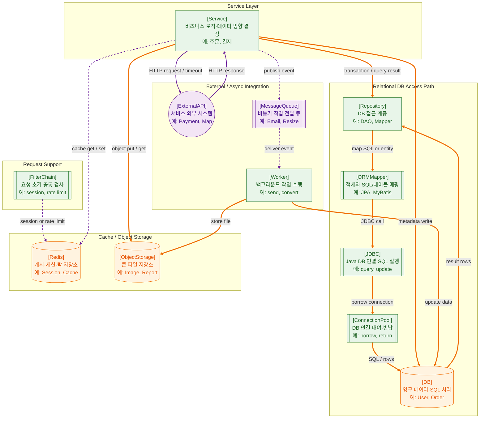

>[!success] 이 지도를 통해 아래 질문들에 답할 수 있게 됩니다.
>- Service 계층은 데이터를 가져올 때 어떤 경로를 거치는가?
>- DB, Redis, Object Storage, External API, Message Queue는 서로 어떻게 구분되는가?
>- 어떤 작업은 동기로 처리하고, 어떤 작업은 Queue로 넘겨야 하는가?
>- DB 접근에서 Repository, Mapper/ORM, JDBC, Connection Pool은 각각 왜 필요한가?

---

---
이 지도는 서버의 Service 계층이 데이터를 어디서 가져오고 어디에 저장하는지를 설명한다. 웹 서비스의 비즈니스 로직은 대부분 데이터와 연결된다. 회원을 조회하고, 주문을 저장하고, 파일을 업로드하고, 외부 API를 호출하고, 오래 걸리는 작업을 큐에 넘기는 일이 모두 이 범위에 들어간다.

DB 접근의 일반적인 흐름은 `Service → Repository → Mapper/ORM → JDBC → Connection Pool → DB`로 볼 수 있다. Service는 “무엇을 해야 하는가”를 결정하고, Repository는 “어떻게 데이터를 가져올 것인가”를 담당한다. JDBC는 Java에서 DB에 접근하는 표준 API 계층이고, Connection Pool은 DB 연결을 매번 새로 만들지 않고 재사용하게 해준다.

DB는 기본적으로 영구적인 데이터이다. 회원, 주문, 게시글, 권한, 결제 기록처럼 사라지면 안 되는 데이터가 저장된다. 따라서 DB 접근은 단순 조회만이 아니라 트랜잭션, 락, 인덱스, 쿼리 성능과 연결된다. 이 지도에서 DB 화살표를 굵게 표현한 이유는 DB 접근이 서비스의 정합성과 성능을 동시에 좌우하기 때문이다.

Redis는 DB를 대체하는 저장소는 아니다. 빠른 응답이 필요한 보조 저장소로 보는 것이 좋다. 캐시, 세션, Rate Limit, 분산 락처럼 짧은 시간에 자주 읽고 쓰는 데이터가 Redis에 적합하다. Redis 문서는 Redis를 캐시, 주요 데이터 구조, Pub/Sub 등을 지원하는 데이터 저장소로 다룬다.

Object Storage는 파일을 저장하는 영역이다. 이미지를 DB 컬럼에 그대로 넣기보다, 파일은 Object Storage에 저장하고 DB에는 파일 경로, key, 메타데이터를 저장하는 구조가 일반적이다. Amazon S3에서 객체는 저장할 내용과 메타데이터를 포함하며, 버킷 안에서 key로 식별된다.

External API는 서비스 외부의 기능을 호출하는 지점이다. 결제, 메일, 문자, 지도, 주소 검색, 본인인증 같은 기능이 여기에 해당한다. 외부 API는 내부 DB보다 실패 가능성이 높고 지연 시간이 길 수 있으므로 timeout, retry, fallback, rate limit을 별도로 고려해야 한다.

Message Queue는 사용자가 즉시 기다리지 않아도 되는 작업을 분리한다. RabbitMQ 문서에서는 Queue를 메시지를 보관하는 버퍼로 설명하고, producer가 보낸 메시지를 consumer가 가져가는 구조로 설명한다.

이 지도에서 중요한 기준은 동기와 비동기의 구분이다. 사용자 응답에 즉시 필요한 데이터는 DB나 Redis에서 동기적으로 가져오고, 오래 걸리거나 실패해도 재시도할 수 있는 작업은 Queue로 넘긴다. 이 구분이 서비스 응답 속도와 장애 격리의 핵심이다.

지도에서 굵은 선은 정합성과 영속성이 중요한 데이터 접근, 실선은 동기 외부 호출, 점선은 캐시·세션·비동기 전달 같은 보조 흐름을 뜻한다. 그래프를 키우지 않기 위해 DB와 External API의 왕복은 `SQL / rows`, `HTTP request / response`처럼 라벨에 압축했다.

실무에서는 데이터 접근을 단순 CRUD로만 보면 부족하다. DB는 트랜잭션 격리, 인덱스, 락 대기, Connection Pool이 함께 움직이고, 외부 API는 timeout, retry, circuit breaker, idempotency key 같은 실패 제어가 필요하다. Queue로 넘기는 작업도 중복 실행될 수 있으므로 처리 결과가 한 번만 반영되도록 설계해야 한다.

## 장애가 났을 때 먼저 확인할 것

- DB 연결 실패인지, 쿼리 지연인지, 락 대기인지 먼저 구분한다.
- Connection Pool이 고갈되었는지 active/idle/wait 지표를 확인한다.
- Redis 장애인지, 캐시 miss 증가인지, 세션 조회 실패인지 확인한다.
- 외부 API timeout, 429, 5xx, DNS 오류를 내부 장애와 분리해 본다.
- Queue 발행 실패와 Worker 처리 실패를 따로 확인한다.

## 설계할 때 선택 기준

- 정합성이 가장 중요하면 DB 트랜잭션 안에서 처리한다.
- 조회 성능이 중요하고 약간의 지연된 갱신을 허용하면 캐시를 고려한다.
- 외부 API 호출은 timeout과 retry를 기본으로 두고, 연쇄 장애가 우려되면 circuit breaker를 둔다.
- 같은 요청이 두 번 들어와도 결과가 깨지면 안 되는 작업에는 idempotency key를 둔다.
- 대용량 파일은 Object Storage에 두고 DB에는 key, owner, size, content type 같은 메타데이터를 둔다.

## 운영 중 볼 지표

- DB: query latency, slow query count, lock wait time, deadlock count, connection pool usage
- Redis: cache hit ratio, memory usage, eviction count, command latency
- Object Storage: upload failure rate, download latency, 4xx/5xx count
- External API: timeout count, retry count, 429 rate, circuit open count
- Queue: publish failure count, queue depth, consumer lag, duplicate 처리 count

## 흔한 오해

- DB가 느리면 무조건 Redis를 붙이면 된다고 생각하기 쉽지만, 원인이 인덱스나 락이면 캐시가 답이 아닐 수 있다.
- retry는 안정성을 높이지만, 무제한 retry는 장애를 증폭시킨다.
- 외부 API가 느린데 timeout이 길면 WAS Thread가 함께 고갈될 수 있다.
- Queue에 넣었다고 작업이 정확히 한 번만 처리되는 것은 아니다.
- Object Storage에 파일을 넣어도 권한, 만료 URL, 메타데이터 정합성은 별도로 설계해야 한다.

## 실전 체크리스트

- [ ] 주요 쿼리에 인덱스와 실행 계획을 확인했는가?
- [ ] 외부 API마다 timeout, retry, fallback 기준이 있는가?
- [ ] 중복 요청과 중복 메시지에 대한 멱등성 처리가 있는가?
- [ ] 캐시 무효화와 TTL 정책이 문서화되어 있는가?
- [ ] DB, Redis, API, Queue 지표를 한 화면에서 볼 수 있는가?

## 질문에 대한 답변

1. Service 계층은 데이터를 가져올 때 어떤 경로를 거치는가?

   DB 데이터가 필요하면 보통 `Service → Repository → ORMMapper → JDBC → ConnectionPool → DB` 흐름을 탄다. DB는 결과 rows를 돌려주고, Repository는 이를 Service가 다룰 수 있는 객체나 결과로 되돌린다. Redis, ObjectStorage, ExternalAPI, MessageQueue는 업무 성격에 따라 Service가 별도 경로로 접근한다.

2. DB, Redis, Object Storage, External API, Message Queue는 서로 어떻게 구분되는가?

   DB는 영구 데이터와 트랜잭션의 중심이다. Redis는 빠른 조회, 세션, 캐시, 락처럼 짧고 자주 접근하는 데이터에 적합하다. Object Storage는 이미지나 리포트 같은 큰 파일을 저장한다. External API는 결제, 지도, 알림처럼 내 시스템 밖의 기능을 동기적으로 호출하는 지점이다. Message Queue는 지금 당장 처리하지 않아도 되는 작업을 Worker에게 넘기는 비동기 통로다.

3. 어떤 작업은 동기로 처리하고, 어떤 작업은 Queue로 넘겨야 하는가?

   사용자의 현재 응답을 만들기 위해 꼭 필요한 조회나 검증은 동기로 처리해야 한다. 예를 들어 결제 승인 결과나 로그인 세션 확인은 사용자가 기다려야 한다. 반대로 메일 발송, 이미지 변환, 통계 집계처럼 늦게 처리해도 되고 재시도할 수 있는 작업은 Queue로 넘기는 편이 좋다.

4. DB 접근에서 Repository, Mapper/ORM, JDBC, Connection Pool은 각각 왜 필요한가?

   Repository는 데이터 접근 코드를 한곳에 모아 Service가 SQL 세부사항에 덜 의존하게 한다. Mapper/ORM은 객체와 SQL 또는 테이블 사이의 변환을 담당한다. JDBC는 Java에서 DB에 연결하고 SQL을 실행하는 표준 API다. Connection Pool은 DB 연결을 매번 새로 만들지 않고 빌려 쓰게 해서 지연시간과 연결 비용을 줄인다.

## 관련 상세 문서

- [Data Access 압축 정리](<../Web-Back(Spring)/12. Data Access/00. Data Access 압축 정리.md>)
- [Transaction 압축 정리](<../Web-Database/06. Transaction/00. Transaction 압축 정리.md>)
- [Connection Pool Timeout 장애 전파 압축 정리](<../Web-Database/10. Connection Pool Timeout 장애 전파/00. Connection Pool Timeout 장애 전파 압축 정리.md>)
- [Redis Cache 실전 설계 상세](<../System Design/05. Cache 전략과 정합성/05. Redis Cache 실전 설계 상세.md>)
- [Object Storage와 정적 파일 상세](<../Web-Operations/13. Cloud Infra VM VPC LB Object Storage/04. Object Storage와 정적 파일 상세.md>)
- [Timeout Retry Idempotency Circuit Breaker 압축 정리](<../Web-Network/12. Timeout Retry Idempotency Circuit Breaker/00. Timeout Retry Idempotency Circuit Breaker 압축 정리.md>)
- [Queue Async Event-driven Design 압축 정리](<../System Design/06. Queue Async Event-driven Design/00. Queue Async Event-driven Design 압축 정리.md>)

## 참고한 자료

- [Oracle Java Tutorials - JDBC Basics](https://docs.oracle.com/javase/tutorial/jdbc/basics/index.html)
- [Redis Docs - Redis data types](https://redis.io/docs/latest/develop/data-types/)
- [AWS - What is Amazon S3?](https://docs.aws.amazon.com/AmazonS3/latest/userguide/Welcome.html)
- [RabbitMQ Docs - Queues](https://www.rabbitmq.com/docs/queues)
