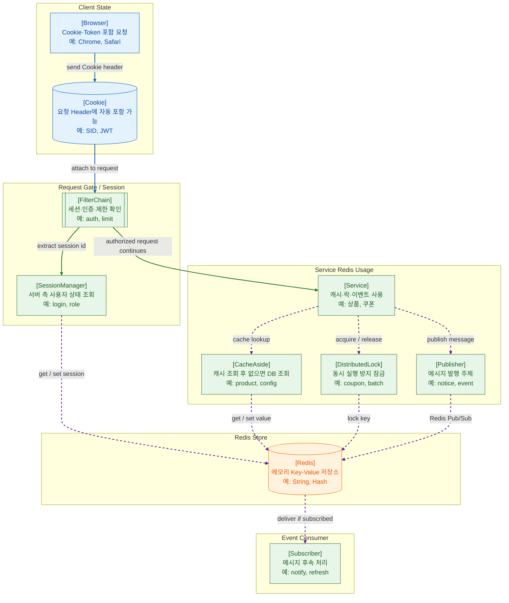

>[!success] 이 지도를 통해 아래 질문들에 답할 수 있게 됩니다.
>- Redis는 단순히 빠른 DB인가, 그것이 아니라면, 어떤 특수한 역할을 하는가?
>- 세션 저장소로 Redis를 쓰면 WAS Scale-out에 어떤 도움이 되는가?
>- 캐시를 쓰면 왜 성능은 좋아지지만 정합성 문제가 생길 수 있는가?
>- Redis Pub/Sub과 Message Queue는 어떤 점에서 구분해서 봐야 하는가?

---

---
이 지도는 Redis가 웹 서비스에서 실제로 어디에 쓰이는지 확대해서 설명한다. Redis는 단순히 “빠른 DB”가 아니다. 주로 짧은 지연시간, 빈번한 읽기/쓰기, 만료 시간, 원자적 연산이 필요한 곳에 붙는다.

첫 번째 사용처는 세션이다. 사용자가 로그인하면 서버는 사용자의 로그인 상태를 어딘가에 저장해야 한다. 서버 인스턴스가 하나뿐이면 메모리 세션도 가능하지만, WAS를 여러 대로 늘리면 문제가 생긴다. 어떤 요청은 A 서버로 가고, 다음 요청은 B 서버로 갈 수 있기 때문이다. 이때 세션을 Redis 같은 공용 저장소에 두면 여러 WAS가 같은 로그인 상태를 공유할 수 있다.

두 번째 사용처는 캐시다. 캐시는 자주 조회되지만 자주 바뀌지는 않는 데이터를 빠르게 가져오기 위한 구조다. 예를 들어 상품 상세, 인기 게시글, 지역 코드, 설정값 같은 데이터는 DB를 매번 조회하지 않고 Redis에 저장해둘 수 있다.

캐시를 사용할 때 핵심은 “무효화”다. 캐시에 값이 있다는 것은 빠르다는 뜻이지만, 동시에 오래된 값을 줄 위험도 있다는 뜻이다. 데이터가 변경되었을 때 Redis 값을 삭제하거나 갱신하지 않으면 사용자는 실제 DB와 다른 값을 볼 수 있다. 따라서 캐시는 성능 기술인 동시에 정합성 설계 문제다.

세 번째 사용처는 분산 락이다. 서버가 여러 대일 때 같은 작업을 동시에 실행하면 문제가 생길 수 있다. 예를 들어 선착순 쿠폰 발급, 중복 결제 방지, 배치 중복 실행 방지처럼 “한 번만 실행되어야 하는 작업”에는 락이 필요하다. Redis는 key 기반 원자 연산과 만료 시간을 활용해 이런 분산 제어에 사용될 수 있다.

네 번째 사용처는 Pub/Sub이다. Pub/Sub은 한쪽에서 메시지를 발행하면 구독자가 이를 받아 처리하는 방식이다. Redis 공식 문서는 Pub/Sub이 이벤트를 여러 소비자에게 broadcast하는 방식으로 사용될 수 있다고 설명한다.

다만 Pub/Sub은 반드시 처리되어야 하는 업무 큐와는 다르게 봐야 한다. Pub/Sub은 at-most-once 전달 의미를 가진다. 즉, 구독자가 장애 상태라면 메시지를 놓칠 수 있다.

이 지도를 볼 때 중요한 점은 Redis를 “DB 옆에 있는 빠른 저장소” 정도로만 보지 않는 것이다. Redis는 로그인 상태 공유, DB 부하 감소, 동시성 제어, 이벤트 전달처럼 서버 확장성과 운영 안정성에 직접 연결된다. 다만 Redis 장애가 곧 로그인 장애나 캐시 장애로 번질 수 있으므로, TTL, 장애 fallback, 데이터 재생성 전략을 함께 설계해야 한다.

지도에서 파란 실선은 브라우저가 Cookie를 요청에 싣는 클라이언트 흐름, 초록 실선은 인증된 요청이 Service로 계속 진행되는 흐름, 보라색 점선은 Redis를 보조 저장소나 이벤트 전달 경로로 사용하는 흐름을 뜻한다. CacheAside의 DB fallback과 Pub/Sub 메시지 유실 가능성은 그래프를 키우지 않기 위해 본문과 답변에서 보강했다.

Redis를 운영에 붙일 때는 “빠르다”보다 “메모리 기반 상태를 어떻게 잃어도 버틸 것인가”가 중요하다. maxmemory와 eviction policy, TTL, 재생성 가능성, Redis 장애 시 degrade 전략, Sentinel/Cluster 같은 가용성 구성을 함께 봐야 한다. 메시지 전달이 필요할 때도 Pub/Sub, Streams, 전용 Message Queue의 전달 보장 차이를 구분해야 한다.

## 장애가 났을 때 먼저 확인할 것

- Redis 연결 실패인지, 명령 지연인지, 메모리 부족인지 먼저 구분한다.
- 세션 장애라면 로그인 사용자 전체 영향인지 특정 인스턴스 영향인지 확인한다.
- 캐시 장애라면 DB fallback이 정상인지, DB 부하가 급증했는지 확인한다.
- 락 장애라면 lock key TTL, 중복 실행, lock release 실패 여부를 확인한다.
- Pub/Sub 장애라면 구독자가 살아 있었는지와 유실되어도 되는 메시지였는지 확인한다.

## 설계할 때 선택 기준

- 로그인 상태 공유처럼 빠른 서버 측 상태가 필요하면 Redis 세션을 검토한다.
- 없어져도 DB에서 다시 만들 수 있는 값은 캐시 후보로 본다.
- 사라지면 안 되는 업무 이벤트는 Pub/Sub보다 Streams나 Message Queue를 우선 검토한다.
- 분산 락은 TTL, 원자적 획득, 해제 주체 확인이 가능할 때만 사용한다.
- Redis 장애 시 기능 저하로 버틸지, 요청을 실패시킬지 업무 중요도별로 정한다.

## 운영 중 볼 지표

- redis_command_latency, connected_clients, blocked_clients
- used_memory, maxmemory, evicted_keys, expired_keys
- cache hit ratio, cache miss spike, DB fallback count
- session read/write failure count, login failure rate
- pubsub_channels, stream lag, lock acquire failure count

## 흔한 오해

- Redis는 빠르지만 무한히 큰 저장소가 아니다.
- TTL을 걸었다고 캐시 정합성 문제가 모두 해결되지는 않는다.
- Pub/Sub은 현재 구독 중인 소비자에게 보내는 구조라 업무 큐와 다르다.
- 분산 락은 쉽게 붙일 수 있지만 잘못 쓰면 장애 시 락이 남거나 중복 실행을 막지 못한다.
- Redis 장애 fallback 없이 세션을 모두 Redis에 두면 Redis 장애가 곧 로그인 장애가 된다.

## 실전 체크리스트

- [ ] Redis key마다 TTL과 데이터 재생성 방법이 정해져 있는가?
- [ ] maxmemory와 eviction policy가 서비스 특성에 맞는가?
- [ ] Redis 장애 시 DB fallback 또는 기능 제한 정책이 있는가?
- [ ] Pub/Sub으로 처리하는 메시지가 유실되어도 되는 성격인가?
- [ ] lock key의 TTL과 release 안전장치가 있는가?

## 질문에 대한 답변

1. Redis는 단순히 빠른 DB인가, 그것이 아니라면, 어떤 특수한 역할을 하는가?

   Redis는 빠른 읽기·쓰기를 제공하지만, 단순히 DB를 대체하는 저장소로 보는 것은 위험하다. 그래프에서는 세션 조회, CacheAside, DistributedLock, Pub/Sub이 Redis에 붙어 있다. 즉 Redis는 로그인 상태 공유, 반복 조회 감소, 분산 환경의 동시성 제어, 이벤트 전달 같은 “운영 중 자주 필요한 빠른 상태”에 쓰인다.

2. 세션 저장소로 Redis를 쓰면 WAS Scale-out에 어떤 도움이 되는가?

   WAS가 여러 대가 되면 사용자의 다음 요청이 이전과 다른 서버로 갈 수 있다. 세션을 각 WAS 메모리에만 두면 로그인 상태가 서버마다 달라진다. Redis를 공용 세션 저장소로 두면 `FilterChain → SessionManager → Redis` 흐름으로 어느 WAS에서도 같은 Session ID를 조회할 수 있어 Scale-out이 쉬워진다.

3. 캐시를 쓰면 왜 성능은 좋아지지만 정합성 문제가 생길 수 있는가?

   CacheAside는 먼저 Redis를 보고, 값이 없으면 DB에서 읽은 뒤 Redis에 저장하는 방식이다. 자주 읽는 값을 빠르게 돌려줄 수 있지만, DB 값이 바뀌었는데 Redis 값이 삭제되거나 갱신되지 않으면 오래된 데이터를 줄 수 있다. 그래서 TTL, 캐시 무효화, 갱신 순서, 장애 시 DB fallback 전략이 함께 필요하다.

4. Redis Pub/Sub과 Message Queue는 어떤 점에서 구분해서 봐야 하는가?

   Redis Pub/Sub은 발행자가 메시지를 보내면 현재 구독 중인 Subscriber에게 전달하는 broadcast 성격이 강하다. Redis 문서에서도 Pub/Sub은 at-most-once 전달 의미를 가진다고 설명한다. 반면 업무용 Message Queue는 메시지를 보관하고 소비자가 나중에 처리하는 흐름을 설계하는 데 더 적합하다. 반드시 처리되어야 하는 작업이라면 Pub/Sub만으로 충분한지 신중히 봐야 한다.

## 관련 상세 문서

- [Cache 전략과 정합성 압축 정리](<../System Design/05. Cache 전략과 정합성/00. Cache 전략과 정합성 압축 정리.md>)
- [Redis Cache 실전 설계 상세](<../System Design/05. Cache 전략과 정합성/05. Redis Cache 실전 설계 상세.md>)
- [Session Cookie JWT Token 압축 정리](<../Web-Security/04. Session Cookie JWT Token/00. Session Cookie JWT Token 압축 정리.md>)
- [Rate Limit Backpressure 압축 정리](<../System Design/08. Rate Limit Backpressure/00. Rate Limit Backpressure 압축 정리.md>)
- [Redis Stream PubSub 압축 정리](<../Data Engineering/08. Redis Stream PubSub/00. Redis Stream PubSub 압축 정리.md>)
- [Cookie Session SameSite CORS 압축 정리](<../Web-Network/08. Cookie Session SameSite CORS/00. Cookie Session SameSite CORS 압축 정리.md>)

## 참고한 자료

- [Redis Docs - Redis data types](https://redis.io/docs/latest/develop/data-types/)
- [Redis Docs - Redis Pub/Sub](https://redis.io/docs/latest/develop/pubsub/)
- [Redis Docs - Distributed Locks with Redis](https://redis.io/docs/latest/develop/use/patterns/distributed-locks/)
- [RabbitMQ Docs - Queues](https://www.rabbitmq.com/docs/queues)
