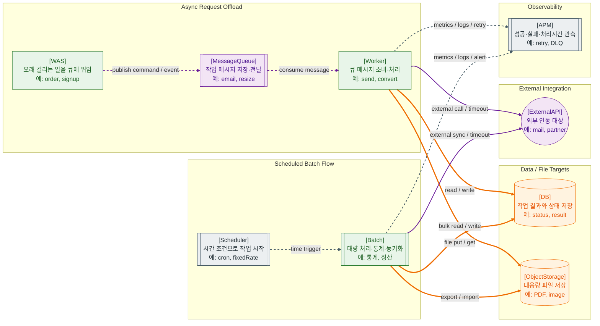

>[!success] 이 지도를 통해 아래 질문들에 답할 수 있게 됩니다.
>- 사용자가 기다려야 하는 작업과 기다리지 않아도 되는 작업은 어떻게 구분하는가?
>- Message Queue와 Worker는 왜 필요한가?
>- Scheduler와 Batch는 일반 HTTP 요청 처리와 무엇이 다른가?
>- 비동기 작업은 왜 APM, 로그, 재시도, DLQ 같은 실패 추적이 더 중요한가?

---

---
이 지도는 사용자가 요청을 보낸 즉시 응답받는 흐름이 아니라, 뒤에서 따로 처리되는 작업을 설명한다. 웹 서비스에는 사용자가 기다려야 하는 작업과 기다리지 않아도 되는 작업이 있다. 이 둘을 구분하지 않으면 화면 응답이 느려지고, 외부 API 실패가 사용자 요청 실패로 바로 이어진다.

비동기 처리는 보통 `WAS → Message Queue → Worker` 흐름으로 이해하면 된다. WAS는 사용자 요청을 처리하다가 오래 걸리는 작업을 Queue에 메시지로 남기고, Worker가 나중에 그 메시지를 소비해 실제 작업을 수행한다. RabbitMQ 문서에서도 producer, queue, consumer 구조를 기본 메시징 모델로 설명한다.

예를 들어 회원가입 후 환영 메일 발송, 주문 완료 후 알림 전송, 이미지 리사이징, PDF 생성, 외부 시스템 동기화는 사용자가 즉시 결과를 기다릴 필요가 없는 경우가 많다. 이런 작업을 HTTP 요청 안에서 끝까지 처리하면 사용자는 불필요하게 오래 기다리고, 외부 메일 API 장애가 회원가입 실패처럼 보일 수 있다.

Scheduler와 Batch는 시간 기반 작업이다. Scheduler는 “언제 실행할 것인가”를 담당하고, Batch는 “무엇을 대량으로 처리할 것인가”를 담당한다. 매일 새벽 통계 집계, 미납 알림 대상 산출, 공공데이터 동기화, 로그 정리, 정산 파일 생성 같은 작업이 여기에 해당한다.

비동기 작업과 Batch는 눈에 잘 보이지 않는 실패가 많다. 사용자가 브라우저에서 바로 실패를 보는 구조가 아니기 때문에, 작업 실패가 조용히 누적될 수 있다. 그래서 Worker와 Batch에는 성공/실패 로그, 처리 시간, 재시도 횟수, 미처리 메시지 수, Dead Letter Queue 여부를 관측하는 체계가 필요하다.

이 지도에서 APM이 붙는 이유도 여기에 있다. 동기 요청은 사용자 불만이나 API 응답 오류로 비교적 빨리 드러나지만, 비동기 작업은 운영자가 관측하지 않으면 누락을 알아차리기 어렵다. OpenTelemetry는 traces, metrics, logs 같은 telemetry 데이터를 생성·수집·내보내는 관측 프레임워크로 설명된다.

이 지도의 핵심은 “모든 일을 HTTP 요청 안에서 끝내려 하지 말라”는 것이다. 즉시 응답해야 하는 작업은 동기 처리하고, 오래 걸리거나 실패해도 재시도 가능한 작업은 Queue, Worker, Scheduler, Batch로 분리해야 한다.

지도에서 점선은 비동기 전달과 운영 관측, 굵은 선은 DB나 파일 저장소에 남는 작업 결과, 실선은 외부 API 호출을 뜻한다. Retry나 Dead Letter Queue를 별도 노드로 늘리면 지도가 커지므로, 이 문서에서는 APM 라벨과 설명에서 실패 추적의 의미를 보강했다.

비동기 처리는 “나중에 처리한다”가 아니라 “실패와 중복을 감당하는 다른 실행 모델로 옮긴다”는 뜻에 가깝다. Worker가 메시지를 처리한 뒤 ack를 보내는지, 실패 시 retry backoff를 어떻게 둘지, 같은 메시지가 두 번 처리되어도 안전한지, 순서가 중요한지, DLQ를 누가 언제 확인할지까지 설계해야 한다.

## 장애가 났을 때 먼저 확인할 것

- Queue에 메시지가 쌓이는지, Worker가 죽었는지, 외부 API가 느린지 먼저 구분한다.
- consumer lag, queue depth, unacked message 수를 확인한다.
- retry가 폭증하는지, DLQ로 이동하는 메시지가 있는지 확인한다.
- 중복 처리로 DB 결과가 여러 번 반영되었는지 확인한다.
- Scheduler/Batch는 마지막 성공 시각과 다음 실행 예정 시각을 확인한다.

## 설계할 때 선택 기준

- 사용자 응답에 반드시 필요한 결과는 동기 처리한다.
- 오래 걸리고 재시도 가능한 작업은 Queue와 Worker로 분리한다.
- 메시지 유실이 치명적이면 publisher confirm, durable queue, consumer ack를 검토한다.
- 중복 처리가 가능한 구조가 아니면 idempotency key나 처리 이력 테이블을 둔다.
- 순서 보장이 중요하면 partition key, 단일 consumer, 업무 단위 재설계를 함께 검토한다.

## 운영 중 볼 지표

- queue depth, ready message count, unacked message count
- consumer count, consumer lag, processing latency
- retry count, retry age, DLQ count
- batch success/failure count, last success time, job duration
- duplicate skip count, idempotency conflict count

## 흔한 오해

- Queue를 쓰면 작업이 자동으로 한 번만 처리된다고 생각하기 쉽다.
- retry를 늘리면 안정적일 것 같지만, 원인 장애가 계속되면 더 큰 부하가 된다.
- DLQ는 실패를 해결하는 장치가 아니라 실패를 격리하고 보이게 하는 장치다.
- 비동기 작업은 사용자 화면에 바로 드러나지 않아서 더 강한 관측이 필요하다.
- Scheduler는 단순 타이머가 아니라 중복 실행, 지연 실행, 실패 재시작을 고려해야 한다.

## 실전 체크리스트

- [ ] Worker가 성공 후 ack, 실패 후 nack/retry/DLQ를 명확히 처리하는가?
- [ ] retry backoff와 최대 재시도 횟수가 정해져 있는가?
- [ ] 같은 메시지가 두 번 와도 결과가 안전한가?
- [ ] DLQ를 확인하고 재처리하는 운영 절차가 있는가?
- [ ] Batch의 마지막 성공 시각과 처리 건수를 볼 수 있는가?

## 질문에 대한 답변

1. 사용자가 기다려야 하는 작업과 기다리지 않아도 되는 작업은 어떻게 구분하는가?

   현재 화면 응답을 만들기 위해 반드시 필요한 결과는 사용자가 기다려야 한다. 예를 들어 결제 승인, 로그인 성공 여부, 재고 차감 결과는 동기 처리가 필요하다. 반면 환영 메일, 이미지 리사이징, PDF 생성, 통계 집계처럼 나중에 끝나도 되는 작업은 Queue로 넘겨 사용자 응답과 분리할 수 있다.

2. Message Queue와 Worker는 왜 필요한가?

   Message Queue는 WAS가 오래 걸리는 작업을 메시지로 남겨두는 버퍼 역할을 한다. Worker는 그 메시지를 소비해 실제 작업을 수행한다. 이 구조를 쓰면 외부 메일 API가 잠시 느리거나 실패해도 사용자 요청 전체가 바로 실패하지 않고, Worker 쪽에서 재시도나 실패 기록을 남길 수 있다.

3. Scheduler와 Batch는 일반 HTTP 요청 처리와 무엇이 다른가?

   Scheduler는 사용자의 클릭이 아니라 시간 조건으로 작업을 시작한다. Batch는 한 건의 요청을 빠르게 처리하는 구조가 아니라 대량 데이터 처리, 정산, 통계, 외부 데이터 동기화처럼 많은 데이터를 묶어서 처리한다. 그래서 처리 시간, 중간 실패, 재시작 가능성, 결과 기록이 일반 HTTP 요청보다 중요하다.

4. 비동기 작업은 왜 APM, 로그, 재시도, DLQ 같은 실패 추적이 더 중요한가?

   동기 요청 실패는 사용자가 바로 오류를 보거나 API 호출자가 실패를 받는다. 하지만 비동기 작업 실패는 화면에 바로 드러나지 않을 수 있다. Queue에 메시지가 쌓이거나 Worker가 반복 실패해도 관측하지 않으면 누락을 늦게 발견한다. 그래서 성공/실패 로그, 처리 시간, retry 횟수, DLQ 여부, queue depth 같은 지표가 필요하다.

## 관련 상세 문서

- [Queue Async Event-driven Design 압축 정리](<../System Design/06. Queue Async Event-driven Design/00. Queue Async Event-driven Design 압축 정리.md>)
- [Retry Timeout Idempotency 압축 정리](<../System Design/07. Retry Timeout Idempotency/00. Retry Timeout Idempotency 압축 정리.md>)
- [Batch Scheduler Cron 압축 정리](<../Data Engineering/04. Batch Scheduler Cron/00. Batch Scheduler Cron 압축 정리.md>)
- [Kafka Message Queue Event Stream 압축 정리](<../Data Engineering/06. Kafka Message Queue Event Stream/00. Kafka Message Queue Event Stream 압축 정리.md>)
- [중복 처리 재처리 Backfill 압축 정리](<../Data Engineering/09. 중복 처리 재처리 Backfill/00. 중복 처리 재처리 Backfill 압축 정리.md>)
- [Logging Metrics Tracing 압축 정리](<../Web-Operations/09. Logging Metrics Tracing/00. Logging Metrics Tracing 압축 정리.md>)

## 참고한 자료

- [RabbitMQ Docs - Queues](https://www.rabbitmq.com/docs/queues)
- [RabbitMQ Docs - Dead Letter Exchanges](https://www.rabbitmq.com/docs/dlx)
- [Spring Framework Reference - Scheduling](https://docs.spring.io/spring-framework/reference/integration/scheduling.html)
- [Spring Batch Reference](https://docs.spring.io/spring-batch/reference/)
- [OpenTelemetry Docs - Signals](https://opentelemetry.io/docs/concepts/signals/)
