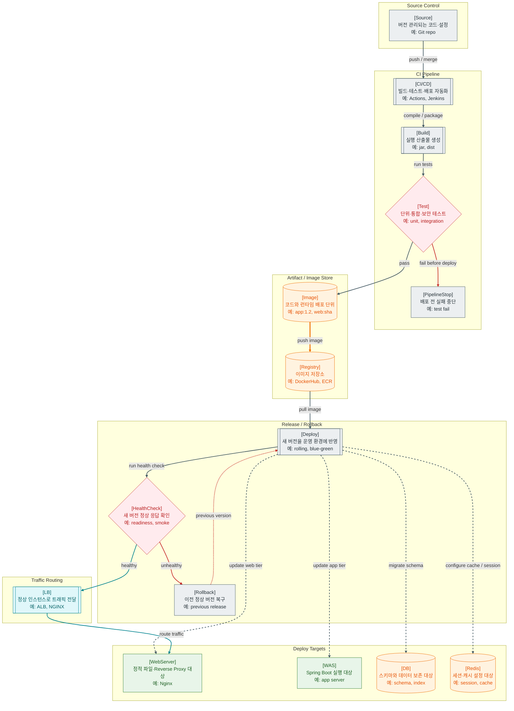

>[!success] 이 지도를 통해 아래 질문들에 답할 수 있게 됩니다.
>- 개발자가 작성한 코드는 어떤 과정을 거쳐 운영 환경에 반영되는가?
>- Build, Test, Image, Registry, Deploy는 각각 어디에서 품질을 확인하거나 산출물을 넘기는가?
>- 테스트 실패와 배포 후 장애는 왜 서로 다른 실패 흐름으로 봐야 하는가?
>- DB Migration은 왜 애플리케이션 배포보다 더 조심해야 하는가?

---

---
이 지도는 사용자의 요청 흐름이 아니라, 개발자가 작성한 코드가 운영 환경에 반영되는 흐름을 설명한다. 웹 서비스를 이해할 때 런타임만 보면 절반만 본 것이다. 실제 서비스는 코드가 변경되고, 테스트되고, 배포되고, 문제가 생기면 되돌아가는 과정을 계속 반복한다.

CI/CD의 출발점은 Source다. 개발자가 Git에 코드를 push하거나 merge하면 파이프라인이 시작된다. CI는 변경된 코드가 기존 기능을 깨뜨리지 않는지 빌드와 테스트로 확인하는 단계다. Docker 문서는 CI를 main branch에 변경을 합치기 전 테스트와 빌드를 수행해 예상치 못한 동작을 검증하는 개발 프로세스의 일부로 설명한다.

Build는 소스 코드를 실행 가능한 산출물로 만드는 단계다. Java/Spring 프로젝트라면 컴파일과 jar 생성이 포함될 수 있고, 프론트엔드라면 정적 파일 묶음이 만들어질 수 있다. 이후 Docker Image를 만든다면 애플리케이션 실행에 필요한 런타임, 설정, 파일 구조를 이미지로 묶는다. Registry는 이 이미지를 저장하고 공유하는 공간이다.

Deploy는 새 버전을 실제 서버나 컨테이너 환경에 반영하는 단계다. 이때 단순히 컨테이너를 띄우는 것만 중요한 것이 아니다. 새 버전이 정상 응답하는지 Health Check를 해야 하고, 문제가 있으면 Load Balancer가 해당 인스턴스로 트래픽을 보내지 않도록 해야 한다.

테스트 실패와 Rollback은 구분해야 한다. 테스트 실패는 아직 운영 환경이 바뀌기 전이므로 PipelineStop으로 중단하면 된다. 반면 Rollback은 새 버전이 이미 배포되었거나 트래픽 전환 직전 Health Check에서 실패했을 때 이전 정상 버전으로 되돌리는 복구 흐름이다. Kubernetes의 readiness probe처럼 트래픽을 받아도 되는지 확인하는 장치는 잘못된 버전으로 사용자가 흘러가는 일을 줄여준다.

DB Migration은 특히 조심해야 한다. 애플리케이션 코드는 이전 이미지로 되돌릴 수 있지만, DB 스키마 변경이나 데이터 변경은 쉽게 되돌릴 수 없다. 따라서 컬럼 추가, 컬럼 삭제, 데이터 백필, 인덱스 생성, 락 발생 가능성, 이전 버전과의 호환성을 고려해야 한다.

이 지도에서 WebServer, WAS, DB, Redis가 Deploy와 점선으로 연결되는 이유는 배포가 사용자 요청의 실시간 흐름이 아니라 운영 환경을 바꾸는 관리 흐름이기 때문이다. CI/CD는 서비스가 사용자에게 도달하기 전의 품질 관문이며, 배포 이후에는 Health Check와 APM을 통해 실제 정상 동작 여부를 확인해야 한다.

지도에서 실선은 파이프라인의 순차 진행, 굵은 선은 이미지 저장소로 산출물이 이동하는 흐름, 점선은 운영 환경을 바꾸는 배포 작업, 빨간 선은 실패와 복구 흐름을 뜻한다. 그래프 크기를 키우지 않기 위해 세부적인 승인 단계나 수동 배포 절차는 줄글에서만 설명했다.

실무 배포에서는 개발, 스테이징, 운영 환경을 분리하고, secret은 코드나 이미지에 넣지 않으며, 인프라 변경은 IaC로 추적하는 편이 안전하다. 배포 전략도 한 번에 전체 교체만 있는 것이 아니라 rolling, blue-green, canary처럼 위험을 줄이는 방식이 있고, DB Migration은 expand-contract 방식처럼 이전 버전과 새 버전이 함께 버틸 수 있게 나누어야 한다.

## 장애가 났을 때 먼저 확인할 것

- 실패가 Build/Test 단계인지, Deploy 단계인지, 배포 후 Runtime 단계인지 구분한다.
- 새 이미지 tag와 실제 실행 중인 버전이 일치하는지 확인한다.
- Health Check, readiness, smoke test 실패 로그를 확인한다.
- 환경 변수, secret, config 차이로 운영에서만 깨졌는지 확인한다.
- DB Migration 실행 여부, 락 발생, 이전 버전 호환성 문제를 확인한다.

## 설계할 때 선택 기준

- 작은 서비스와 낮은 위험 배포는 rolling으로 시작할 수 있다.
- 빠른 전환과 명확한 복구가 중요하면 blue-green을 검토한다.
- 사용자 일부에게만 새 버전을 노출하고 싶으면 canary를 검토한다.
- DB 변경은 컬럼 추가, 코드 배포, 백필, 기존 컬럼 제거를 나누어 진행한다.
- 환경별 설정과 secret은 CI/CD 변수나 secret manager에서 주입한다.

## 운영 중 볼 지표

- pipeline success rate, build duration, test failure count
- deploy duration, deploy failure count, rollback count
- health check failure count, readiness failure count
- version별 5xx rate, p95 latency, error budget burn
- migration duration, lock wait time, failed migration count

## 흔한 오해

- 테스트가 통과했다고 운영 장애가 없다는 뜻은 아니다.
- Rollback은 코드만 되돌리면 끝나는 것이 아니라 DB와 외부 상태 호환성을 함께 봐야 한다.
- secret을 이미지에 넣으면 한 번 유출된 이미지를 되돌리기 어렵다.
- Health Check가 단순 200 응답만 보면 실제 준비 상태를 놓칠 수 있다.
- 수동 배포는 작을 때 편하지만 변경 이력과 재현성이 약해질 수 있다.

## 실전 체크리스트

- [ ] 환경별 config와 secret 주입 방식이 분리되어 있는가?
- [ ] 배포된 버전과 Git commit/image tag를 추적할 수 있는가?
- [ ] 배포 후 smoke test와 자동 rollback 기준이 있는가?
- [ ] DB Migration이 이전/새 버전 호환성을 고려하는가?
- [ ] 인프라 변경이 코드처럼 리뷰되고 기록되는가?

## 질문에 대한 답변

1. 개발자가 작성한 코드는 어떤 과정을 거쳐 운영 환경에 반영되는가?

   `Source → CI/CD → Build → Test → Image → Registry → Deploy → HealthCheck → LB` 흐름을 따라간다. 코드는 먼저 저장소에 반영되고, 파이프라인에서 빌드와 테스트를 거친 뒤 이미지로 묶인다. 이미지는 Registry에 저장되고, Deploy 단계에서 WebServer나 WAS 같은 대상에 반영된다. 마지막으로 HealthCheck를 통과해야 LB가 정상 트래픽을 보낸다.

2. Build, Test, Image, Registry, Deploy는 각각 어디에서 품질을 확인하거나 산출물을 넘기는가?

   Build는 실행 가능한 산출물을 만들고, Test는 그 산출물이 기존 기능을 깨뜨리지 않는지 확인한다. Image는 실행 환경까지 묶은 배포 단위이고, Registry는 이미지를 저장하고 배포 대상이 가져갈 수 있게 하는 저장소다. Deploy는 Registry의 이미지를 실제 서버나 클러스터에 반영한다.

3. 테스트 실패와 배포 후 장애는 왜 서로 다른 실패 흐름으로 봐야 하는가?

   테스트 실패는 운영 환경이 아직 바뀌지 않았기 때문에 `PipelineStop`으로 끝내면 된다. 하지만 배포 후 HealthCheck 실패나 운영 장애는 이미 새 버전이 환경에 반영된 뒤의 문제라서 `Rollback`이 필요하다. 두 실패를 같은 흐름으로 그리면 “테스트 실패도 운영 롤백이 필요하다”는 잘못된 인상을 줄 수 있다.

4. DB Migration은 왜 애플리케이션 배포보다 더 조심해야 하는가?

   애플리케이션 이미지는 이전 버전으로 되돌리기 쉽지만, DB 스키마와 데이터는 되돌리기 어렵다. 특히 컬럼 삭제, 타입 변경, 대량 백필, 인덱스 생성은 락이나 호환성 문제를 만들 수 있다. 그래서 DB Migration은 배포 전후 버전이 모두 견딜 수 있는 방식으로 나누어 진행하는 편이 안전하다.

## 관련 상세 문서

- [CI CD Pipeline 압축 정리](<../Web-Operations/07. CI CD Pipeline/00. CI CD Pipeline 압축 정리.md>)
- [Build Artifact Config Profile 압축 정리](<../Web-Operations/03. Build Artifact Config Profile/00. Build Artifact Config Profile 압축 정리.md>)
- [배포 전략 Rolling Blue-Green Canary 압축 정리](<../Web-Operations/08. 배포 전략 Rolling Blue-Green Canary/00. 배포 전략 Rolling Blue-Green Canary 압축 정리.md>)
- [Migration 운영 성능 진단 압축 정리](<../Web-Database/12. Migration 운영 성능 진단/00. Migration 운영 성능 진단 압축 정리.md>)
- [Backup Restore Migration 운영 압축 정리](<../Web-Operations/11. Backup Restore Migration 운영/00. Backup Restore Migration 운영 압축 정리.md>)
- [Docker Image Container Volume Network 압축 정리](<../Web-Operations/04. Docker Image Container Volume Network/00. Docker Image Container Volume Network 압축 정리.md>)

## 참고한 자료

- [Docker Docs - What is a registry?](https://docs.docker.com/get-started/docker-concepts/the-basics/what-is-a-registry/)
- [Kubernetes Docs - Liveness, Readiness, and Startup Probes](https://kubernetes.io/docs/concepts/workloads/pods/probes/)
