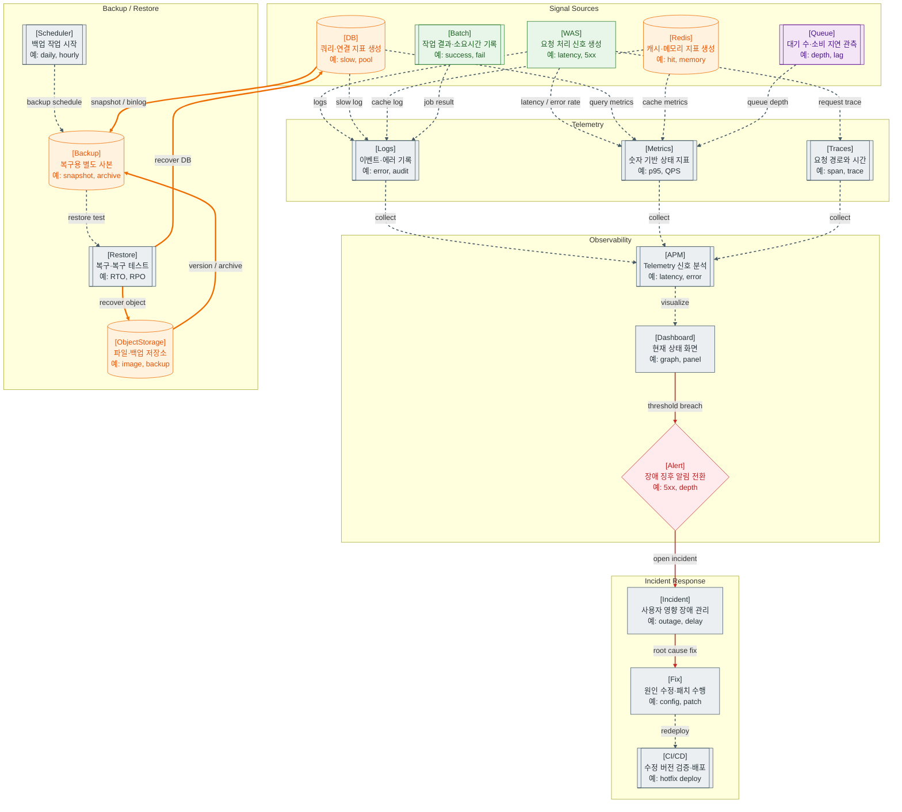

>[!success] 이 지도를 통해 아래 질문들에 답할 수 있게 됩니다.
>- 운영 중인 서비스의 상태는 어떤 데이터로 관측하는가?
>- Logs, Metrics, Traces는 각각 무엇을 설명하는가?
>- Alert, Incident, Fix는 단순 에러 로그와 어떻게 다른가?
>- Backup은 왜 생성보다 Restore 가능성 확인이 더 중요한가?

---

---
이 지도는 서비스가 운영 중일 때 상태를 어떻게 관측하고, 문제가 생겼을 때 어떻게 대응하며, 데이터 손실에 어떻게 대비하는지를 설명한다. 개발 단계에서는 기능 구현이 중요하지만, 운영 단계에서는 “문제를 얼마나 빨리 발견하고, 원인을 찾고, 복구할 수 있는가”가 중요하다.

운영 관측의 기본 재료는 Logs, Metrics, Traces다. Logs는 사건의 상세 기록이고, Metrics는 지연시간, 에러율, CPU, 메모리, QPS 같은 숫자 지표이며, Traces는 하나의 요청이 여러 컴포넌트를 거치는 경로와 소요 시간을 보여준다. OpenTelemetry 문서는 traces, metrics, logs를 telemetry 신호로 설명한다.

APM은 이 관측 데이터를 모아 사람이 볼 수 있게 만든다. WAS의 응답 시간, DB의 Slow Query, Redis의 캐시 적중률, Queue의 대기 메시지 수, Batch의 성공/실패 결과가 APM과 Dashboard에 모이면 운영자는 현재 서비스 상태를 파악할 수 있다.

Alert는 사람이 계속 Dashboard를 보고 있지 않아도 장애 징후를 알 수 있게 하는 장치다. 예를 들어 5xx 비율이 높아지거나, 응답 시간이 급증하거나, DB Connection Pool이 고갈되거나, Queue Depth가 계속 쌓이면 Alert가 발생할 수 있다. Alert는 너무 적으면 장애를 놓치고, 너무 많으면 무시된다.

Incident는 장애 대응의 관리 단위다. 단순히 “에러가 났다”가 아니라, 사용자 영향이 있는 문제를 하나의 사건으로 보고 원인 분석, 임시 조치, 근본 수정, 재발 방지까지 추적한다. Fix는 코드 수정일 수도 있고, 설정 변경, 인프라 증설, 쿼리 개선, 캐시 정책 수정일 수도 있다.

Backup은 장애 대응과 별개로 반드시 필요한 데이터 보호 체계다. DB와 Object Storage는 서비스의 핵심 자산이다. 백업은 “복사본이 있다”에서 끝나지 않는다. 실제로 Restore가 되는지, 복구에 얼마나 걸리는지, 어느 시점까지 복구할 수 있는지를 확인해야 한다.

Object Storage는 업로드 파일과 백업 파일을 저장하는 주요 대상이 될 수 있다. Amazon S3는 다양한 규모의 데이터를 저장하고 보호하기 위한 객체 저장 서비스로 설명된다.

이 지도의 핵심은 운영을 “장애가 난 뒤 확인하는 일”로 보지 않는 것이다. 좋은 운영은 장애 전에는 지표를 보고 위험을 감지하고, 장애 중에는 빠르게 원인을 좁히고, 장애 후에는 재발을 막는 구조를 만드는 일이다. APM, Alert, Incident, Backup, Restore는 모두 이 목적을 위해 연결된다.

지도에서 점선은 관측 데이터 수집과 운영 관리 흐름, 빨간 선은 Alert에서 Incident로 이어지는 장애 대응 흐름, 굵은 선은 DB와 ObjectStorage의 백업·복구 데이터 흐름을 뜻한다. 관측은 “문제 발견과 원인 추적”이고, 백업은 “데이터 손실 대비와 복구 검증”이므로 같은 운영 영역이지만 목적이 다르다.

운영 지표는 많이 모으는 것보다 “사용자에게 좋은 서비스인지 판단할 수 있는가”가 더 중요하다. SLI는 지연시간, 성공률, 가용성처럼 서비스 수준을 재는 지표이고, SLO는 그 지표의 목표다. 장애 대응은 Alert가 울린 뒤 즉흥적으로 움직이는 것이 아니라 runbook, on-call, postmortem, trace id와 log correlation을 통해 반복 가능한 흐름으로 만들어야 한다.

## 장애가 났을 때 먼저 확인할 것

- 사용자 영향이 있는지 먼저 확인하고 Incident로 관리할지 결정한다.
- 최근 배포, 설정 변경, 트래픽 급증, 외부 API 장애 여부를 확인한다.
- Dashboard에서 latency, 5xx, saturation, queue depth를 먼저 본다.
- trace id로 느린 요청이 어느 컴포넌트에서 막혔는지 추적한다.
- 데이터 손상이나 삭제가 의심되면 backup과 restore 가능 시점을 확인한다.

## 설계할 때 선택 기준

- Alert는 단순 CPU보다 사용자 영향과 연결된 SLI 중심으로 잡는다.
- Dashboard는 서비스 전체 화면과 컴포넌트별 상세 화면을 나누어 만든다.
- 로그는 trace id, user/request id, endpoint, error code가 연결되게 남긴다.
- Runbook은 “누가 무엇을 어떤 순서로 확인할지”가 드러나게 작성한다.
- Backup은 RTO, RPO, restore test 주기를 기준으로 설계한다.

## 운영 중 볼 지표

- SLI: availability, success rate, p95/p99 latency, freshness, correctness
- Alert: alert count, false positive count, alert fatigue 후보
- Incident: MTTA, MTTR, incident count, recurrence count
- Trace/Log: trace sampling rate, log error count, uncaught exception count
- Backup: backup success rate, restore test success, RTO, RPO

## 흔한 오해

- 로그가 많다고 관측성이 좋은 것은 아니다.
- CPU 80% 같은 지표만으로 사용자 장애를 판단하기 어렵다.
- Alert는 많이 만들수록 좋은 것이 아니라, 대응할 수 있는 신호여야 한다.
- Backup 파일이 존재하는 것과 Restore가 가능한 것은 다르다.
- Postmortem은 책임 추궁 문서가 아니라 재발 방지 문서다.

## 실전 체크리스트

- [ ] 핵심 사용자 여정별 SLI/SLO가 정의되어 있는가?
- [ ] Alert마다 담당자와 runbook이 연결되어 있는가?
- [ ] 로그, 메트릭, 트레이스가 trace id로 이어지는가?
- [ ] 장애 후 원인, 조치, 재발 방지가 기록되는가?
- [ ] Restore 테스트를 정기적으로 수행하는가?

## 질문에 대한 답변

1. 운영 중인 서비스의 상태는 어떤 데이터로 관측하는가?

   WAS, DB, Redis, Queue, Batch 같은 Signal Sources가 Logs, Metrics, Traces를 만든다. WAS의 응답 시간과 에러율, DB Slow Query와 연결 수, Redis 캐시 적중률, Queue depth, Batch 성공/실패 결과가 대표적이다. 이 데이터가 APM과 Dashboard에 모여 현재 상태를 읽을 수 있게 된다.

2. Logs, Metrics, Traces는 각각 무엇을 설명하는가?

   Logs는 특정 시점에 무슨 일이 있었는지 남기는 사건 기록이다. Metrics는 지연시간, QPS, CPU, 메모리, 에러율 같은 숫자 지표라 추세와 임계치를 보기 좋다. Traces는 하나의 요청이 여러 컴포넌트를 거치며 어디에서 시간이 걸렸는지 보여준다. 장애 분석에서는 세 가지를 함께 봐야 원인 범위를 좁히기 쉽다.

3. Alert, Incident, Fix는 단순 에러 로그와 어떻게 다른가?

   에러 로그는 개별 기록이다. Alert는 에러율 상승, 지연시간 증가, Queue 적체처럼 사람이 봐야 할 조건을 알림으로 바꾼다. Incident는 사용자 영향이 있는 장애를 하나의 대응 단위로 관리하는 것이다. Fix는 그 Incident를 해결하기 위한 설정 변경, 코드 패치, 쿼리 개선, 인프라 조정 같은 실제 수정이다.

4. Backup은 왜 생성보다 Restore 가능성 확인이 더 중요한가?

   백업 파일이 존재해도 실제로 복구할 수 없으면 장애 상황에서 의미가 없다. Restore 테스트를 해야 백업 파일이 깨지지 않았는지, 복구 시간이 얼마나 걸리는지, 어느 시점까지 데이터를 되돌릴 수 있는지 확인할 수 있다. 그래서 운영에서는 Backup 생성뿐 아니라 Restore 절차와 주기적인 복구 검증이 함께 필요하다.

## 관련 상세 문서

- [Logging Metrics Tracing 압축 정리](<../Web-Operations/09. Logging Metrics Tracing/00. Logging Metrics Tracing 압축 정리.md>)
- [APM Health Check Alert 압축 정리](<../Web-Operations/10. APM Health Check Alert/00. APM Health Check Alert 압축 정리.md>)
- [Backup Restore Migration 운영 압축 정리](<../Web-Operations/11. Backup Restore Migration 운영/00. Backup Restore Migration 운영 압축 정리.md>)
- [Incident Response 장애 보고서 압축 정리](<../Web-Operations/12. Incident Response 장애 보고서/00. Incident Response 장애 보고서 압축 정리.md>)
- [Web Operations Runbook 압축 정리](<../Web-Operations/90. Web Operations Runbook/00. Web Operations Runbook 압축 정리.md>)
- [네트워크 장애 대응과 트러블슈팅 압축 정리](<../Web-Network/14. 네트워크 장애 대응과 트러블슈팅/00. 네트워크 장애 대응과 트러블슈팅 압축 정리.md>)

## 참고한 자료

- [OpenTelemetry Docs - Signals](https://opentelemetry.io/docs/concepts/signals/)
- [AWS Backup - What is AWS Backup?](https://docs.aws.amazon.com/aws-backup/latest/devguide/whatisbackup.html)
- [AWS - What is Amazon S3?](https://docs.aws.amazon.com/AmazonS3/latest/userguide/Welcome.html)
- [RabbitMQ Docs - Monitoring](https://www.rabbitmq.com/docs/monitoring)
