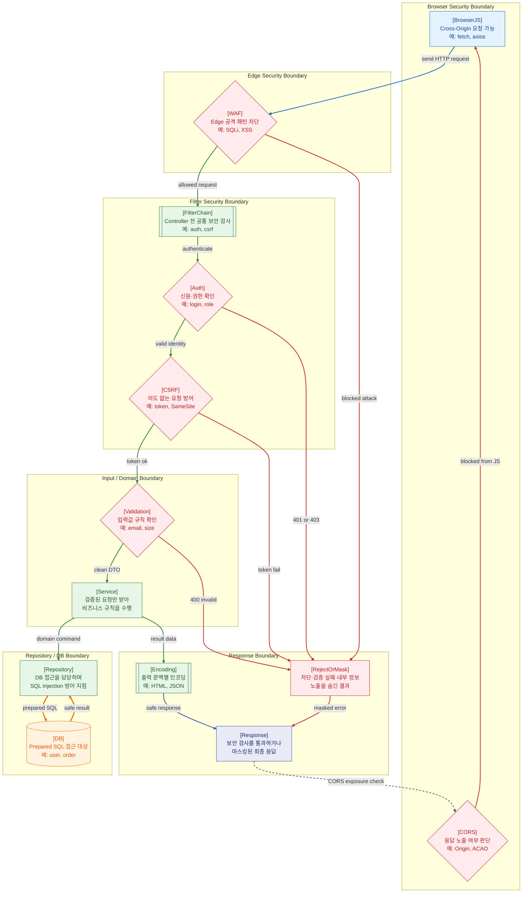

>[!success] 이 지도를 통해 아래 질문들에 답할 수 있게 됩니다.
>- 웹 보안은 요청 처리 흐름의 어느 위치에 배치되어야 하는가?
>- CORS는 서버 API를 보호하는 기능인가, 브라우저의 응답 노출 정책인가?
>- WAF, FilterChain, Validation, Repository, Response Boundary는 각각 무엇을 방어하는가?
>- SQL Injection, XSS, CSRF 같은 공격은 각각 어떤 계층에서 막아야 하는가?

---

---
이 지도는 보안을 하나의 기능으로 보지 않고, 요청이 지나가는 여러 경계마다 배치되는 검증 지점으로 설명한다. 웹 보안은 `보안 모듈 하나 추가`로 끝나는 문제가 아니다. 브라우저, Edge, Filter, Controller, Repository, Response 각각의 위치에 맞는 방어가 필요하다.

첫 번째 위치는 브라우저와 CORS다. CORS는 서버 간 통신을 막는 기능이 아니라, 브라우저가 다른 Origin의 응답을 JavaScript에 노출해도 되는지 판단하는 정책이다. 그래서 지도에서도 CORS는 요청이 WAF로 가기 전의 서버 방화벽처럼 두지 않고, 최종 Response가 브라우저에 돌아온 뒤 노출 여부를 확인하는 경계로 표현했다. `Access-Control-Allow-Origin` 같은 응답 헤더가 이 판단에 사용된다.

두 번째 위치는 WAF다. WAF는 Edge에서 악성 요청을 1차 차단한다. 그러나 WAF가 모든 공격을 막아준다고 생각하면 안 된다. WAF는 네트워크 앞단의 보조 방어선이고, 실제 애플리케이션 로직의 인증, 인가, 입력 검증, SQL 방어는 내부에서 반드시 수행해야 한다.

세 번째 위치는 FilterChain이다. FilterChain은 Controller에 들어가기 전의 공통 보안 관문이다. Spring Security도 서블릿 Filter 기반으로 보안 처리를 연결한다. 여기에는 인증, 인가, CSRF, CORS 설정, 보안 헤더, Rate Limit, 요청 로깅 같은 처리가 놓일 수 있다. 이 단계에서 실패하면 요청은 Controller까지 가지 않고 401, 403 또는 별도 오류 응답으로 종료된다.

네 번째 위치는 Controller Boundary다. 이곳에서는 사용자가 보낸 입력값을 DTO로 받고, 필수값, 타입, 길이, 범위, 형식을 검증한다. 검증되지 않은 입력이 Service로 들어가면 비즈니스 로직이 오염되고, 이후 DB나 외부 API 호출까지 잘못 이어질 수 있다.

다섯 번째 위치는 Repository Boundary다. SQL Injection 방어는 이 구간에서 특히 중요하다. OWASP는 SQL Injection 방어의 1차 선택지로 Prepared Statements와 Parameterized Queries를 제시하며, SQL 코드와 사용자 입력 파라미터를 분리해야 한다고 설명한다.

여섯 번째 위치는 Response Boundary다. 응답에 사용자 입력이 포함될 수 있다면 HTML, JavaScript, JSON 문맥에 맞는 인코딩이 필요하다. 또한 오류 응답에서는 StackTrace, 내부 파일 경로, SQL, 환경 변수, 보안 설정 같은 정보가 노출되지 않도록 Error Masking이 필요하다.

이 지도의 핵심은 보안을 “한 번 검사하면 끝나는 절차”로 보지 않는 것이다. CORS는 브라우저의 노출 정책이고, WAF는 Edge 방어선이며, FilterChain은 공통 보안 관문이고, Validation은 입력 경계이며, Repository는 SQL 방어선이고, Response는 출력 방어선이다. 보안은 요청이 이동하는 모든 경계에 배치되어야 한다.

지도에서 실선은 서버 안쪽으로 진행되는 요청 처리, 굵은 선은 DB 접근, 점선은 브라우저가 응답을 노출할지 판단하는 보조 흐름, 빨간 선은 차단이나 검증 실패를 뜻한다. CORS는 요청을 서버에 보내지 못하게 하는 만능 방어막이 아니라는 점이 이 문서의 핵심 오해 방지 포인트다.

보안 설계는 인증과 인가를 구분하는 것에서 시작한다. 인증은 “누구인가”를 확인하는 일이고, 인가는 “무엇을 할 수 있는가”를 결정하는 일이다. Session, OAuth/OIDC, JWT, RBAC 같은 선택지는 서로 대체 관계라기보다 서비스 형태와 신뢰 경계에 따라 조합된다. 또한 CSP, security headers, secret 관리, dependency scanning처럼 요청 처리 밖의 보안도 함께 필요하다.

## 장애가 났을 때 먼저 확인할 것

- 401인지 403인지 구분해 인증 실패와 인가 실패를 나눈다.
- CORS 오류라면 서버가 요청을 못 받은 것인지, 브라우저가 응답 노출을 막은 것인지 확인한다.
- JWT나 세션 장애라면 만료, 서명키, 쿠키 속성, Redis 세션 저장소를 확인한다.
- 갑작스러운 403 증가라면 WAF, CSRF, 권한 정책 변경을 확인한다.
- XSS나 정보 노출 의심 시 응답 인코딩, CSP, 에러 마스킹을 확인한다.

## 설계할 때 선택 기준

- 서버 렌더링이나 같은 도메인 중심 서비스는 HttpOnly Cookie 기반 Session이 단순할 수 있다.
- 외부 클라이언트, 모바일, 여러 서비스 연동이 많으면 OAuth/OIDC와 토큰 기반 흐름을 검토한다.
- JWT는 stateless 검증이 장점이지만 폐기, 저장 위치, 만료 전략을 함께 설계해야 한다.
- 권한은 문자열 비교로 흩뜨리지 말고 RBAC/ABAC 같은 모델로 모은다.
- 민감 설정은 코드, Git, 이미지가 아니라 secret manager나 환경별 secret 주입으로 관리한다.

## 운영 중 볼 지표

- auth failure rate, 401/403 rate, login failure count
- token validation failure count, expired token count, session lookup failure count
- WAF blocked count, CSRF failure count, CORS failure report
- dependency vulnerability count, secret scanning finding count
- CSP violation report, suspicious request rate

## 흔한 오해

- CORS를 열거나 닫는 것이 API 인증을 대신하지 않는다.
- JWT를 쓰면 세션 저장소가 항상 필요 없다고 생각하면 위험하다.
- 인증된 사용자라고 모든 리소스에 접근할 수 있는 것은 아니다.
- 입력 검증만으로 XSS가 완전히 막히지 않고, 출력 인코딩과 CSP가 함께 필요하다.
- Secret은 base64로 인코딩했다고 안전해지는 것이 아니다.

## 실전 체크리스트

- [ ] 인증 실패와 인가 실패가 상태 코드와 로그에서 구분되는가?
- [ ] 쿠키에 HttpOnly, Secure, SameSite 같은 속성이 적절히 설정되어 있는가?
- [ ] JWT 만료, 갱신, 폐기, 키 회전 전략이 있는가?
- [ ] CSP, 보안 헤더, 에러 마스킹이 적용되어 있는가?
- [ ] dependency scanning과 secret scanning이 CI에 연결되어 있는가?

## 질문에 대한 답변

1. 웹 보안은 요청 처리 흐름의 어느 위치에 배치되어야 하는가?

   보안은 한 지점이 아니라 여러 경계에 나뉘어 배치된다. 그래프에서는 `Browser Security Boundary`, `Edge Security Boundary`, `Filter Security Boundary`, `Input / Domain Boundary`, `Repository / DB Boundary`, `Response Boundary`가 각각 다른 방어 책임을 가진다. 앞단에서 막을 수 있는 것은 앞단에서 줄이고, 애플리케이션 내부에서는 인증, 검증, DB 접근, 출력 인코딩을 다시 수행해야 한다.

2. CORS는 서버 API를 보호하는 기능인가, 브라우저의 응답 노출 정책인가?

   CORS는 브라우저의 응답 노출 정책에 가깝다. 서버가 CORS 헤더를 내려주지 않으면 브라우저 JavaScript가 응답을 읽지 못하지만, 서버가 요청을 전혀 받지 않는다는 뜻은 아니다. 그래서 CORS만으로 API 인증이나 권한 검사를 대체할 수 없다.

3. WAF, FilterChain, Validation, Repository, Response Boundary는 각각 무엇을 방어하는가?

   WAF는 Edge에서 알려진 공격 패턴과 비정상 요청을 1차로 줄인다. FilterChain은 Controller 전에 인증, 인가, CSRF 같은 공통 보안을 처리한다. Validation은 입력값의 타입, 길이, 범위, 필수 여부를 확인한다. Repository는 Prepared Statement 같은 방식으로 SQL Injection을 막아야 한다. Response Boundary는 사용자 입력을 문맥에 맞게 인코딩하고 내부 오류 정보가 밖으로 새지 않게 한다.

4. SQL Injection, XSS, CSRF 같은 공격은 각각 어떤 계층에서 막아야 하는가?

   SQL Injection은 Repository/DB 경계에서 Prepared Statement와 파라미터 바인딩으로 막는 것이 기본이다. XSS는 입력 검증도 필요하지만, 최종적으로는 HTML, JavaScript, JSON 등 출력 문맥에 맞는 인코딩이 중요하다. CSRF는 사용자의 브라우저가 의도치 않은 요청을 보내는 문제이므로 FilterChain 단계에서 CSRF Token, SameSite Cookie, Origin 검증 같은 방식으로 다룬다.

## 관련 상세 문서

- [Web Security 전체 지도 압축 정리](<../Web-Security/01. Web Security 전체 지도/00. Web Security 전체 지도 압축 정리.md>)
- [Threat Model Trust Boundary 압축 정리](<../Web-Security/02. Threat Model Trust Boundary/00. Threat Model Trust Boundary 압축 정리.md>)
- [Browser Security SOP CORS CSRF XSS 압축 정리](<../Web-Security/06. Browser Security SOP CORS CSRF XSS/00. Browser Security SOP CORS CSRF XSS 압축 정리.md>)
- [API Security SQL Injection Validation 압축 정리](<../Web-Security/07. API Security SQL Injection Validation/00. API Security SQL Injection Validation 압축 정리.md>)
- [Spring Security 압축 정리](<../Web-Back(Spring)/14. Spring Security/00. Spring Security 압축 정리.md>)
- [Security Log Audit Abuse Detection 압축 정리](<../Web-Security/10. Security Log Audit Abuse Detection/00. Security Log Audit Abuse Detection 압축 정리.md>)

## 참고한 자료

- [MDN - Cross-Origin Resource Sharing](https://developer.mozilla.org/en-US/docs/Web/HTTP/Guides/CORS)
- [Spring Security Reference - Servlet Architecture](https://docs.spring.io/spring-security/reference/servlet/architecture.html)
- [OWASP - SQL Injection Prevention Cheat Sheet](https://cheatsheetseries.owasp.org/cheatsheets/SQL_Injection_Prevention_Cheat_Sheet.html)
- [OWASP - Cross Site Scripting Prevention Cheat Sheet](https://cheatsheetseries.owasp.org/cheatsheets/Cross_Site_Scripting_Prevention_Cheat_Sheet.html)
- [OWASP - Cross-Site Request Forgery Prevention Cheat Sheet](https://cheatsheetseries.owasp.org/cheatsheets/Cross-Site_Request_Forgery_Prevention_Cheat_Sheet.html)
